# 泛微 Ecology E9 二次开发文档

> 本文档基于 Ecology E9 平台，涵盖后端开发、前端 API、Ecode 等二次开发相关内容。
> 图片保存在 `ebu4-docs-img/` 目录下。

---

# 目录

1. **基础介绍** — 泛微产品技术栈、E9 产品技术架构说明
2. **开发环境搭建** — 如何搭建 Ecology 开发环境（JDK、IDEA、Tomcat 等）
3. **数据库操作** — 使用 RecordSet 等类进行数据库 CRUD 操作
4. **Api 接口开发** — 基于 Jersey 框架开发 RESTful 接口
5. **建议的开发规范** — 项目代码规范与最佳实践
6. **Action 开发和定时任务** — 流程 Action、计划任务、建模 Action 开发
7. **E9 流程表单前端 API** — 流程表单前端 JS 接口（WfForm 等）
8. **建模表单前端 API** — 建模表单前端 JS 接口（ModeForm / ModeList 等）
9. **Ecode 开发** — 前端在线开发平台：组件复写、组件重写、新页面开发


---

# 基础介绍

## 开发前的准备

在开始 Ecology 二次开发之前，需要先了解其技术栈和整体架构。

官方技术组件库：`https://e-cloudstore.com/e9/index2.html`

### E9 核心架构

Ecology 9 采用**前后端分离**架构：

- **前端**：React 16 + MobX（状态管理）+ ecCom（泛微自研组件库）
- **后端**：Jersey 框架（RESTful Web Service）+ 面向服务架构（SOA）

后端采用层次化架构，分层的同时支持 AOP、IOC、Interceptor，Service 层和 Command 层必须**面向接口编程**，通过 IOC 和命令委托实现各层解耦。架构总体采用**命令模式 + 职责链模式**作为基础开发模式。

后端提供全局 Interceptor 和局部 Interceptor、SERVICE-AOP、COMMAND-AOP 支持，可用于日志记录、声明式事务、安全性、缓存等功能的无侵入二开。

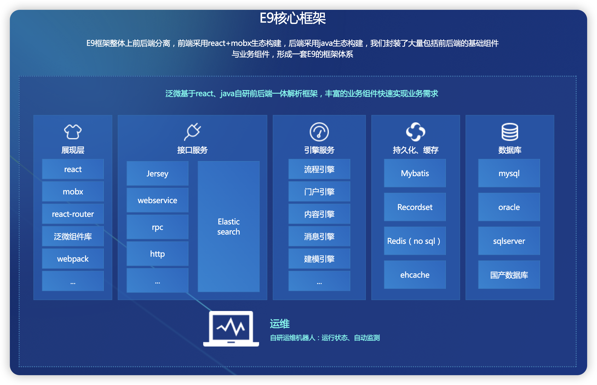

### E9 技术栈

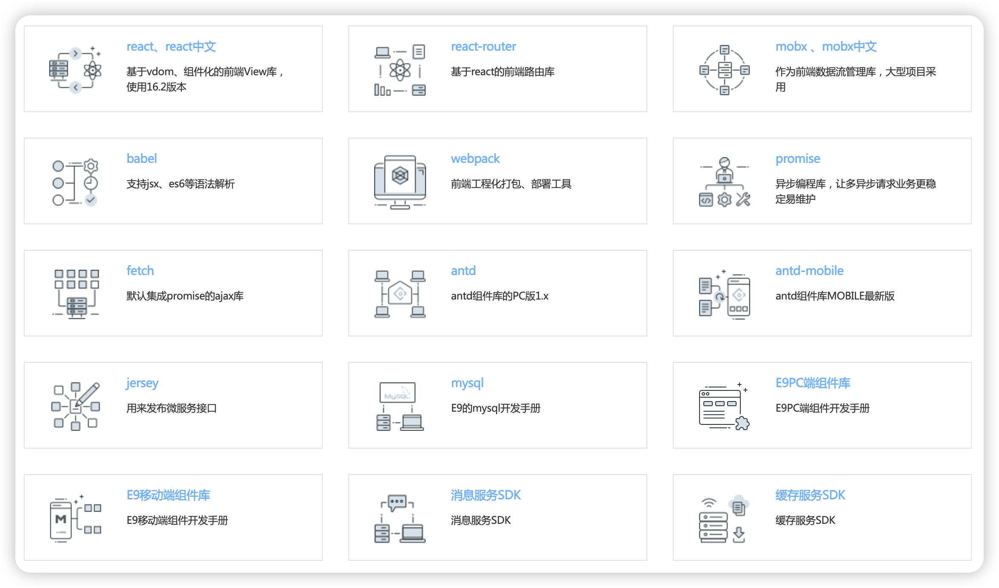

**后端技术栈：**

| 技术 | 版本 | 说明 |
|------|------|------|
| Java | JDK 1.8 | Ecology 运行基础 |
| Jersey | 1.19.1 | RESTful Web Service 框架 |
| Resin | 3.0 / 4.0 | Web 容器（推荐 4.0） |
| 数据库 | SQL Server / Oracle / MySQL / PgSQL | 由 `weaver.properties` 配置 |

Jersey 官方文档：`https://eclipse-ee4j.github.io/jersey/`

**前端技术栈：**

| 技术 | 版本 | 说明 |
|------|------|------|
| React | ^16.2.0 | UI 框架 |
| MobX | - | 状态管理 |
| ecCom | - | 泛微 PC 端组件库 |
| WeaverMobile | - | 泛微移动端组件库 |
| antd | - | Ant Design 基础组件 |

React 官方文档：`https://zh-hans.react.dev/`

在开始开发之前，需要具备 Java 和 React 的基础知识。

### Ecology 目录结构

了解 Ecology 的目录结构是开发的基础：

```
ecology/
├── src/                    # 源码目录（二次开发代码放这里）
├── classbean/              # 编译后的 class 文件（非信创环境）
├── WEB-INF/
│   ├── classes/            # 编译后的 class 文件（信创环境）
│   ├── lib/                # 依赖 jar 包
│   ├── config/             # 配置文件（ehcache.xml 等）
│   ├── prop/               # 属性文件目录
│   │   └── weaver.properties   # 数据库连接等核心配置
│   └── web.xml             # Web 应用配置
├── log/                    # 日志目录
│   ├── thread/             # 线程日志
│   ├── sql/                # SQL 日志
│   ├── mem/                # 内存日志
│   └── conn/               # 数据库连接日志
├── sqllog/                 # SQL 监听日志
├── sqlupgrade/             # SQL 自动升级脚本
└── cloudstore/             # Ecode 发布产物目录
    ├── release/${appId}/   # 各 ecode 项目编译产物
    └── dev/
        ├── init.js         # 前置加载 JS 合并文件
        └── init.css        # 前置加载 CSS 合并文件
```

**关键配置文件：**

- `weaver.properties` — 数据库连接信息、系统核心配置
- `weaver_isSqlLog.properties` — SQL 日志监听开关（路径：`ecology/WEB-INF/prop/`）
- `weaver_security_rules.xml` — 安全补丁规则（路径：`ecology/WEB-INF/`）
- `weaver_security_rules_for_ws.xml` — WebService 接口安全白名单

**默认账号：** 数据库初始化后，系统默认管理员账号为 `sysadmin`，密码为 `1`。


---

# 开发环境搭建

 ## 说明

 泛微 ecology 开发有多种方式，搭建的开发环境也各有不同，每个人的开发习惯也不一样，这里正对开发环境的搭建采用的是 maven 项目的形式进行搭建，当然也可以更具其他的文档或者教程来搭建普通项目或者集成中间件的项目。

 ecology 运行时的主要依赖更具项目性质不同而有所差异，如果是信创环境（国产中间件），程序主要依赖的文件有`ecology/WEB-INF/classes/*`、`ecology/WEB-INF/lib/*`和中间件的`lib/*`，非信创环境（如 Resin），程序主要依赖的文件有`ecology/classbean/*`、`ecology/WEB-INF/lib/*`和中间件的`lib/*`。

 ## 搭建准备——了解程序运行的主要结构和依赖

 ecology 程序包含很多文件，每个文件都有这不同的作用，但是在搭建开发环境时，并非所有的文件都能用得到，如下是 ecology 中包含的文件和文件夹

 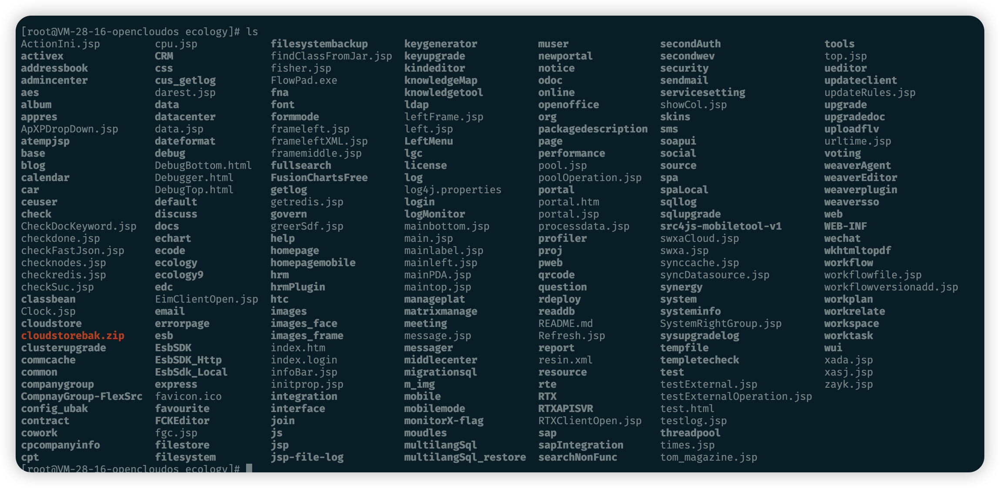

 上图胡总我们可以看到很多文件和文件夹，但是在我们搭建开发环境时，只有寥寥几个和我们相关，首先是 classbean 文件夹以及 WEB-INF 文件夹；


> classbean 文件夹（classes 根目录）

 `classbean`文件夹下面的所有 class 文件是我们程序运行的关键所在，所以也是我们搭建开发环境的必要依赖文件，这里涉及到是否是信创环境（国产中间件），如果是信创环境，这个目录下的文件不生效（并非绝对，应为可以在中间件中修改`classse`的根路径，一般默认情况下是不生效的），只有是非国产中间件（`Resin`）这里的文件才是我们所需要的依赖文件

 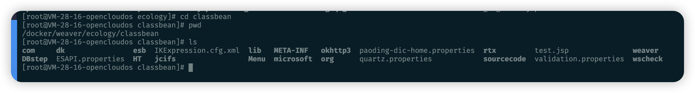


> WEB-INF 文件夹

 WEB-INF 文件夹下面有很多文件是开发环境搭建所需要的，首先是`classes`文件夹，它是信创环境的默认`classes`根路径，所以如果环境为信创环境，搭建开发环境的依赖就不再是`classbean`文件夹，而是`WEB-INF/classes`文件夹

 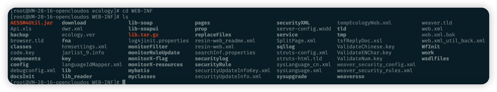

 除了`classes`文件夹之外，还有一个重要的依赖文件夹，即`WEB-INF/lib`，此文件夹下的所有 jar 包都是程序运行的依赖 jar 包（有些 jar 包是没有内容的，这些 jar 包是公司用来覆盖原有客户环境的低版本依赖所创建的空 jar 包，用来解决依赖版本冲突等问题，这些 jar 包通常不需要管它）

 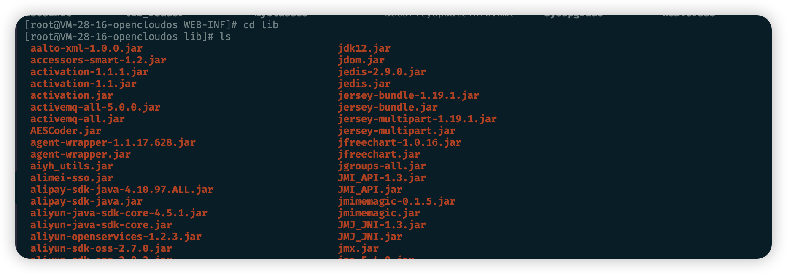

 到这里，我们搭建开发环境的`class`依赖文件基本就齐全了，但是除了 ecology 应用本身的依赖文件意外，程序还依赖了中间件的 lib 文件，最主要的是`servlet`包，这里以`Resin`中间件举例，搭建环境时不要忽略掉它的依赖

 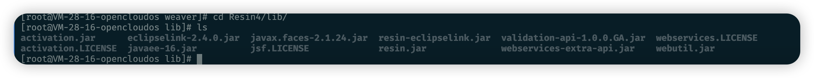

 在`WEB-INF`中还有程序运行的关键配置文件目录： prop

 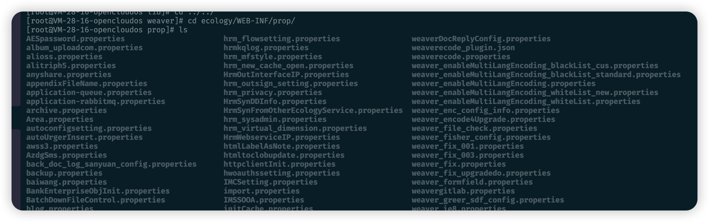

 这里最为重要的是：`weaver.properties`文件，其中包含了链接数据库的配置信息

 除了以上主要的搭建环境的依赖和文件之外，还有一些在开发中比较常用到的目录：

 `ecology/log`：程序运行时的日志默认输出目录

 `ecology/systemfile`：程序的文件存储目录

 `ecology/WEB-INF/web.xml`：程序的`web.xml`配置文件

 `ecology/WEB-INF/securityXML`： 程序的安全配置等信息配置

 `ecology/WEB-INF/securitylog`： 程序运行时安全拦截等的输出路径

 ## 环境搭建

 可查看另外几种搭建方式：`E9开发环境搭建IDEA篇.docx`和`../二次开发环境搭建.mp4`

 ### 依赖准备

 将上述所需要的文件从服务器中下载到本地，也可以将整个 ecology 目录下载到本地，按需下载需要下载：

 对应环境的`classes`根目录的所有文件，`WEB-INF/lib`下的所有 jar 包文件或者整个目录，`WEB-INF/prop`下的配置文件，可以全部获取或者一下文件(搭建环境进行单元测试时必要的文件，后续可以按需引入)：


```
initCache.properties
interceptsql.properties
isSyncLog4j.properties
weaver.properties
weaver_client_pwd.properties
weaver_enableMultiLangEncoding_blackList_cus.properties
weaver_enableMultiLangEncoding_blackList_standard.properties
weaver_enableMultiLangEncoding_whiteList.properties
weaver_enableMultiLangEncoding_whiteList_new.properties

```
除了上述的配置文件外还需要`WEB-INF/config/ehcache.xml`文件和`WEB-INF/log4jinit.properties`

 ### 搭建环境

 这里环境依赖搭建有几种形式，一种是将`classes`文件打包成 jar 包然后当做依赖引入，一种是直接引入`class`文件，`lib`下依赖的 jar 包可以通过 idea 的依赖导入方式进行导入，也可以使用 maven 的方式引入，看个人喜好。

 这里我采用的方式是将`class`文件打包成 jar 包然后当做依赖导入，首先我们需要准备我们的 jdk 环境（因为 ecology 的 jdk 是 1.8 版本的，所以需要准备 1.8 的 jdk），然后配置好环境变量

 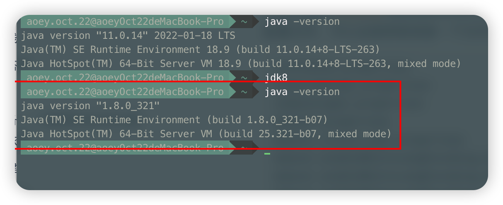

 进入`classes`根路径（非信创`classbean`）

 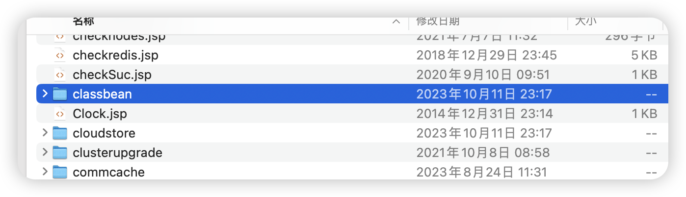

 打开控制台输入命令


```
# 将classben下的所有文件打包成jar包 jar包名称可以自定义
jar -cvf e9-classbean.jar ./

```
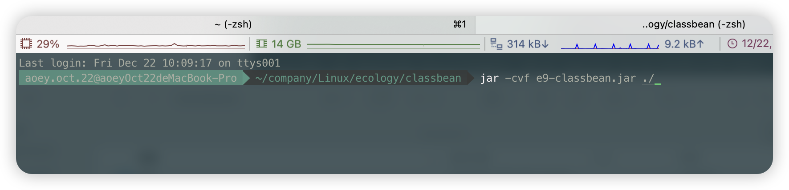

 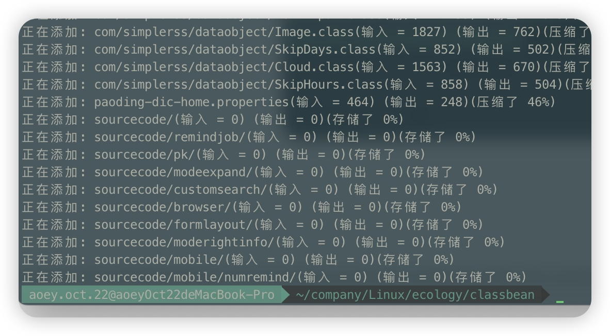

 结束后会在当前目录下生成`e9-classbean.jar`文件

 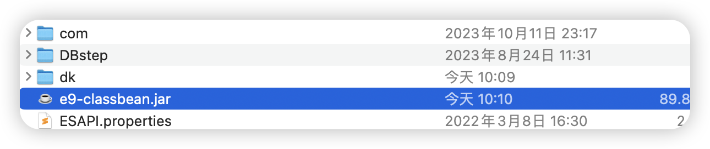

 这个就是我们所有的`classes`根路径下的`class`文件依赖

 使用 java 编程工具创建开发项目，更具个人喜好选择对应的工具，这里采用`idea`作位举例

 此处使用 maven 来搭建项目，所以我们创建一个 maven 项目

 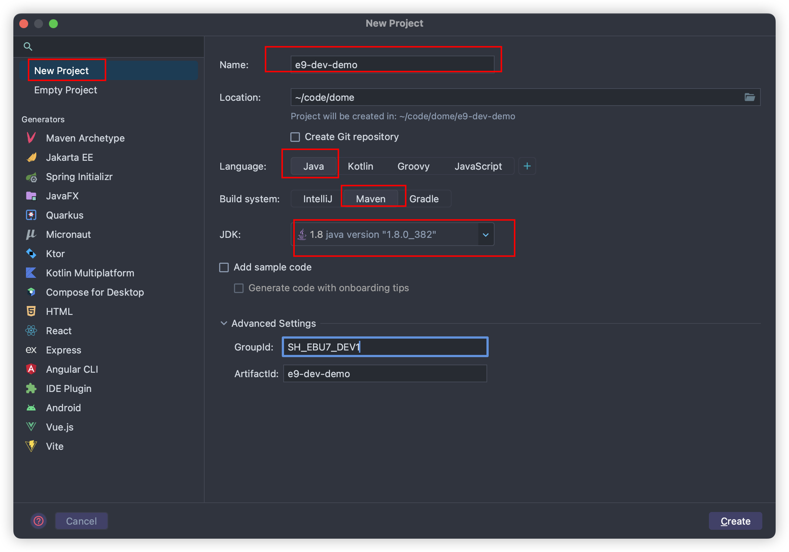

 当前采用最简单的单 maven 的项目创建，可以更具团队或公司需求创建多 maven 项目

  我们创建完成工程后，会得到这样的一个项目结构

 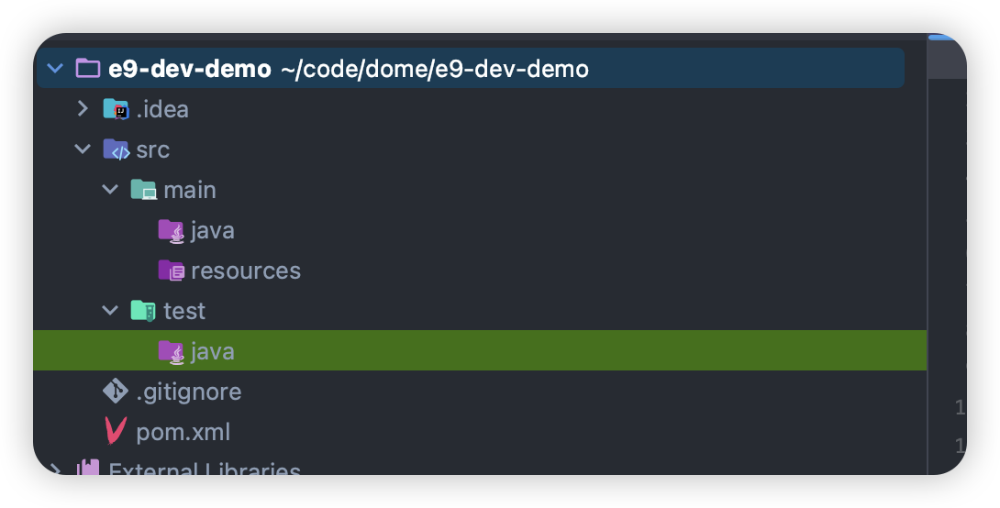

 编写代码的方式与普通 maven 项目一致，此时我们需要导入`ecology`的相关依赖，首先创建一个`lib`文件夹用于存放对应的依赖信息(通常操作，也可以直接引入本地任何路径下的依赖，无需单独创建)，并且将对应的依赖放到`lib`文件夹下


- 导入`classes`对应的依赖

 将我们刚才生成的 jar 包导入到`lib`文件夹下，并在`pom`文件中添加对应依赖的引入

 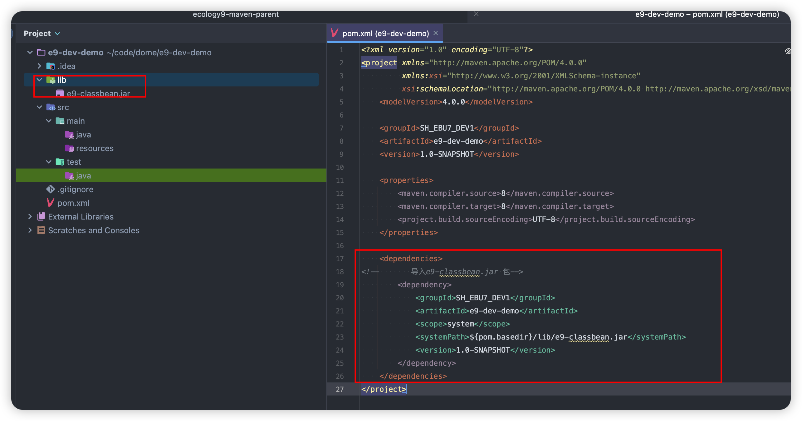


```
<!-- 导入e9-classbean.jar 包-->
<dependency>
 <groupId>com.example.ecology</groupId>
 <artifactId>e9-dev-demo</artifactId>
 <scope>system</scope>
 <systemPath>${pom.basedir}/lib/e9-classbean.jar</systemPath>
 <version>1.0-SNAPSHOT</version>
</dependency>

```
- 导入`WEB-INF/lib`下的所有 jar 包（有些空 jar 包可以跳过）,以及`中间件中的lib`下的所有 jar 包

  到这里后有两种导入方式，一种是使用 idea 的项目`Libraries`方式导入


> 第一种方式

 找到项目设置

 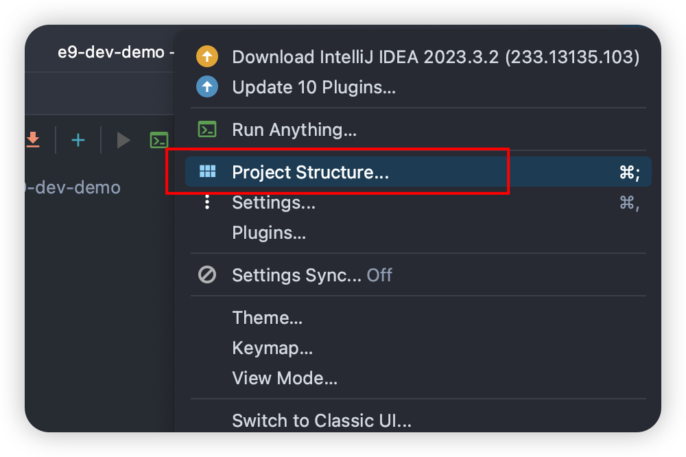

 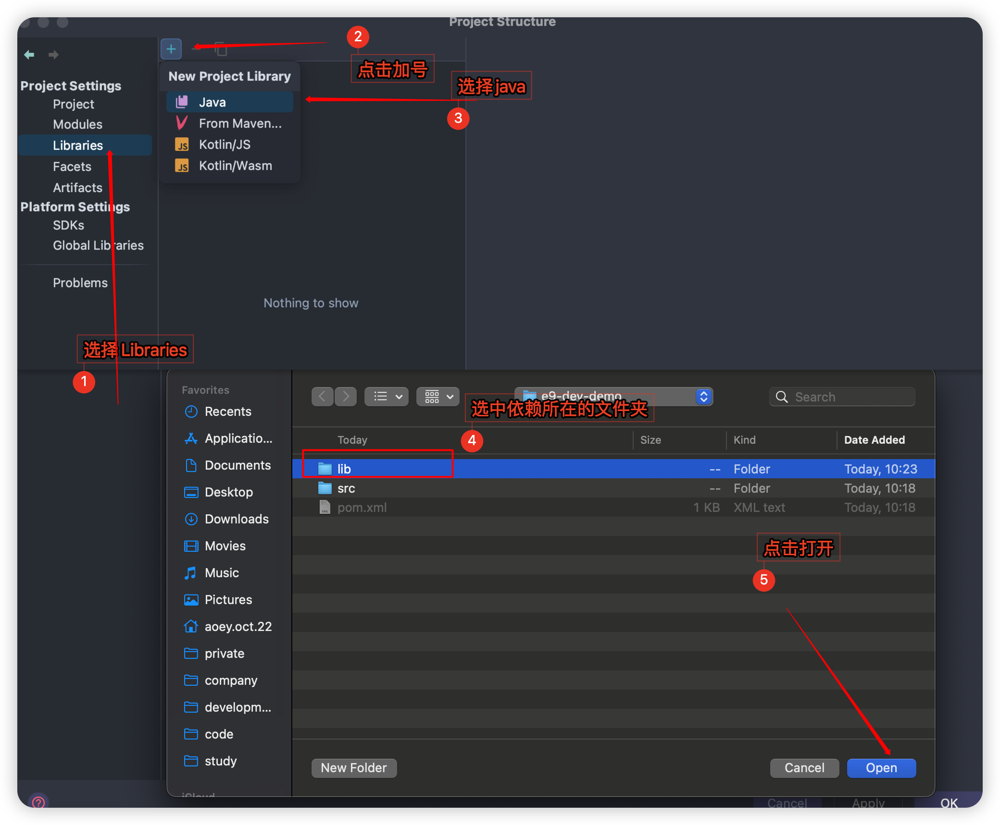

 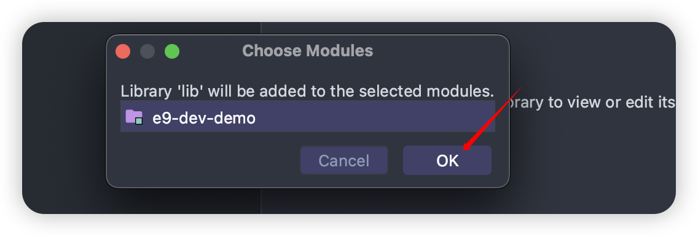

 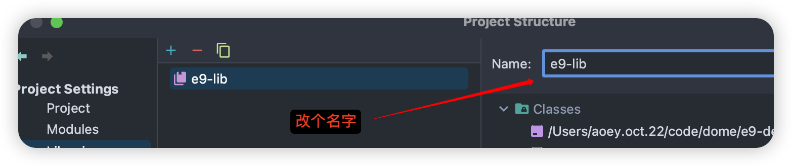

 回到 modules 查看依赖是否绑定，并且修改 jdk 版本，如果没有绑定，则需要添加下脚的加号，将依赖添加

 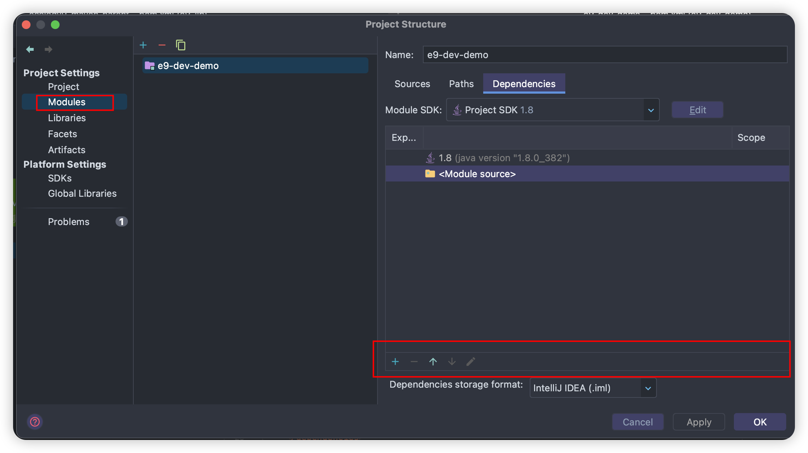

 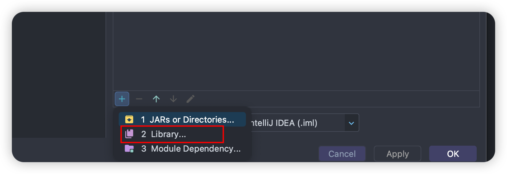

 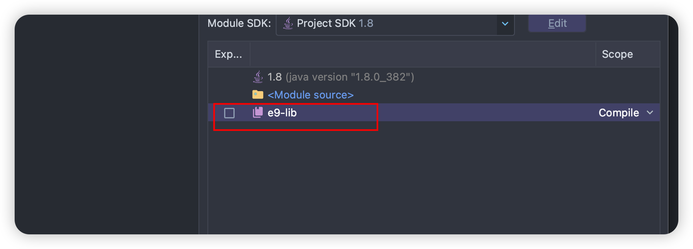

 点击确定

 等待 idea 索引完成


> 第二种方式

 第二种方式稍微负责一些，我们可以采用 maven 来引入我们的 jar 包依赖，但是因为依赖很多，所以相对不好处理，可以效仿`classbean`依赖到如的方法来导入依赖，`classbean`也可以采用第一种方法来引入。如果使用 maven 的方式引入，我们则需要编写大量的 maven 坐标引入本地文件（推荐使用脚本生成或者将 jar 用 maven 安装到本地后引入依赖，但也需要编写大量 maven 坐标）

 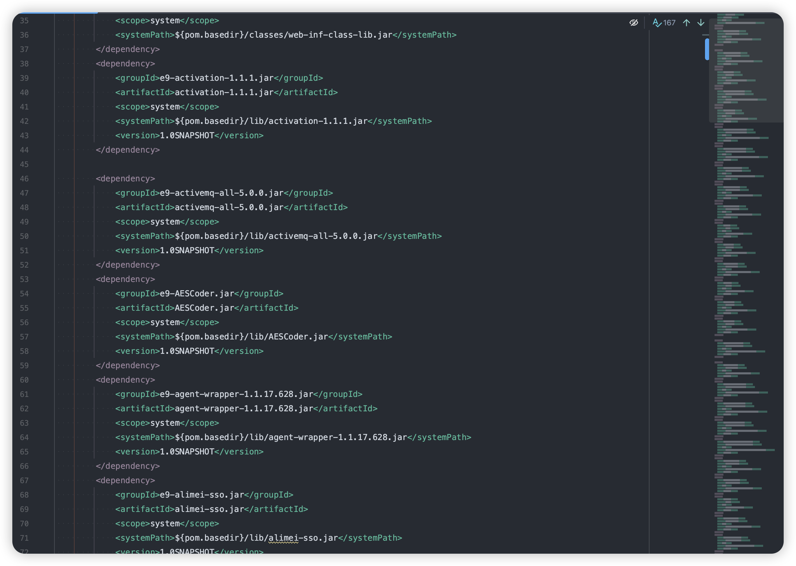

 两种方式根据个人的喜好选择

 接下来我们创建一个类来测试依赖是否导入成功

 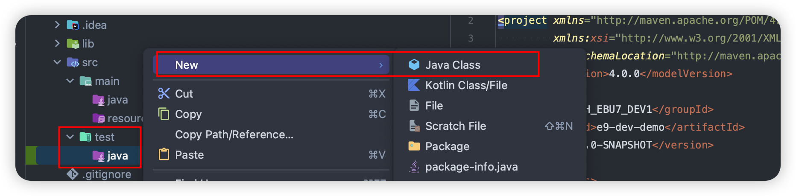

 如果能正常到如对应的依赖则表示依赖设置成功

 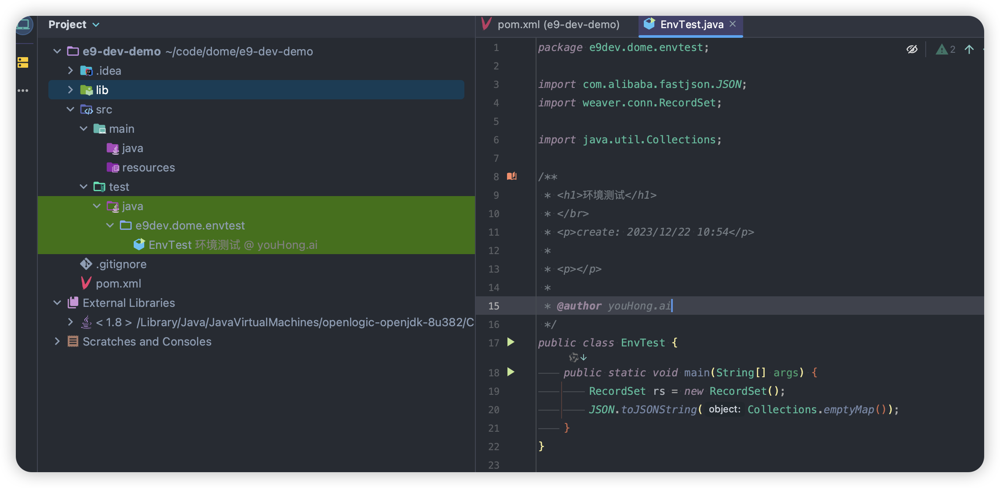


```
package e9dev.dome.envtest;

import com.alibaba.fastjson.JSON;
import weaver.conn.RecordSet;

import java.util.Collections;

/**
 * <h1>环境测试</h1>
 * </br>
 * <p>create: 2023/12/22 10:54</p>
 *
 * <p></p>
 *
 */
public class EnvTest {
 public static void main(String[] args) {
 RecordSet rs = new RecordSet();
 JSON.toJSONString(Collections.emptyMap());
 }
}

```
接下来对配置文件进行导入

 我们需要在`resources`下创建`WEB-INF`目录，并在下面创建`config`和`prop`文件夹，将文件放到对应的目录中


```
ecology/WEB-INF/config/ehcache.xml

```
存放到创建的`config`目录下

 将对应的`prop`存放到创建的`prop`文件夹下(也可以全部复制，当然也可以不用复制，保留在原地，然后通过代码配置设置 prop 的地址，看个人喜好和团队开发时如何协调处置)，这里云行时报那个文件找不到则找到对应的文件放入即


```
ecology/WEB-INF/prop/initCache.properties
ecology/WEB-INF/prop/initDb.properties
ecology/WEB-INF/prop/interceptsql.properties
ecology/WEB-INF/prop/isSyncLog4j.properties
ecology/WEB-INF/prop/weaver.properties
ecology/WEB-INF/prop/weaver_client_pwd.properties
ecology/WEB-INF/prop/weaver_enableMultiLangEncoding_blackList_cus.properties
ecology/WEB-INF/prop/weaver_enableMultiLangEncoding_blackList_standard.properties
ecology/WEB-INF/prop/weaver_enableMultiLangEncoding_whiteList.properties
ecology/WEB-INF/prop/weaver_enableMultiLangEncoding_whiteList_new.properties

```
将下列文件存放到`WEB-INF`中


```
ecology/WEB-INF/log4jinit.properties

```
最终效果

 
> 环境检测

 在 test 包中新建一个测试文件，用于检测环境是否搭建成功

 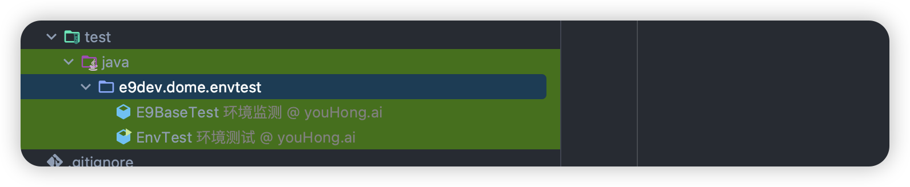


```
package e9dev.dome.envtest;

import com.alibaba.fastjson.JSON;
import org.junit.Before;
import weaver.general.GCONST;
import weaver.hrm.User;

/**
 * <h1>环境检测</h1>
 * </br>
 * <p>create: 2023/12/22 11:22</p>
 *
 * <p></p>
 *
 */
public class E9BaseTest {
 public static void main(String[] args) {
 // 设置服务名称，这里的名称也可以理解为数据源，默认是ecology
 GCONST.setServerName("ecology");
 // 设置根路径，这里设置的是服务的路径地址，如果没有吧WEB-INF文件放到项目中，则这里可以填写实际的ecology的路径地址
 GCONST.setRootPath("/Users/aoey.oct.22/code/dome/e9-dev-demo/src/main/resources/WEB-INF");
 User user = new User(1);
 System.out.println(JSON.toJSONString(user));
 }
 /**
 * ************************************************************
 * <h2>针对后期使用单元测试，我们可以将路径地址写到before中这样就不用每次都重新设置和编写了</h2>
 * <i>2023/12/22 11:37</i>
 *
 * ************************************************************
 */

 @Before
 public void before(){

 // 设置服务名称，这里的名称也可以理解为数据源，默认是ecology
 GCONST.setServerName("ecology");
 // 设置根路径，这里设置的是服务的路径地址，如果没有吧WEB-INF文件放到项目中，则这里可以填写实际的ecology的路径地址
 GCONST.setRootPath("/Users/aoey.oct.22/code/dome/e9-dev-demo/src/main/resources/WEB-INF/");
 }
}

```
程序运行结果当前 user 为系统管理员则表示环境搭建成功，这里推荐使用 debug 查看 user，控制台日志输出太多，不容易找到

 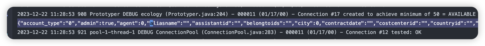

 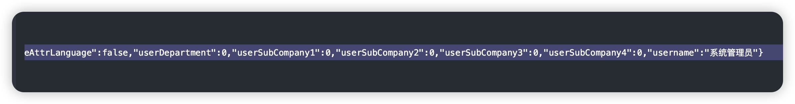

 ## 思考


- 如何使用单元测试？
- 如何添加一个第三方 jar 包？
- 如果运行报错某个 properties 找不到，如何解决？
- 如何知晓当前项目使用的数据库信息？
- 每个单元测试类都需要添加 public void before()方法吗？

 ## 常见问题与调试技巧

 ### Resin 配置要点

修改 `Resin/conf/resin.xml`：

- 添加 `-g` 编译参数，使 debug 时可以看到变量值
- 指定 ecology 根路径
- 修改 java 编译器路径

修改 `Resin/conf/app-default.xml`：

- 添加 `source="src"` 表示源码来自 `ecology/src` 目录
- 设置 `path="classbean"` 表示编译后 class 文件输出目录

修改 `Resin/conf/resin.properties`：

- 修改 OA 默认发布端口（如 8080）

> **注意**：要注释掉 resin 自带的编译器配置，否则会导致 JSP 无法编译。修改 `root-directory` 时需确保路径正确，否则会报 404。

### 启动报错排查

| 错误信息 | 原因 | 解决方案 |
|----------|------|---------|
| `Unsupported major.minor version 52.0` | JDK 版本不匹配 | 升级 JDK 到 1.8 |
| `ClassNotFoundException: com.caucho.loader.SystemClassLoader` | resin.jar 未在 classpath | 将 resin.jar 添加到环境变量 |
| 某个 properties 找不到 | 配置文件未引入 | 检查 `WEB-INF/prop` 目录下的配置文件是否全部引入 |
| 编译报错类找不到 | classbean 依赖缺失 | 确保 `classbean` 目录已正确打包为 jar 并引入 |

### SQL 日志监听

开启 SQL 监听可以追踪数据库操作，用于调试：

1. 编辑 `ecology/WEB-INF/prop/weaver_isSqlLog.properties` 开启监听
2. 日志输出位置：`ecology/sqllog/ecologysql`
3. 记录除 SELECT 之外的所有 SQL 操作

### WebService 安全白名单

如果接口被安全策略拦截，检查 `ecology/WEB-INF/securityXML/weaver_security_rules_for_ws.xml`：

```xml
<?xml version="1.0" encoding="UTF-8"?>
<root>
  <webservice-list>
    <webservice>/services/</webservice>
  </webservice-list>
  <webservice-ip-list>
    <ip>10.</ip>
    <ip>192.</ip>
    <ip>127.0.0.1</ip>
    <ip>localhost</ip>
  </webservice-ip-list>
</root>
```


---

# 数据库操作

 对系统做二开基本上都是需要与数据库进行交互的，所以要对系统开发，就一定要知道如何在 ecology 中使用代码操作数据库数据（`CRUD`），这一章就是对数据库操作做一个简单的说明和讲解

 ## 数据库表结构

 ecology 有很多表，这里对几个常用的表进行一定的讲解

 ### 用户表


> 用户表
hrmresource

 用户是 oa 系统中最重要的一个元素，在系统中存储用户的表为`hrmresource`表，表信息如下


| | | | | | | | | | |
| --- | --- | --- | --- | --- | --- | --- | --- | --- | --- |
| 序号 | 数据库列名 | 中文名称 | 数据类型 | 长度 | 是否允许空值 | 是否为外键 | 是否自增长 | 默认值 | 说明 |
| 1 | haschangepwd | 密码是否已经改过 | varchar2 | 80 | 是 | 否 | 否 | | 密码是否已经改过 |
| 2 | created | 创建时间 | timestamp(6) | 11 | 是 | 否 | 否 | | 创建时间 |
| 3 | creater | 创建人 id | integer | | 是 | 否 | 否 | | 创建人 id |
| 4 | modified | 修改时间 | timestamp(6) | 11 | 是 | 否 | 否 | | 修改时间 |
| 5 | modifier | 修改人 id | integer | | 是 | 否 | 否 | | 修改人 id |
| 6 | passwordlocktime | 密码锁定时间 | date | 7 | 是 | 否 | 否 | | 密码锁定时间 |
| 7 | salt | 加盐 | varchar2 | 800 | 是 | 否 | 否 | | 加盐 |
| 8 | mobilecaflag | 未知字段 | varchar2 | 80 | 是 | 否 | 否 | | 未知字段 |
| 9 | companystartdate | 公司开始日期 | char | 10 | 是 | 否 | 否 | | 公司开始日期 |
| 10 | companyworkyear | 公司年限 | number | (4,2) | 是 | 否 | 否 | | 公司年限 |
| 11 | workstartdate | 工作开始日期 | char | 10 | 是 | 否 | 否 | | 工作开始日期 |
| 12 | workyear | 工作年限 | number | (4,2) | 是 | 否 | 否 | | 工作年限 |
| 13 | secondarypwd | 第二密码 | varchar2 | 100 | 是 | 否 | 否 | | 第二密码 |
| 14 | usesecondarypwd | 使用第二密码 | integer | | 是 | 否 | 否 | | 使用第二密码 |
| 15 | usekind | 用工性质 | integer | | 是 | 否 | 否 | | 用工性质 |
| 16 | jobcall | 职称 | integer | | 是 | 否 | 否 | | 职称 |
| 17 | accumfundaccount | 公积金帐号 | varchar2 | 240 | 是 | 否 | 否 | | 公积金帐号 |
| 18 | birthplace | 出生地 | varchar2 | 480 | 是 | 否 | 否 | | 出生地 |
| 19 | folk | 民族 | varchar2 | 240 | 是 | 否 | 否 | | 民族 |
| 20 | residentphone | 居住地电话 | varchar2 | 480 | 是 | 否 | 否 | | 居住地电话 |
| 21 | residentpostcode | 居住地邮编 | varchar2 | 480 | 是 | 否 | 否 | | 居住地邮编 |
| 22 | extphone | 分机 | varchar2 | 400 | 是 | 否 | 否 | | 分机 |
| 23 | managerstr | 所有上级 | varchar2 | 1000 | 是 | 否 | 否 | | 所有上级 |
| 24 | status | 状态 | integer | | 是 | 否 | 否 | | 0：试用 1：正式 2：临时 3：试用延期 4：解聘 5：离职 6：退休 7：无效 |
| 25 | fax | 传真 | varchar2 | 480 | 是 | 否 | 否 | | 传真 |
| 26 | islabouunion | 是否为工会会员 | char | 1 | 是 | 否 | 否 | | 是否为工会会员 |
| 27 | weight | 体重 | integer | | 是 | 否 | 否 | | 体重 |
| 28 | tempresidentnumber | 暂住证号码 | varchar2 | 480 | 是 | 否 | 否 | | 暂住证号码 |
| 29 | probationenddate | 试用期结束日期 | char | 10 | 是 | 否 | 否 | | 试用期结束日期 |
| 30 | countryid | 国家 id | integer | | 是 | 否 | 否 | 1 | 国家 id |
| 31 | passwdchgdate | 密码改变日期 | char | 10 | 是 | 否 | 否 | | 密码改变日期 |
| 32 | needusb | 是否需要 usb | integer | | 是 | 否 | 否 | | 是否需要 usb |
| 33 | serial | usb 相关 | varchar2 | 256 | 是 | 否 | 否 | | usb 相关 |
| 34 | account | AD 域账号 | varchar2 | 60 | 是 | 否 | 否 | | AD 域账号 |
| 35 | lloginid | 上次系统账号 | varchar2 | 480 | 是 | 否 | 否 | | 上次系统账号 |
| 36 | needdynapass | 是否使用动态密码 | integer | | 是 | 否 | 否 | | 是否使用动态密码 |
| 37 | dsporder | 显示顺序 | float | 22 | 是 | 否 | 否 | | 显示顺序 |
| 38 | passwordstate | 动态密码状态 | integer | | 是 | 否 | 否 | | 0：启用，1：停止（默认），2：网段策略 |
| 39 | accounttype | 帐号类型 | integer | | 是 | 否 | 否 | | 0 或者为空:主账号,1:次账号 |
| 40 | belongto | 所属主帐号 | integer | | 是 | 否 | 否 | | hrmreource 表 id |
| 41 | dactylogram | 主指纹 | varchar2 | 4000 | 是 | 否 | 否 | | 主指纹 |
| 42 | assistantdactylogram | 次指纹 | varchar2 | 4000 | 是 | 否 | 否 | | 次指纹 |
| 43 | passwordlock | 密码锁定标记 | integer | | 是 | 否 | 否 | | 密码锁定标记 |
| 44 | sumpasswordwrong | 连续错误次数 | integer | | 是 | 否 | 否 | | 连续错误次数 |
| 45 | oldpassword1 | 旧密码 1 | varchar2 | 800 | 是 | 否 | 否 | | 旧密码 1 |
| 46 | oldpassword2 | 旧密码 2 | varchar2 | 800 | 是 | 否 | 否 | | 旧密码 2 |
| 47 | msgstyle | 未知字段 | varchar2 | 160 | 是 | 否 | 否 | | 未知字段 |
| 48 | messagerurl | 人员头像存储地址 | varchar2 | 800 | 是 | 否 | 否 | | 人员头像存储地址 |
| 49 | pinyinlastname | 人员姓名拼音首字母 | varchar2 | 50 | 是 | 否 | 否 | | 人员姓名拼音首字母 |
| 50 | tokenkey | 动态令牌序列号 | varchar2 | 800 | 是 | 否 | 否 | | 动态令牌序列号 |
| 51 | userusbtype | usb 类型 | varchar2 | 80 | 是 | 否 | 否 | | 1-微步 key 2-海泰 key 3-动态令牌 4-动态密码 |
| 52 | outkey | 外键与集成相关 | varchar2 | 800 | 是 | 否 | 否 | | 外键与集成相关 |
| 53 | adsjgs | ad 同步上级公司 | varchar2 | 1000 | 是 | 否 | 否 | | ad 同步上级公司 |
| 54 | adgs | ad 同步公司 | varchar2 | 1000 | 是 | 否 | 否 | | ad 同步公司 |
| 55 | adbm | ad 同步部门 | varchar2 | 1000 | 是 | 否 | 否 | | ad 同步部门 |
| 56 | mobileshowtype | 移动电话显示类型 | integer | | 是 | 否 | 否 | | 移动电话显示类型 |
| 57 | usbstate | usb 启用策略 | integer | | 是 | 否 | 否 | | 0-启用 1-禁用 2-网段策略 |
| 58 | totalspace | 未知字段 | float | 22 | 是 | 否 | 否 | 100 | 未知字段 |
| 59 | occupyspace | 未知字段 | float | 22 | 是 | 否 | 否 | 0 | 未知字段 |
| 60 | ecology_pinyin_search | 人员浏览按钮模糊搜索拼音首字母 | varchar2 | 1000 | 是 | 否 | 否 | | 人员浏览按钮模糊搜索拼音首字母 |
| 61 | isadaccount | 是否是 ad 账号 | char | 1 | 是 | 否 | 否 | | 是否是 ad 账号 |
| 62 | accountname | 工资账号户名 | varchar2 | 1000 | 是 | 否 | 否 | | 工资账号户名 |
| 63 | id | ID | integer | | 否 | 否 | 否 | | ID |
| 64 | loginid | 系统登陆帐号 | varchar2 | 60 | 是 | 否 | 否 | | 系统登陆帐号 |
| 65 | password | 系统登陆密码 | varchar2 | 800 | 是 | 否 | 否 | | 系统登陆密码 |
| 66 | lastname | 名 | varchar2 | 60 | 是 | 否 | 否 | | 名 |
| 67 | sex | 性别 | char | 1 | 是 | 否 | 否 | | 性别 |
| 68 | birthday | 生日 | char | 10 | 是 | 否 | 否 | | 生日 |
| 69 | nationality | 国籍 | integer | | 是 | 否 | 否 | | 国籍 |
| 70 | systemlanguage | 系统语言 | integer | | 是 | 否 | 否 | | 系统语言 |
| 71 | maritalstatus | 婚姻状况 | char | 1 | 是 | 否 | 否 | | 婚姻状况 |
| 72 | telephone | 电话 | varchar2 | 480 | 是 | 否 | 否 | | 电话 |
| 73 | mobile | 手机 | varchar2 | 480 | 是 | 否 | 否 | | 手机 |
| 74 | mobilecall | 其他电话 | varchar2 | 480 | 是 | 否 | 否 | | 其他电话 |
| 75 | email | 电子邮件 | varchar2 | 480 | 是 | 否 | 否 | | 电子邮件 |
| 76 | locationid | 工作地点 | integer | | 是 | 否 | 否 | | 工作地点 |
| 77 | workroom | 办公室 | varchar2 | 480 | 是 | 否 | 否 | | 办公室 |
| 78 | homeaddress | 家庭住址 | varchar2 | 800 | 是 | 否 | 否 | | 家庭住址 |
| 79 | resourcetype | 用户类别 | char | 1 | 是 | 否 | 否 | | 用户类别 |
| 80 | startdate | 合同开始日期 | char | 10 | 是 | 否 | 否 | | 合同开始日期 |
| 81 | enddate | 合同结束日期 | char | 10 | 是 | 否 | 否 | | 合同结束日期 |
| 82 | jobtitle | 岗位 | integer | | 是 | 否 | 否 | | 岗位 |
| 83 | jobactivitydesc | 职责描述 | varchar2 | 1000 | 是 | 否 | 否 | | 职责描述 |
| 84 | joblevel | 工作级别 | integer | | 是 | 否 | 否 | | 工作级别 |
| 85 | seclevel | 安全级别 | integer | | 是 | 否 | 否 | | 安全级别 |
| 86 | departmentid | 所属部门 | integer | | 是 | 否 | 否 | | 所属部门 |
| 87 | subcompanyid1 | 所属分部 1 | integer | | 是 | 否 | 否 | | 所属分部 1 |
| 88 | costcenterid | 所属成本中心 | integer | | 是 | 否 | 否 | | 所属成本中心 |
| 89 | managerid | 经理 | integer | | 是 | 否 | 否 | | 直接上级 |
| 90 | assistantid | 助理 | integer | | 是 | 否 | 否 | | 助理 |
| 91 | bankid1 | 工资银行 1 | integer | | 是 | 否 | 否 | | 工资银行 1 |
| 92 | accountid1 | 工资帐号 1 | varchar2 | 800 | 是 | 否 | 否 | | 工资帐号 1 |
| 93 | resourceimageid | 照片 id | integer | | 是 | 否 | 否 | | 人员的照片存放附件 id，和文档附件 imagefileid 表关联 |
| 94 | createrid | 创建人 id | integer | | 是 | 否 | 否 | | 创建人 id |
| 95 | createdate | 创建日期 | char | 10 | 是 | 否 | 否 | | 创建日期 |
| 96 | lastmodid | 最后修改人 id | integer | | 是 | 否 | 否 | | 最后修改人 id |
| 97 | lastmoddate | 最后修改日期 | char | 10 | 是 | 否 | 否 | | 最后修改日期 |
| 98 | lastlogindate | 最后登陆日期 | char | 10 | 是 | 否 | 否 | | 最后登陆日期 |
| 99 | datefield1 | 自定义日期 1 | varchar2 | 80 | 是 | 否 | 否 | | 自定义日期 1 |
| 100 | datefield2 | 自定义日期 2 | varchar2 | 80 | 是 | 否 | 否 | | 自定义日期 2 |
| 101 | datefield3 | 自定义日期 3 | varchar2 | 80 | 是 | 否 | 否 | | 自定义日期 3 |
| 102 | datefield4 | 自定义日期 4 | varchar2 | 80 | 是 | 否 | 否 | | 自定义日期 4 |
| 103 | datefield5 | 自定义日期 5 | varchar2 | 80 | 是 | 否 | 否 | | 自定义日期 5 |
| 104 | numberfield1 | 自定义数字 1 | float | 22 | 是 | 否 | 否 | | 自定义数字 1 |
| 105 | numberfield2 | 自定义数字 2 | float | 22 | 是 | 否 | 否 | | 自定义数字 2 |
| 106 | numberfield3 | 自定义数字 3 | float | 22 | 是 | 否 | 否 | | 自定义数字 3 |
| 107 | numberfield4 | 自定义数字 4 | float | 22 | 是 | 否 | 否 | | 自定义数字 4 |
| 108 | numberfield5 | 自定义数字 5 | float | 22 | 是 | 否 | 否 | | 自定义数字 5 |
| 109 | textfield1 | 自定义文本 1 | varchar2 | 800 | 是 | 否 | 否 | | 自定义文本 1 |
| 110 | textfield2 | 自定义文本 2 | varchar2 | 800 | 是 | 否 | 否 | | 自定义文本 2 |
| 111 | textfield3 | 自定义文本 3 | varchar2 | 800 | 是 | 否 | 否 | | 自定义文本 3 |
| 112 | textfield4 | 自定义文本 4 | varchar2 | 800 | 是 | 否 | 否 | | 自定义文本 4 |
| 113 | textfield5 | 自定义文本 5 | varchar2 | 800 | 是 | 否 | 否 | | 自定义文本 5 |
| 114 | tinyintfield1 | 自定义判断 1 | integer | | 是 | 否 | 否 | | 自定义判断 1 |
| 115 | tinyintfield2 | 自定义判断 2 | integer | | 是 | 否 | 否 | | 自定义判断 2 |
| 116 | tinyintfield3 | 自定义判断 3 | integer | | 是 | 否 | 否 | | 自定义判断 3 |
| 117 | tinyintfield4 | 自定义判断 4 | integer | | 是 | 否 | 否 | | 自定义判断 4 |
| 118 | tinyintfield5 | 自定义判断 5 | integer | | 是 | 否 | 否 | | 自定义判断 5 |
| 119 | certificatenum | 身份证号码 | varchar2 | 480 | 是 | 否 | 否 | | 身份证号码 |
| 120 | nativeplace | 籍贯 | varchar2 | 800 | 是 | 否 | 否 | | 籍贯 |
| 121 | educationlevel | 学历 | integer | | 是 | 否 | 否 | | 学历 |
| 122 | bememberdate | 入团时间 | char | 10 | 是 | 否 | 否 | | 入团时间 |
| 123 | bepartydate | 入党时间 | char | 10 | 是 | 否 | 否 | | 入党时间 |
| 124 | workcode | 编号 | varchar2 | 480 | 是 | 否 | 否 | | 编号 |
| 125 | regresidentplace | 户口 | varchar2 | 1000 | 是 | 否 | 否 | | 户口 |
| 126 | healthinfo | 健康状况 | char | 1 | 是 | 否 | 否 | | 健康状况 |
| 127 | residentplace | 居住地 | varchar2 | 1000 | 是 | 否 | 否 | | 居住地 |
| 128 | policy | 政治面貌 | varchar2 | 240 | 是 | 否 | 否 | | 政治面貌 |
| 129 | degree | 学位 | varchar2 | 240 | 是 | 否 | 否 | | 学位 |
| 130 | height | 身高 | varchar2 | 80 | 是 | 否 | 否 | | 身高 |
 ### 流程基本信息表


> 流程类型表 （工作流基本信息表）
workflow_base


| 序号 | 数据库列名 | 中文名称 | 数据类型 | 长度 | 是否允许空值 | 是否为外键 | 是否自增长 | 默认值 | 说明 |
| --- | --- | --- | --- | --- | --- | --- | --- | --- | --- |
| 1 | isshowsrc | 显示意见来源 | varchar2 | 8 | 是 | 否 | 否 | | |
| 2 | sendtomessagetype | 消息类型 | char | 1 | 是 | 否 | 否 | | |
| 3 | islockworkflow | 流程锁定 | char | 1 | 是 | 否 | 否 | | |
| 4 | limitvalue | 限制附件上传格式 | varchar2 | 2000 | 是 | 否 | 否 | | |
| 5 | locknodes | 流程编辑锁定 | varchar2 | 2000 | 是 | 否 | 否 | | |
| 6 | tracefieldid | 痕迹正文字段 | integer | | 是 | 否 | 否 | | |
| 7 | tracesavesecid | 痕迹正文保存目录 | integer | | 是 | 否 | 否 | | |
| 8 | tracecategorytype | 痕迹正文保存目录类型 | char | 1 | 是 | 否 | 否 | | |
| 9 | tracecategoryfieldid | 痕迹正文保存目录字段 ID | integer | | 是 | 否 | 否 | | |
| 10 | tracedocownertype | 痕迹正文所有者类型 | integer | | 是 | 否 | 否 | | |
| 11 | tracedocownerfieldid | 痕迹正文所有者字段 | integer | | 是 | 否 | 否 | | |
| 12 | tracedocowner | 痕迹正文所有者 | integer | | 是 | 否 | 否 | | |
| 13 | titletemplate | 标题模版 | clob | 4000 | 是 | 否 | 否 | | |
| 14 | freewftype | 自由流程的模式 | char | 1 | 是 | 否 | 否 | | 1：简易模式，2：高级模式 |
| 15 | titleset | 自定义模式 | char | 1 | 是 | 否 | 否 | | 0 或空为默认模式 |
| 16 | isautoremark | 自动填写户最后一次手动操作的意见 | char | 1 | 是 | 否 | 否 | | |
| 17 | importreadonlyfield | 允许导入数据到只读字段 | char | 1 | 是 | 否 | 否 | | 1：是　其他：否 |
| 18 | enablesignature | test | char | 1 | 是 | 否 | 否 | | |
| 19 | issmsremind | 是否开启短信提醒 | char | 1 | 是 | 否 | 否 | | |
| 20 | iswechatremind | 是否开启微信提醒 | char | 1 | 是 | 否 | 否 | | |
| 21 | isemailremind | 是否开启邮件提醒 | char | 1 | 是 | 否 | 否 | | |
| 22 | isdefaultsmsremind | 短信默认提醒 | char | 1 | 是 | 否 | 否 | | |
| 23 | isdefaultwechatremind | 微信默认提醒 | char | 1 | 是 | 否 | 否 | | |
| 24 | isdefaultemailremind | 邮件默认提醒 | char | 1 | 是 | 否 | 否 | | |
| 25 | isarchivenoremind | 归档节点不需提醒 | char | 1 | 是 | 否 | 否 | | |
| 26 | isccnoremind | 抄送人不需提醒 | char | 1 | 是 | 否 | 否 | | |
| 27 | ischosereminder | 由操作者选择提醒接收人 | char | 1 | 是 | 否 | 否 | | |
| 28 | alterremindnodestype | 允许修改提醒的节点类型 | char | 1 | 是 | 否 | 否 | | 0：全部，1：选择 |
| 29 | alterremindnodes | 选择提醒的节点 id，用“,”间隔 | varchar2 | 1000 | 是 | 否 | 否 | | |
| 30 | submittype | 批量提交启用节点 | integer | | 是 | 否 | 否 | | 0:全部,1:选择 2：排除 |
| 31 | hrmconditionshowtype | 人力资源条件显示设置 | char | 1 | 是 | 否 | 否 | | |
| 32 | defaultnameruletype | 标题设置规则 | char | 1 | 是 | 否 | 否 | 0 | |
| 33 | isreaffirm | test | char | 1 | 是 | 否 | 否 | 0 | |
| 34 | isonlyoneautoapprove | 仅当后续节点操作者为本人一人时自动处理 | char | 1 | 是 | 否 | 否 | | |
| 35 | isopencommunication | 是否启用相关交流 | integer | | 是 | 否 | 否 | | |
| 36 | isselectrejectnode | 退回时是否可选择退回节点 | char | 1 | 是 | 否 | 否 | | |
| 37 | forbidattdownload | 禁止附件批量下载 | integer | | 是 | 否 | 否 | 0 | |
| 38 | isimportdetail | 是否导入明细 | char | 1 | 是 | 否 | 否 | | |
| 39 | specialapproval | 是否特批件 | char | 1 | 是 | 否 | 否 | | 1:是,0 或其他:否 |
| 40 | frequency | 次数 | integer | | 是 | 否 | 否 | | |
| 41 | cycle | 周期 | char | 1 | 是 | 否 | 否 | | |
| 42 | nosynfields | 不需同步字段 | varchar2 | 2000 | 是 | 否 | 否 | | |
| 43 | isneeddelacc | 设置是否流程删除时相关的附件 | varchar2 | 8 | 是 | 否 | 否 | | |
| 44 | sapsource | sap 数据源 | varchar2 | 160 | 是 | 否 | 否 | | |
| 45 | isfnacontrol | 是否需要预算控制 | char | 1 | 是 | 否 | 否 | | |
| 46 | fnanodeid | 预算节点 id | varchar2 | 4000 | 是 | 否 | 否 | | |
| 47 | fnadepartmentid | 预算部门 id | varchar2 | 4000 | 是 | 否 | 否 | | |
| 48 | smsalertstype | 设置短信提醒方式 | char | 1 | 是 | 否 | 否 | | |
| 49 | forwardreceivedef | 转发接收定义 | char | 1 | 是 | 否 | 否 | | |
| 50 | issavecheckform | 流程保存是否验证必填 | char | 1 | 是 | 否 | 否 | | 0：否 1：是 |
| 51 | archivenomsgalert | 归档节点不需短信提醒 | char | 1 | 是 | 否 | 否 | | 0：否 1：是 流程提醒改造前使用字段， |
| 52 | archivenomailalert | 归档节点不需邮件提醒 | char | 1 | 是 | 否 | 否 | | 0：否 1：是 流程提醒改造前使用字段， |
| 53 | isfnabudgetwf | 是否是费控流程 | char | 1 | 是 | 否 | 否 | | |
| 54 | chatstype | 是否微信提醒 | integer | | 是 | 否 | 否 | | 流程提醒改造前使用字段， |
| 55 | chatsalerttype | 微信提醒类型 | integer | | 是 | 否 | 否 | | 流程提醒改造前使用字段， |
| 56 | notremindifarchived | 归档节点不需微信提醒 | integer | | 是 | 否 | 否 | | 流程提醒改造前使用字段， |
| 57 | isworkflowdoc | 是否是公文流程 | integer | | 是 | 否 | 否 | | |
| 58 | version | 版本号 | integer | | 是 | 否 | 否 | | |
| 59 | activeversionid | 当前流程所属活动版本 id | integer | | 是 | 否 | 否 | | |
| 60 | versiondescription | 版本介绍 | varchar2 | 1000 | 是 | 否 | 否 | | |
| 61 | versioncreater | 版本创建人 | integer | | 是 | 否 | 否 | | |
| dsporder | 显示顺序 | integer | | 是 | 否 | 否 | | | |
| 63 | fieldnotimport | 无需导入字段 | varchar2 | 4000 | 是 | 否 | 否 | | |
| 64 | isfree | 是否是自由流程 | char | 1 | 是 | 否 | 否 | 0 | |
| 65 | ecology_pinyin_search | 流程名称拼音缩写-用于快速搜索 | varchar2 | 1000 | 是 | 否 | 否 | | |
| 66 | officaltype | 公文类型 | integer | | 是 | 否 | 否 | | |
| 67 | custompage4emoble | 手机版用自定义页面 | varchar2 | 2000 | 是 | 否 | 否 | | |
| 68 | isupdatetitle | 是否修改过流程标题字段 | integer | | 是 | 否 | 否 | 1 | 0 或者空：未修改过流程标题字段 1：修改了流程标题字段 |
| 69 | isshared | 是否允许共享 | char | 1 | 是 | 否 | 否 | | |
| 70 | isoverrb | 归档收回 | char | 1 | 是 | 否 | 否 | | |
| 71 | isoveriv | 归档干预 | char | 1 | 是 | 否 | 否 | | |
| 72 | showcharturl | 显示流程图 | varchar2 | 4000 | 是 | 否 | 否 | | |
| 73 | isautoapprove | 自动批准 | char | 1 | 是 | 否 | 否 | | |
| 74 | isautocommit | 自动提交 | char | 1 | 是 | 否 | 否 | | |
| 75 | id | ID | integer | | 否 | 否 | 否 | | |
| 76 | workflowname | 工作流名称 | varchar2 | 1000 | 是 | 否 | 否 | | |
| 77 | workflowdesc | 工作流描述 | varchar2 | 1000 | 是 | 否 | 否 | | |
| 78 | workflowtype | 所属工作流种类 | integer | | 是 | 否 | 否 | | |
| 79 | securelevel | 安全级别 | varchar2 | 24 | 是 | 否 | 否 | | |
| 80 | formid | 表单或单据 id | integer | | 是 | 否 | 否 | | |
| 81 | userid | 创建人 id | integer | | 是 | 否 | 否 | | |
| 82 | isbill | 单据还是表单 | char | 1 | 是 | 否 | 否 | | 0：表单 1：单据 |
| 83 | iscust | 是否为门户工作流 | integer | | 是 | 否 | 否 | | 0：否 1：是 |
| 84 | helpdocid | 工作流帮助文档 id | integer | | 是 | 否 | 否 | | |
| 85 | isvalid | 是否有效 | char | 1 | 是 | 否 | 否 | | 0：否 1：是 |
| 86 | needmark | 是否需要编号 | char | 1 | 是 | 否 | 否 | | 0：否 1：是 |
| 87 | messagetype | 否短信提醒 | integer | | 是 | 否 | 否 | | 0：否 1：是 |
| 88 | multisubmit | 是否批量提交 | integer | | 是 | 否 | 否 | | 0：否 1：是 |
| 89 | defaultname | 是否默认说明 | integer | | 是 | 否 | 否 | | 0：否 1：是 |
| 90 | docpath | 附件上传目录名称 | varchar2 | 2000 | 是 | 否 | 否 | | |
| 91 | subcompanyid | 分部 id | integer | | 是 | 否 | 否 | | |
| 92 | mailmessagetype | 是否邮件提醒 | integer | | 是 | 否 | 否 | | 0：否 1：是 |
| 93 | docrightbyoperator | 是否跟随文档关联 | integer | | 是 | 否 | 否 | | 0：否 1：是 |
| 94 | doccategory | 附件上传目录 id | varchar2 | 1000 | 是 | 否 | 否 | | |
| 95 | istemplate | 是否为流程模板 | char | 1 | 是 | 否 | 否 | | 0：否 1：是 |
| 96 | templateid | 流程引用模板 id | integer | | 是 | 否 | 否 | | |
| 97 | catelogtype | 附件上传目录类型 | integer | | 是 | 否 | 否 | | 0：固定目录 1：选择目录 |
| 98 | selectedcatelog | 所选择目录的对应的 id | integer | | 是 | 否 | 否 | | |
| 99 | docrightbyhrmresource | 是否按人力资源字段附权 | integer | | 是 | 否 | 否 | | 默认为不启用 |
| 100 | needaffirmance | 是否需要提交确认 | char | 1 | 是 | 否 | 否 | | 0：否 1：是 |
| 101 | isremarks | 是否允许已办及办结事宜转发 | char | 1 | 是 | 否 | 否 | | |
| 102 | isannexupload | 是否允许签字意见上传附件 | char | 1 | 是 | 否 | 否 | | |
| 103 | annexdoccategory | 流程签字意见附件文档目录 | varchar2 | 1000 | 是 | 否 | 否 | | |
| 104 | isshowonreportinput | 是否数据中心输入表 | char | 1 | 是 | 否 | 否 | 0 | 0：否 1：是 |
| 105 | titlefieldid | 标题字段 id | integer | | 是 | 否 | 否 | | |
| 106 | keywordfieldid | 主题词字段 id | integer | | 是 | 否 | 否 | | |
| 107 | isshowchart | 提交流程后是否显示流程图 | char | 1 | 是 | 否 | 否 | | 0：否 1：是 |
| 108 | orderbytype | 流程审批意见显示顺序 | char | 1 | 是 | 否 | 否 | | 1：倒序；2：正序 |
| 109 | istridiffworkflow | 是否触发不同流程 | char | 1 | 是 | 否 | 否 | | 0：否 1：是 |
| 110 | ismodifylog | 是否记录表单修改日志 | char | 1 | 是 | 否 | 否 | 0 | 0：否 1：是 |
| 111 | ifversion | 是否保留正文版本 | char | 1 | 是 | 否 | 否 | | 0：否 1：是 |
| 112 | wfdocpath | 流程保存为文档的路径 | varchar2 | 800 | 是 | 否 | 否 | | |
| 113 | wfdocowner | 流程保存?槲?n 的所有者 | varchar2 | 800 | 是 | 否 | 否 | | |
| 114 | isedit | 是否正在图形化编辑 | char | 1 | 是 | 否 | 否 | | |
| 115 | editor | 当前编辑人 | integer | | 是 | 否 | 否 | | |
| 116 | editdate | 编辑日期 | char | 10 | 是 | 否 | 否 | | |
| 117 | edittime | 编辑时间 | char | 8 | 是 | 否 | 否 | | |
| 118 | showdelbuttonbyreject | 退回创建节点是否可删除 | char | 1 | 是 | 否 | 否 | | 0：否 1：是 |
| 119 | showuploadtab | 是否显示上传附件 tab | char | 1 | 是 | 否 | 否 | | 0：否 1：是 |
| 120 | issigndoc | 是否允许签字意见关联文档 | char | 1 | 是 | 否 | 否 | | 0：否 1：是 |
| 121 | showdoctab | 是否显示相关文档 tab | char | 1 | 是 | 否 | 否 | | 0：否 1：是 |
| 122 | issignworkflow | 是否允许签字意见关联流程 | char | 1 | 是 | 否 | 否 | | 0：否 1：是 |
| 123 | showworkflowtab | 是否显示相关流程 tab | char | 1 | 是 | 否 | 否 | | 0：否 1：是 |
| 124 | candelacc | 是否允许删除附件 | char | 1 | 是 | 否 | 否 | | 0：否 1：是 |
| 125 | isforwardrights | 是否允许转发人设置被转发人权限 | char | 1 | 是 | 否 | 否 | | 0：否 1：是 |
| 126 | isimportwf | 新建时是否可导入流程 | char | 1 | 是 | 否 | 否 | | 0：否 1：是 |
| 127 | isrejectremind | 退回是否提醒的 | char | 1 | 是 | 否 | 否 | | 0：否 1：是 |
| 128 | ischangrejectnode | 退回人是否可设置提醒节点 | char | 1 | 是 | 否 | 否 | | 0：否 1：是 |
| 129 | wfdocownertype | 流程存为文档的文档所有者取值类型 | integer | | 是 | 否 | 否 | | 1、指定人 2、取流程表单字段的值 |
| 130 | wfdocownerfieldid | 流程存为文档的文档所有者 | integer | | 是 | 否 | 否 | | 如果取值与流程表单字段的值，指定字段 id |
| 131 | newdocpath | 流程中多文档字段 | varchar2 | 1000 | 是 | 否 | 否 | | 直接新建文档是可根据该属性指定的目录，直接到文档创建目录（格式主目录 id/分目录 id/子目录 id） |
| 132 | keepsign | 保持签字意见 | integer | | 是 | 否 | 否 | | |
| 133 | seccategoryid | 子目录 id | integer | | 是 | 否 | 否 | | |
| 134 | custompage | 自定义页面 | varchar2 | 2000 | 是 | 否 | 否 | | |
| 135 | issignview | 是否允许查看先关流程签字意见 | integer | | 是 | 否 | 否 | | |
| 136 | cus_titletemplate | 列表显示标题-自定义格式 | clob | | 是 | 否 | 否 | | |
| 137 | reqLevelColorJson | 紧急程度-颜色代码信息 | varchar2 | 2000 | 是 | 否 | 否 | | |
| 138 | docfiles | 流程存为文档，需要的附件 | varchar2 | 10 | 是 | 否 | 否 | | 1、在线 html 2、离线 html 3、pdf |
 ### 流程请求表


> 流程请求表

 workflow_requestbase


| 序号 | 数据库列名 | 中文名称 | 数据类型 | 长度 | 是否允许空值 | 是否为外键 | 是否自增长 | 默认值 | 说明 |
| --- | --- | --- | --- | --- | --- | --- | --- | --- | --- |
| 1 | totalgroups | 总共需要的操作者组数 | integer | | 是 | 否 | 否 | | |
| 2 | requestname | 请求名称 | varchar2 | 1000 | 是 | 否 | 否 | | |
| 3 | creater | 创建人 | integer | | 是 | 否 | 否 | | |
| 4 | createdate | 创建日期 | char | 10 | 是 | 否 | 否 | | |
| 5 | createtime | 创建时间 | char | 8 | 是 | 否 | 否 | | |
| 6 | lastoperator | 最后操作者 id | integer | | 是 | 否 | 否 | | |
| 7 | lastoperatedate | 最后操作日期 | char | 10 | 是 | 否 | 否 | | |
| 8 | lastoperatetime | 最后操作时间 | char | 8 | 是 | 否 | 否 | | |
| 9 | deleted | 是否删除 | integer | | 是 | 否 | 否 | 0 | 0：是 |
| 10 | creatertype | 创建人类型 | integer | | 是 | 否 | 否 | 0 | 1：人力资源，2：客户 |
| 11 | lastoperatortype | 最后操作者类型 | integer | | 是 | 否 | 否 | 0 | 1：人力资源，2：客户 |
| 12 | nodepasstime | 节点超时时间 | float | 22 | 是 | 否 | 否 | -1 | 小时 |
| 13 | nodelefttime | 节点处理剩余时间 | float | 22 | 是 | 否 | 否 | -1 | 小时 |
| 14 | docids | 相关文档 | varchar2 | 4000 | 是 | 否 | 否 | | |
| 15 | crmids | 相关客户 | varchar2 | 4000 | 是 | 否 | 否 | | |
| 16 | hrmids_temp | temp | varchar2 | 4000 | 是 | 否 | 否 | | |
| 17 | prjids | 相关项目 | varchar2 | 4000 | 是 | 否 | 否 | | |
| 18 | cptids | 相关资产 | varchar2 | 4000 | 是 | 否 | 否 | | |
| 19 | requestlevel | 请求级别 | integer | | 是 | 否 | 否 | 0 | 0：正常 1：重要 2：紧急 |
| 20 | requestmark | 请求说明 | varchar2 | 800 | 是 | 否 | 否 | | |
| 21 | messagetype | 消息提醒 | integer | | 是 | 否 | 否 | | |
| 22 | mainrequestid | 主流程的请求 id | integer | | 是 | 否 | 否 | | |
| 23 | currentstatus | 保存流程暂停、撤销时流程状态 | integer | | 是 | 否 | 否 | | 0 为暂停，1 为撤销 |
| 24 | laststatus | 用于保存流程暂停、撤销时，流程 status 的值 | varchar2 | 480 | 是 | 否 | 否 | | |
| 25 | ismultiprint | 是否已批量打印 | integer | | 是 | 否 | 否 | 0 | 1：已经批量打印，0 或其他：未批量打印 |
| 26 | chatstype | 微信提醒 | integer | | 是 | 否 | 否 | | |
| 27 | ecology_pinyin_search | ecology*拼音*搜索 | varchar2 | 1000 | 是 | 否 | 否 | | |
| 28 | hrmids | 相关人力资源 | clob | 4000 | 是 | 否 | 否 | | |
| 29 | requestnamenew | 带标题字段的请求标题 | varchar2 | 4000 | 是 | 否 | 否 | | |
| 30 | formsignaturemd5 | 表单数据串加密字段 | varchar2 | 1000 | 是 | 否 | 否 | | |
| 31 | dataaggregated | 子流程是否归档汇总状态 | char | 1 | 是 | 否 | 否 | | |
| 32 | requestid | 请求 id | integer | | 否 | 否 | 否 | | |
| 33 | workflowid | 工作流 id | integer | | 是 | 否 | 否 | | |
| 34 | lastnodeid | 最后操作节点 id | integer | | 是 | 否 | 否 | | |
| 35 | lastnodetype | 最后操作节点类型 | char | 1 | 是 | 否 | 否 | | |
| 36 | currentnodeid | 当前节点 id | integer | | 是 | 否 | 否 | | |
| 37 | currentnodetype | 当前节点类型 | char | 1 | 是 | 否 | 否 | | 0：创建，1：批准，2：提交，3：归档 |
| 38 | status | 请求状态 | varchar2 | 500 | 是 | 否 | 否 | | |
| 39 | passedgroups | 已经通过的操作者组数 | integer | | 是 | 否 | 否 | | |
| 40 | seclevel | 流程密级 | varchar2 | 1 | 是 | 否 | 否 | | 对应人力资源 ResourceClassification 表中的 secLevel |
| 41 | remindTypes | 流程提醒方式 | varchar2 | 40 | 是 | 否 | 否 | | 0：短信提醒；2：邮件提醒， |
 ### 流程表单表


> 流程表单表

 workflow_bill


| 序号 | 数据库列名 | 中文名称 | 数据类型 | 长度 | 是否允许空值 | 是否为外键 | 是否自增长 | 默认值 | 说明 |
| --- | --- | --- | --- | --- | --- | --- | --- | --- | --- |
| 1 | clazz | 系统单据继承类 | varchar2 | 800 | 是 | 否 | 否 | | |
| 2 | id | ID | integer | | 否 | 否 | 否 | | |
| 3 | namelabel | 单据显示名称 | integer | | 是 | 否 | 否 | | |
| 4 | tablename | 对应的主表名称 | varchar2 | 480 | 是 | 否 | 否 | | |
| 5 | createpage | 创建请求页面 url | varchar2 | 1000 | 是 | 否 | 否 | | |
| 6 | managepage | 管理请求页面 url | varchar2 | 1000 | 是 | 否 | 否 | | |
| 7 | viewpage | 查看请求页面 url | varchar2 | 1000 | 是 | 否 | 否 | | |
| 8 | detailtablename | 对应的从表名称 | varchar2 | 480 | 是 | 否 | 否 | | |
| 9 | detailkeyfield | 从表链接主表的关键字 | varchar2 | 480 | 是 | 否 | 否 | | |
| 10 | operationpage | 后台处理请求页面 url | varchar2 | 1000 | 是 | 否 | 否 | | |
| 11 | hasfileup | 已有文件上传 | char | 1 | 是 | 否 | 否 | | |
| 12 | invalid | 无效标志 | integer | | 是 | 否 | 否 | | |
| 13 | formdes | 表单描述 | varchar2 | 1000 | 是 | 否 | 否 | | |
| 14 | subcompanyid | 子公司 id | integer | | 是 | 否 | 否 | | |
| 15 | dsporder | 显示顺序 | float | 22 | 是 | 否 | 否 | | |
| 16 | subcompanyid3 | 子公司 id3 | integer | | 是 | 否 | 否 | | |
| 17 | from*module* | 表单模块 | varchar2 | 80 | 是 | 否 | 否 | | |
 ### 工作流请求节点操作人信息表


> 工作流请求节点操作人信息表

 workflow_currentoperator


| 序号 | 数据库列名 | 中文名称 | 数据类型 | 长度 | 是否允许空值 | 是否为外键 | 是否自增长 | 默认值 | 说明 |
| --- | --- | --- | --- | --- | --- | --- | --- | --- | --- |
| 1 | isprocessing | 流程异步处理状态 | char | 1 | 是 | 否 | 否 | | |
| 2 | processuser | 实际操作人 | integer | | 是 | 否 | 否 | | |
| 3 | autodate | 无 | varchar2 | 1000 | 是 | 否 | 否 | | |
| 4 | autodatetime | 无 | varchar2 | 1000 | 是 | 否 | 否 | | |
| 5 | isbereject | 是否退回 | char | 1 | 是 | 否 | 否 | | |
| 6 | isreject | 是否为退回前的节点操作人 | char | 1 | 是 | 否 | 否 | | 用于分叉流转日志显示（1：是，0 或其它：否） |
| 7 | needwfback | 需反馈 | char | 1 | 是 | 否 | 否 | | |
| 8 | lastisremark | 用于保存流程暂停、撤销时，流程操作者 isremark 的值 | char | 1 | 是 | 否 | 否 | | |
| 9 | isreminded_csh | 是否超时后提醒 | char | 1 | 是 | 否 | 否 | | |
| 10 | wfreminduser_csh | 流程超时后提醒用户 | varchar2 | 4000 | 是 | 否 | 否 | | |
| 11 | wfusertypes_csh | 超时后的流程用户类型 | varchar2 | 4000 | 是 | 否 | 否 | | |
| 12 | handleforwardid | 用于保存流程转办记录 id | integer | | 是 | 否 | 否 | | |
| 13 | takisremark | 用于记录意见征询标识 | integer | | 是 | 否 | 否 | | 2：是意见征询接收人 -2：是未回复前意见征询人状态 0：是回复后意见征询人状态 |
| 14 | lastreminddatetime | 用于记录上一次超时提醒的时间 | varchar2 | 4000 | 是 | 否 | 否 | | 格式： id_yyyy-mm-dd hh24:mi:ss 多个之间用半角逗号隔开 id 为 workflow_nodelinkovertime 表 id |
| 15 | requestid | 请求 id | integer | | 否 | 否 | 否 | | |
| 16 | userid | 用户 id | integer | | 是 | 否 | 否 | | |
| 17 | groupid | 赋予每个操作人的标示，但是非会签会都一样是同一个值 | integer | | 是 | 否 | 否 | | |
| 18 | workflowid | 工作流 id | integer | | 是 | 否 | 否 | | |
| 19 | workflowtype | 工作流类型 | integer | | 是 | 否 | 否 | | |
| 20 | isremark | 操作类型 | char | 1 | 是 | 否 | 否 | | 0：未操作 1：转发 2：已操作 4：归档 5：超时 8：抄送(不需提交) 9：抄送(需提交) a: 意见征询 b: 回复 h: 转办 j: 转办提交 11:传阅 |
| 21 | usertype | 用户类型 | integer | | 是 | 否 | 否 | | 1、人力资源 2、客户 |
| 22 | nodeid | 操作节点 id | integer | | 是 | 否 | 否 | | |
| 23 | agentorbyagentid | 代理记录 | integer | | 是 | 否 | 否 | | 当前记录为被代理人记录时，显示代理人的 id； 当前记录为代理人记录时，显示被代理人的 id； 没有代理为-1 |
| 24 | agenttype | 代理操作 | char | 1 | 是 | 否 | 否 | | 0：没有代理 1：当前记录是被代理人记录(isremak=2 或=4)； 2：当前记录是代理人记录（isremak 值取决于代理人是否已经操作） |
| 25 | showorder | 操作人的显示顺序 | integer | | 是 | 否 | 否 | | 从 0 开始 |
| 26 | receivedate | 接收到的日期 | char | 10 | 是 | 否 | 否 | | |
| 27 | receivetime | 接收到的时间 | char | 8 | 是 | 否 | 否 | | |
| 28 | viewtype | 查看标志 | integer | | 是 | 否 | 否 | | 0：接收到流程且未查看过，显示红色 new 标记； -1：查看过流程后又有新的未查看回复，显示黄色 new 标记； -2：已查看过流程，不显示任何 new 标记； |
| 29 | iscomplete | 标记流程是否归档 | integer | | 是 | 否 | 否 | | 0:未归档，1:归档 |
| 30 | islasttimes | 操作人最后一次操作记录 | integer | | 是 | 否 | 否 | | 0：操作人在流程中多次出现，且本条记录不是操作人最后一次操作所用的纪录； 1：操作人在流程中出现一次；或操作人在流程中多次出现，且本条记录是操作人最后一次操作所用的纪录； |
| 31 | id | 自增长 id 字段 | integer | | 否 | 否 | 否 | | |
| 32 | operatedate | 操作日期 | char | 10 | 是 | 否 | 否 | | 未查看时为空； 查看后记录第一次查看时间； 操作后记录操作时间； |
| 33 | operatetime | 操作时间 | char | 8 | 是 | 否 | 否 | | 未查看时为空； 查看后记录第一次查看时间； 操作后记录操作时间； |
| 34 | groupdetailid | 节点操作组里的操作人条件 id | integer | | 是 | 否 | 否 | | |
| 35 | isreminded | 是否已经超时提醒过 | char | 1 | 是 | 否 | 否 | | 1、已经超时提醒 |
| 36 | isprocessed | 是否已经超时处理过 | char | 1 | 是 | 否 | 否 | | 1、自动流转 2：流转到指定对象 3：超时并未启用超时处理或自动流转失败 |
| 37 | wfreminduser | 工作流超时提醒人 | varchar2 | 1000 | 是 | 否 | 否 | | |
| 38 | wfusertypes | 工作流超时提醒人类型 | varchar2 | 800 | 是 | 否 | 否 | | |
| 39 | preisremark | 改变前的 isremark | char | 1 | 是 | 否 | 否 | | |
| 40 | overtime | 超时处理时间点 | varchar2 | | 否 | 否 | 否 | | |
| 41 | overworktime | 接收时间到超时处理时间点相隔多少工作时间 | varchar2 | | 否 | 否 | 否 | | |
| 42 | takId | 意见征询的记录 id | integer | | 否 | 否 | 否 | | |
| 43 | multiTakLevel | 意见征询层级 | integer | | 否 | 否 | 否 | | 0：一级征询， 1：二级征询，依次叠加 |
| 44 | isTakOut | 当前记录是否征询出去 | char | 1 | 否 | 否 | 否 | | 1：当前记录已征询出去 0：未征询出去 |
| 45 | isInMultiTak | 是否处于多级征询状态 | char | 1 | 否 | 否 | 否 | | 1：当前记录处于多级征询状态 0：未处于多级征询状态 |
 ### 工作流单据字段表


> 工作流单据字段表

 workflow_billfield


| 序号 | 数据库列名 | 中文名称 | 数据类型 | 长度 | 是否允许空值 | 是否为外键 | 是否自增长 | 默认值 | 说明 |
| --- | --- | --- | --- | --- | --- | --- | --- | --- | --- |
| 1 | fieldshowtypes | 显示类型 | integer | | 是 | 否 | 否 | | |
| 2 | id | ID | integer | | 否 | 否 | 否 | | |
| 3 | billid | 单据 id | integer | | 是 | 否 | 否 | | |
| 4 | fieldname | 数据库表字段名称 | varchar2 | 480 | 是 | 否 | 否 | | |
| 5 | fieldlabel | 字段显示名称 | integer | | 是 | 否 | 否 | | |
| 6 | fielddbtype | 单据字段数据库类型 | varchar2 | 320 | 是 | 否 | 否 | | |
| 7 | fieldhtmltype | 单据字段页面类型 | char | 1 | 是 | 否 | 否 | | 1：单行文本框 2：多行文本框 3：浏览按钮 4：check 框 5：选择框 |
| 8 | viewtype | 主表字段还是从表字段 | integer | | 是 | 否 | 否 | 0 | 0：主表 1：从表 |
| 9 | detailtable | 明细表 | varchar2 | 400 | 是 | 否 | 否 | | |
| 10 | fromuser | 用户表单 | char | 1 | 是 | 否 | 否 | 1 | |
| 11 | textheight | 文本高度 | integer | | 是 | 否 | 否 | | |
| 12 | dsporder | 显示顺序 | number | (15,2) | 是 | 否 | 否 | | |
| 13 | childfieldid | 子字段 id | integer | | 是 | 否 | 否 | | |
| 14 | imgheight | 图片高度 | integer | | 是 | 否 | 否 | (0) | |
| 15 | imgwidth | 图片宽度 | integer | | 是 | 否 | 否 | (0) | |
| 16 | places | 位置 | integer | | 是 | 否 | 否 | | |
| 17 | qfws | 小数位数 | varchar2 | 400 | 是 | 否 | 否 | | |
| 18 | textheight_2 | 文本高度_2 | varchar2 | 400 | 是 | 否 | 否 | | |
| 19 | selectitem | 选择条目 | integer | | 是 | 否 | 否 | | |
| 20 | linkfield | 连接字段 | integer | | 是 | 否 | 否 | | |
| 21 | selectitemtype | 公共选择框 | char | 1 | 是 | 否 | 否 | | |
| 22 | pubchoiceid | 公共选择框 ID | integer | | 是 | 否 | 否 | | |
| 23 | pubchilchoiceid | 公共选择框子项 ID | integer | | 是 | 否 | 否 | | |
| 24 | statelev | 选择框级数 | integer | | 是 | 否 | 否 | | |
| 25 | locatetype | 定位类型 | char | 1 | 是 | 否 | 否 | | 2：自动、1：手动 |
 ### 流程单据明细表


> 流程单据明细表

 workflow_billdetailtable


| 序号 | 数据库列名 | 中文名称 | 数据类型 | 长度 | 是否允许空值 | 是否为外键 | 是否自增长 | 默认值 | 说明 |
| --- | --- | --- | --- | --- | --- | --- | --- | --- | --- |
| 1 | id | ID | integer | | 否 | 否 | 否 | | |
| 2 | billid | 单号 id | integer | | 是 | 否 | 否 | | |
| 3 | tablename | 表名 | varchar2 | 400 | 是 | 否 | 否 | | |
| 4 | title | 标题 | varchar2 | 1000 | 是 | 否 | 否 | | |
| 5 | orderid | 排序 id | integer | | 是 | 否 | 否 | 0 | |
 其他表类型这里就不一一展示了

 ## java 代码操作数据库

 java 代码中操作数据库，有公司封装好的类，当然也可以使用 mybatis 等 orm 框架，但是使用公司封装好的类更加契合 ecology 系统，其中有一些加密解密以及一些多语言的解析信息，所以这里推荐使用公司封装的类，本文档也只对公司封装的类进行讲解

 ### 基础介绍

 操作数据的类


```
weaver.conn.RecordSet

```
`RecordSet`内部封装了`jdbc`，其中操作数据库方式与`jdbc`十分类似


```
weaver.conn.RecordSetTrans

```
带有事务的类

 `RecordSetTrans`与`RecordSet`一致，但是内部做了对事务的处理，并不会自动提交操作，而是需要手动提交事务

 ### 查询

 #### 基础查询

 在进行二开时，使用最多的 sql 操作应该就是查询了，下面使用代码来看下如何在代码中查询数据库数据

 我们需要查询人力资源表中的数据，并且展示用户的 id 和他的用户名，我们可以将代码写成如下


```
@Test
 public void queryDatabase(){
 // 创建recordset对象
 RecordSet rs = new RecordSet();
 // 执行数据sql查询操作
 rs.executeQuery("select * from hrmresource");
 // 判断是否有下一行结果集
 while (rs.next()) {
 // 获取结果集信息
 System.out.println("id: " + rs.getInt("id"));
 //System.out.println("id: " + rs.getInt(1));
 System.out.println("lastname: " + rs.getString("lastname"));
 //System.out.println("lastname: " + rs.getString(2));
 }
 }

```
看下执行结果


```
id: 69227
lastname: 杨文元-zzj
id: 69229
lastname: 李妍-zzj
id: 69230
lastname: 徐平-zzj
id: 69231
lastname: 赵静-zzj
id: 69232
lastname: 刘长庚-zzj
id: 69233
lastname: 付蕾-zzj

```
使用`RecordSet`的`executeQuery`方法可以查询到我们所需要的数据，同样我们也可以通过其他方法来查询数据


```
@Test
 public void queryDatabase2(){
 // 创建recordset对象
 RecordSet rs = new RecordSet();
 // 执行数据sql查询操作
 rs.execute("select * from hrmresource");
 // 判断是否有下一行结果集
 while (rs.next()) {
 // 获取结果集信息
 System.out.println("id: " + rs.getInt("id"));
 System.out.println("lastname: " + rs.getString("lastname"));
 }
 }

 @Test
 public void queryDatabase3(){
 // 创建recordset对象
 RecordSet rs = new RecordSet();
 // 执行数据sql查询操作
 rs.executeSql("select * from hrmresource",null);
 // 判断是否有下一行结果集
 while (rs.next()) {
 // 获取结果集信息
 System.out.println("id: " + rs.getInt("id"));
 System.out.println("lastname: " + rs.getString("lastname"));
 }
 }

```
其他一些方法可以后续自行探索

 如何传参呢？

 #### 传递参数

 如果我们要查询某个条件的数据，可以通过 sql 拼接的形式进行查询，但是这并不值得推荐，因为只要经常开发的都知道，这个存在 sql 注入的风险，所以`Recordset`也提供了`jdbc`的`preparedstatement`操作方式，可以通过`?`来对参数进行站位，在执行 sql 时传入对应的参数即可以完成参数的传递


```
@Test
 public void queryDatabaseByParam(){
 // 创建recordset对象
 RecordSet rs = new RecordSet();
 // 执行数据sql查询操作
 rs.executeQuery("select * from hrmresource where id = ?",69227);
 // 判断是否有下一行结果集
 while (rs.next()) {
 // 获取结果集信息
 System.out.println("id: " + rs.getInt("id"));
 System.out.println("lastname: " + rs.getString("lastname"));
 }
 }

```
`executeQuery`方法的第二个参数是不定长的， 所以可以传入一个`Object`数组，与上述的传参方式是等效的


```
rs.executeQuery("select * from hrmresource where id = ?",new Object[]{69227});
// 或
List<Object> args = new ArrayList<>();
args.add(69227);
rs.executeQuery("select * from hrmresource where id =?",args);

```
### 更新

 更新操作与查询操作类似，只是调用方法不一样而已，接下来上代码展示


```
@Test
 public void updateDatabase(){
 // 创建recordset对象
 RecordSet rs = new RecordSet();
 rs.executeQuery("select * from hrmresource where id = ?",69227);
 // 判断是否有下一行结果集
 while (rs.next()) {
 // 获取结果集信息
 System.out.println("id: " + rs.getInt("id"));
 System.out.println("lastname: " + rs.getString("lastname"));
 }
 // 执行数据sql更新操作
 if(rs.executeUpdate("update hrmresource set lastname = 'test' where id =?",69227)){
 System.out.println("更新成功");
 }
 rs.executeQuery("select * from hrmresource where id = ?",69227);
 // 判断是否有下一行结果集
 while (rs.next()) {
 // 获取结果集信息
 System.out.println("id: " + rs.getInt("id"));
 System.out.println("lastname: " + rs.getString("lastname"));
 }
 }

```
看输出结果


```
id: 69227
lastname: 杨文元-zzj
更新成功
id: 69227
lastname: test

```
接下来看下事务操作


```
@Test
 public void updateDatabaseByTrans() throws Exception {
 // 创建recordset对象
 RecordSetTrans rs = new RecordSetTrans();
 // 设置自动提交为false
 rs.setAutoCommit(false);
 RecordSet rsQuery = new RecordSet();
 rsQuery.executeQuery("select * from hrmresource where id = ?",69227);
 // 判断是否有下一行结果集
 while (rsQuery.next()) {
 // 获取结果集信息
 System.out.println("id: " + rsQuery.getInt("id"));
 System.out.println("lastname: " + rsQuery.getString("lastname"));
 }
 // 执行数据sql更新操作
 if(rs.executeUpdate("update hrmresource set lastname = 'test-tran' where id =?",69227)){
 System.out.println("更新成功: 但是我要回滚");
 }
 // rs.rollbackOnly();
 rs.rollback();
 // 事务回滚或者提交后当前事务对象就销毁了，需要重新获取事务对象
 rs = new RecordSetTrans();
 rs.setAutoCommit(false);
 rsQuery.executeQuery("select * from hrmresource where id = ?",69227);
 // 判断是否有下一行结果集
 while (rsQuery.next()) {
 // 获取结果集信息
 System.out.println("id: " + rsQuery.getInt("id"));
 System.out.println("lastname: " + rsQuery.getString("lastname"));
 }
 // 执行数据sql更新操作
 if(rs.executeUpdate("update hrmresource set lastname = 'test-tran' where id =?",69227)){
 System.out.println("更新成功: 这次提交");
 }
 rs.commit();
 rsQuery.executeQuery("select * from hrmresource where id = ?",69227);
 // 判断是否有下一行结果集
 while (rsQuery.next()) {
 // 获取结果集信息
 System.out.println("id: " + rsQuery.getInt("id"));
 System.out.println("lastname: " + rsQuery.getString("lastname"));
 }
 }

```
看下输出结果


```
id: 69227
lastname: test
更新成功: 但是我要回滚
id: 69227
lastname: test
更新成功: 这次提交
id: 69227
lastname: test-tran

```
### 插入

 插入操作与更新操作，接下来上代码展示


```
@Test
 public void insertDatabase(){
 // 创建recordset对象
 RecordSet rs = new RecordSet();
 // 执行数据sql插入操作
 if(rs.executeUpdate("insert into hrmresource(id,lastname) values(?,?)",69326,"test-insert")){
 System.out.println("插入成功");
 }
 // 执行数据sql查询操作
 rs.executeQuery("select * from hrmresource where id = ?",69326);
 // 判断是否有下一行结果集
 while (rs.next()) {
 // 获取结果集信息
 System.out.println("id: " + rs.getInt("id"));
 System.out.println("lastname: " + rs.getString("lastname"));
 }
 }

```
看下执行结果


```
插入成功
id: 69326
lastname: test-insert

```
事务操作与更新的事务操作是一样的

 ### 删除数据

 删除操作与更新操作，接下来上代码展示


```
@Test
 public void deleteDatabase(){
 // 创建recordset对象
 RecordSet rs = new RecordSet();
 // 执行数据sql删除操作
 if(rs.executeUpdate("delete from hrmresource where id =?",69326)){
 System.out.println("删除成功");
 }
 // 执行数据sql查询操作
 rs.executeQuery("select * from hrmresource where id =?",69326);
 // 判断是否有下一行结果集
 if(rs.next()) {
 // 获取结果集信息
 System.out.println("id: " + rs.getInt("id"));
 System.out.println("lastname: " + rs.getString("lastname"));
 }else{
 System.out.println("删除成功,数据库中查询不到数据");
 }
 }

```
看下执行结果


```
删除成功
删除成功,数据库中查询不到数据

```
事务操作与更新的事务操作是一样的

 ### 批量操作

 除了基本的数据操作之外，还有批量操作的功能，接下来使用批量插入与批量删除来演示

 批量插入


```
@Test
 public void batchInsertDatabase() {
 List<List> args = new ArrayList<>();
 List<Integer> ids = new ArrayList<>();
 for (int i = 0; i < 10; i++) {
 List arg = new ArrayList<>();
 arg.add(69327 + i);
 ids.add(69327 + i);
 arg.add("test-batch-insert_" + i);
 args.add(arg);
 }
 RecordSet rs = new RecordSet();
 if(rs.executeBatchSql("insert into hrmresource(id,lastname) values(?,?)", args)){
 System.out.println("批量插入成功");
 }
 // 查询验证
 rs.executeQuery("select * from hrmresource where id in (?,?,?,?,?,?,?,?,?,?)", ids);
 // 判断是否有下一行结果集
 while (rs.next()) {
 // 获取结果集信息
 System.out.println("id: " + rs.getInt("id"));
 System.out.println("lastname: " + rs.getString("lastname"));
 }
 }

```
看下执行结果


```
批量插入成功
id: 69327
lastname: test-batch-insert_0
id: 69328
lastname: test-batch-insert_1
id: 69329
lastname: test-batch-insert_2
id: 69330
lastname: test-batch-insert_3
id: 69331
lastname: test-batch-insert_4
id: 69332
lastname: test-batch-insert_5
id: 69333
lastname: test-batch-insert_6
id: 69334
lastname: test-batch-insert_7
id: 69335
lastname: test-batch-insert_8
id: 69336
lastname: test-batch-insert_9

```
看下批量删除


```
@Test
 public void batchDeleteDatabase() {
 List<List> ids = new ArrayList<>();
 for (int i = 0; i < 10; i++) {
 List arg = new ArrayList<>();
 arg.add(69327 + i);
 ids.add(arg);
 }
 RecordSet rs = new RecordSet();
 if(rs.executeBatchSql("delete from hrmresource where id = ?", ids)){
 System.out.println("批量删除成功");
 }
 // 查询验证
 rs.executeQuery("select * from hrmresource where id in (?,?,?,?,?,?,?,?,?,?)", ids);
 // 判断是否有下一行结果集
 while (rs.next()) {
 // 获取结果集信息
 System.out.println("id: " + rs.getInt("id"));
 System.out.println("lastname: " + rs.getString("lastname"));
 }
 }

```
看下输出结果


```
批量删除成功

```
批量更新和插入删除是一样的接受一个`List<List>`的批量参数，这里需要注意的是，事务的批量操作方法接收的参数是`List<List<Object>>`类型的参数，所以需要注意泛型（个版本之间可能有差异，编译时期即可发现问题，无需过于担心）

 ## 思考


- 查询当前数据库下有多少个部门？
- 查询某条流程示例当前所处那个节点？


---

# Api 接口开发

接口开发是 Ecology 二次开发中最常见的需求之一，主要用于前后端数据交互和第三方系统集成。Ecology 后端基于 Jersey 框架（JAX-RS 实现）提供 RESTful 风格的接口。

**接口开发的核心要素：**

- 使用 Jersey 注解定义资源路径和 HTTP 方法
- 通过 `@GET`、`@POST`、`@PUT`、`@DELETE` 标注请求类型
- 使用 `@Path` 定义 URL 路径
- 通过 `@Consumes` / `@Produces` 指定请求/响应的媒体类型
- 接口安全通过 WebService 白名单和 Interceptor 控制

 接口开发在我们项目开发过程中是非常多的，也是我们前后端数据交互和第三方数据交互的主要手段之一，本文章将重点介绍如何使用 Jersey 的 API 和注解来创建 RESTful Web 服务。我们将创建一个简单的示例，展示如何定义资源类、路径、HTTP 方法等。

 ## 框架介绍

 Ecology 系统使用的 RESTful Web Service 框架是`Jersey`，`Jersey`是 JAX-RS 标准的参考实现，是 Java 领域中最纯正的 REST 服务开发框架。项目地址：[Jersey](https://eclipse-ee4j.github.io/jersey/)

 Jersey 源代码的托管地址是[JerseyGitHub](https://github.com/jersey/jersey)，我们可以通过 git 命令，将 Jersey 主干代码迁出到本地。示例如下。


```
git clone https://github.com/jersey/jersey.git

```
**Jersey 问答**

 StackOverflow 是专业的程序员问答系统，Jersey 的问题列表地址是：[http://stackoverflow.com/questions/tagged/jersey](http://stackoverflow.com/questions/tagged/jersey)。该链接在 Jersey 官网首页底部被列出，可见 Jersey 对问答系统的重视。另外，邮件列表也是一种知识共享的途径，读者可以自行订阅，地址是：[https://jersey.java.net/mailing.html](https://jersey.java.net/mailing.html)。

 ## 接口开发

 **注意：** ecology 的接口开发，在开发完接口后，进行访问接口时，有固定前缀`/api`

 ### Jersey 注解

 Jersey 使用一组注解来简化 RESTful 服务的开发。以下是一些常用的 Jersey 注解：


- `@Path`: 定义资源类或方法的路径。
- `@GET`, `@POST`, `@PUT`, `@DELETE`: 定义 HTTP 方法。
- `@PathParam`: 从 URI 中提取路径参数。
- `@QueryParam`: 从查询参数中提取参数。
- `@Produces`: 指定资源类或方法的响应类型。
- `@Consumes`: 指定资源类或方法能够处理的请求类型。

 ### 创建资源类

 首先，让我们创建一个简单的资源类。在 `com.api.example.web` 包下创建一个名为 `MyResourceApi.java` 的类：


```
package com.api.example.web;

import javax.ws.rs.GET;
import javax.ws.rs.Path;

/**
 * <h1>我的自定义api</h1>
 * </br>
 * <p>create: 2023/12/23 18:48</p>
 *
 * <p></p>
 *
 */
@Path("/myresource")
public class MyResourceApi {

 @GET
 public String get() {
 return "Hello from MyResource!";
 }
}

```
在上述代码中，我们使用了 `@Path("/myresource")` 注解来定义资源的路径，使用 `@GET` 注解来定义处理 GET 请求的方法。

 看下请求结果


```
Hello from MyResource!

```
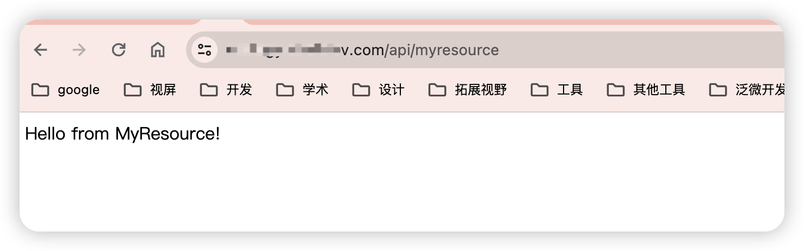

 ### 路径参数

 Jersey 允许你从 URI 中提取路径参数。修改 `MyResourceApi.java`，添加一个带路径参数的方法：


```
package com.api.example.web;

import javax.ws.rs.GET;
import javax.ws.rs.Path;
import javax.ws.rs.PathParam;

/**
 * <h1>我的自定义api</h1>
 * </br>
 * <p>create: 2023/12/23 18:48</p>
 *
 * <p></p>
 *
 */
@Path("/myresource")
public class MyResourceApi {

 @GET
 public String get() {
 return "Hello from MyResource!";
 }

 @GET
 @Path("/{name}")
 public String getByName(@PathParam("name") String name) {
 return "Hello, " + name + "!";
 }
}

```
在上述代码中，我们使用了 `@PathParam` 注解来提取路径参数，并且使用`@Path`为方法也添加了路径映射。例如，访问 `/myresource/Ecology 将返回 "Hello, Ecology!"。

 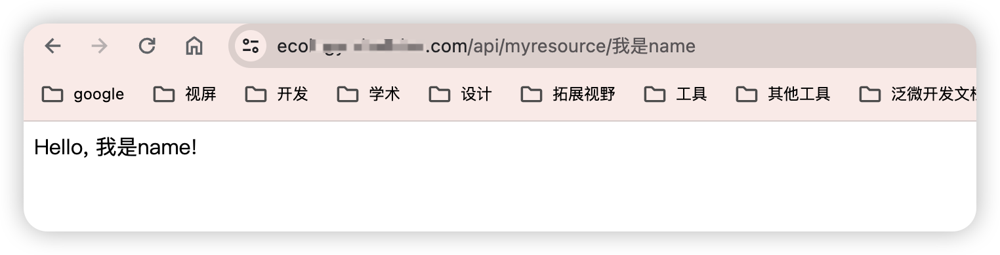

 ### 查询参数

 Jersey 也支持从查询参数中提取参数。修改 `MyResourceApi.java`，添加一个带查询参数的方法：


```
package com.api.example.web;

import javax.ws.rs.GET;
import javax.ws.rs.Path;
import javax.ws.rs.PathParam;
import javax.ws.rs.QueryParam;

/**
 * <h1>我的自定义api</h1>
 * </br>
 * <p>create: 2023/12/23 18:48</p>
 *
 * <p></p>
 *
 */
@Path("/myresource")
public class MyResourceApi {

 @GET
 public String get() {
 return "Hello from MyResource!";
 }

 @GET
 @Path("/greet")
 public String greet(@QueryParam("name") String name) {
 return "Hello, " + name + "!";
 }
}

```
在上述代码中，我们使用了 `@QueryParam` 注解来提取查询参数。例如，访问 `/myresource/greet?name=Ecology` 将返回 "Hello, Ecology!"。

 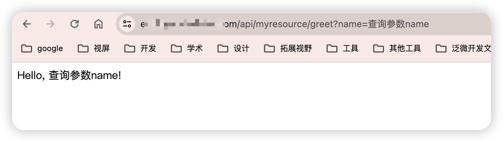

 ### 响应类型

 你可以使用 `@Produces` 注解来指定资源类或方法的响应类型。默认情况下，Jersey 会将返回的对象转换为 JSON。


```
package com.api.example.web;

import javax.ws.rs.*;
import javax.ws.rs.core.MediaType;

/**
 * <h1>我的自定义api</h1>
 * </br>
 * <p>create: 2023/12/23 18:48</p>
 *
 * <p></p>
 *
 */
@Path("/myresource")
public class MyResourceApi {

 @GET
 public String get() {
 return "Hello from MyResource!";
 }

 @GET
 @Path("getText")
 @Produces(MediaType.TEXT_PLAIN)
 public String getText() {
 return "Hello from MyResource!";
 }

 @GET
 @Path("getJSON")
 @Produces(MediaType.APPLICATION_JSON)
 public String getJSON() {
 Map<String,Object> result = new HashMap<>();
 result.put("code",200);
 result.put("msg", "success");
 result.put("data", "Hello from MyResource!");
 return JSONObject.toJSONString(result);
 }
}

```
在上述代码中，我们使用了 `@Produces(MediaType.TEXT_PLAIN)` 注解来指定响应类型为纯文本。使用`@Produces(MediaType.APPLICATION_JSON)`注解来指定响应类型为`json`

 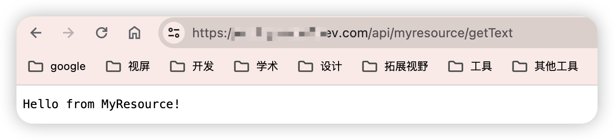

  ### 请求参数类型


```
package com.api.example.web;

import com.alibaba.fastjson.JSONObject;

import javax.ws.rs.*;
import javax.ws.rs.core.MediaType;
import java.util.HashMap;
import java.util.Map;

/**
 * <h1>我的自定义api</h1>
 * </br>
 * <p>create: 2023/12/23 18:48</p>
 *
 * <p></p>
 *
 */
@Path("/myresource")
public class MyResourceApi {

 @GET
 public String get() {
 return "Hello from MyResource!";
 }

 @POST
 @Path("postJSON")
 @Consumes(MediaType.APPLICATION_JSON)
 @Produces(MediaType.APPLICATION_JSON)
 public String postJSON(String json) {
 Map<String,Object> result = new HashMap<>();
 result.put("code",200);
 result.put("msg", "success");
 result.put("data",json);
 return JSONObject.toJSONString(result);
 }

 @POST
 @Path("postJSONObj")
 @Consumes(MediaType.APPLICATION_JSON)
 @Produces(MediaType.APPLICATION_JSON)
 public String postJSONObj(Map<String,Object> params) {
 Map<String,Object> result = new HashMap<>();
 result.put("code",200);
 result.put("msg", "success");
 result.put("data",params);
 return JSONObject.toJSONString(result);
 }
 // @Context HttpServletRequest request, @Context HttpServletResponse response
 // User user = HrmUserVarify.getUser(request, response); // 获取当前登录人员
}

```
  ## 升级打包

 当我们写完接口后，如何让接口生效呢，让接口运行在我们的 ecology 服务其中？

 接下来给大家讲解说明一下如何升级打包

 ### 代码结构整理

 在`开发规范`中我们提到了开发的代码有一定的规范建议，所以我们在开发过程中代码会在不同的目录结构下，当我们写完代码后，编译完成的`class`文件也必须要保持原有的`src`目录结构（包名结构），我们需要将涉及到的本次开发的所有`class`文件进行整合打包，其路径一定与原来的`src`目录结构一致，只不过上层目录不同。

 源码的上层目录是`src`，但是`class`最终整理打包的目录需要看当前运行的服务器环境（服务运行的根路径），如果是信创环境，则是`ecology/WEB-INF/classes`，如果是非信创环境（Resin）则是`ecology/classbean`，后续举例以`Resin`为例

 那么按照上述`接口开发`中的案例文件`com.api.example.web.MyResourceApi`最终需要生成的压缩包目录则是

 `ecology/com/api/example/web/MyResourceApi.class`

 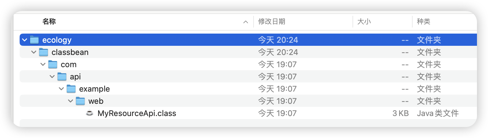

 如图所示，这样将升级包压缩后，上传服务器，与 ecology 同级目录下解压文件（解压如果涉及到覆盖文件，请记得备份原始文件），合并内容即可完成升级，然后启动服务器，则可以测试我们刚写的代码

 如果存在第三方 jar 包的依赖，则将 jar 包存放在`ecology/WEB-INF/lib`下

 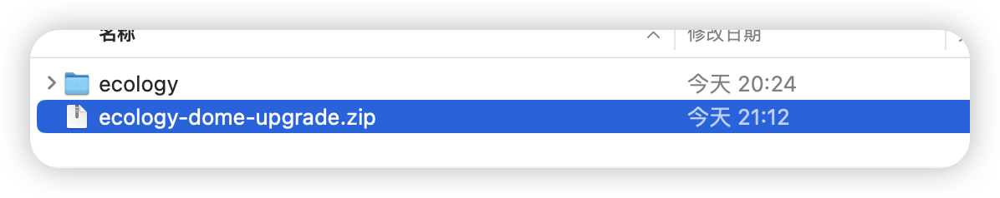

 将升级包与 ecology 放到同级目录下

 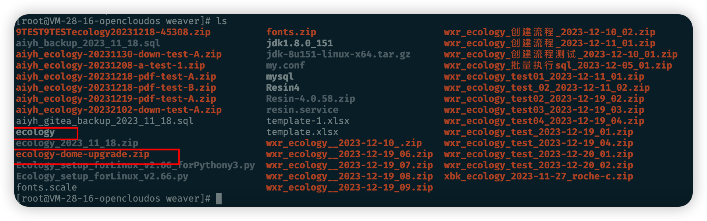

 然后停止服务器，解压文件

 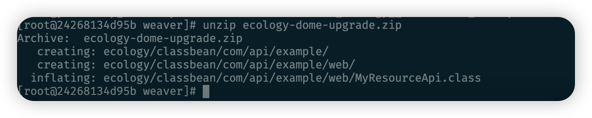

 解压成功合并文件之后，重启服务器，访问我们之前写好的接口

 

 ## 思考


- 编写一个 get 请求，返回一个数据库中存在的用户姓名和登录名以及 id
- 编写一个 post 请求，更新当前用户的姓名，并且返回更新前、后的用户信息


---

# 建议的开发规范


> 本篇文章仅对公司建议的开发规范做一个搬运和讲解，具体开发规范请以各个客户或者团队规定为准

 ## Ecology 开发架构和目录介绍

 ### 概述

 E9 总体采用前后端分离架构，前端采用 REACT+MOBX+WeaCom（组件）进行开发构建，后端采用面向服务的架构，提供 RESTFUL 风格的接口，服务后端采用层次化架构风格，分层的同时增加了 AOP、IOC、interceptor 的支持。

 架构要求分层中 service 和 Command 层必须面向接口编程， 同时通过 IOC 和命令委托方式进行各层的解耦（具体参加下方示例）;

 另外，该架构还提供全局 interceptor 和局部 interceptor、SERVICE-AOP、COMMAND-AOP 的支持，可以进行比如日志记录、声明性事务、安全性，和缓存等等功能的实现和无侵入二开。

 该架构总体采用命令模式和职责链模式作为基础开发模式，提供一系列的公共实现，用于规范开发过程。

 ### 架构图

 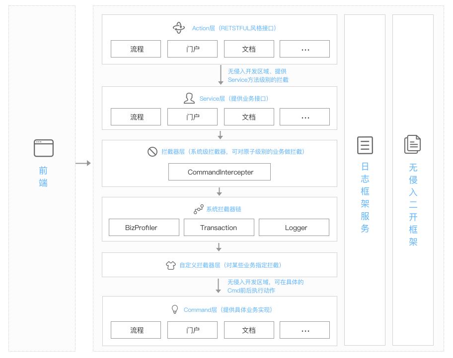

 ### 目录结构

 总体的目录结构

 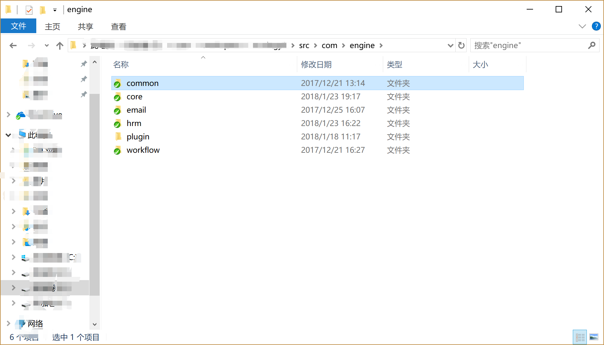

 目录说明：


| 目录 | 说明 |
| --- | --- |
| command | 公共模块 |
| core | 核心框架 |
| workflow | 流程模块 |
| hrm | 人力资源模块 |
| email | 邮件模块 |
| ... | 其他 |
 注意：每一个模块在该目录下都应该有一个对应的目录

 内部文件结构

 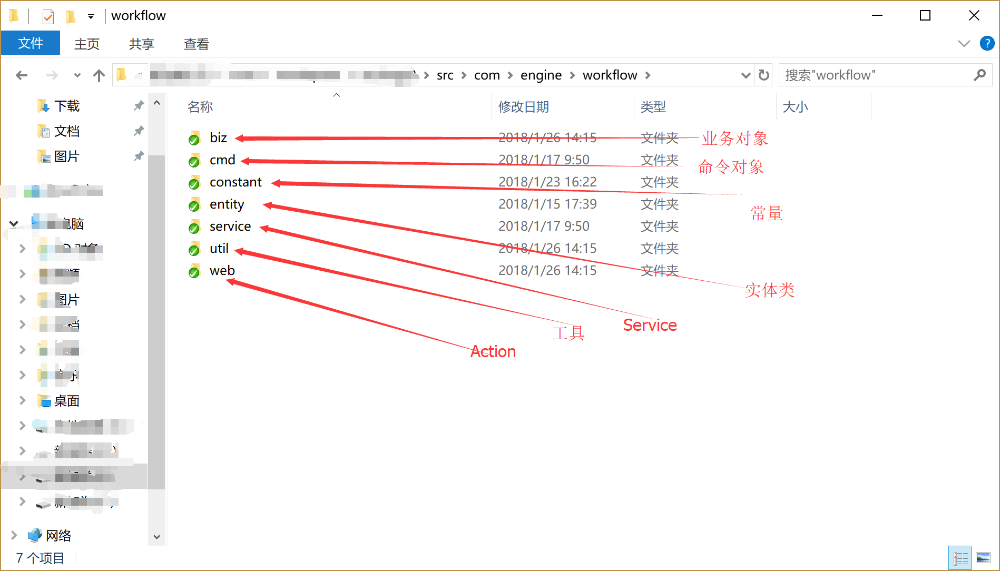

 目录说明：


| 目录 | 说明 |
| --- | --- |
| biz | 模块内公共业务类目录 |
| constant | 常量类目录 |
| cmd | 业务 Command 类目录 |
| entity | 实体类目录 |
| service | 业务 Service 服务类目录 |
| util | 工具类目录 |
| web | Action 类目录 |
 ## **标准开发指南**

 ### **开发说明**

 #### 1、建立 Action 类

 Action 类需要在 web 目录下建立，web 目录位于模块文件夹下；

 每一个功能都应有一个与之对应的 Action 类，用于对外提供接口服务，Action 中不建议包含业务逻辑的处理，业务逻辑请放到 Command 层（见后文）。

 Action 类作为边界类，对外提供接口服务， 对内做业务调用，并负责将内部返回的数据做 JSON 格式的转换，返回给接口的调用者，这里需要注意的是：数据格式的转换尽量的放到 Action 中， 不要放到业务层（Service、Command 层），这样做的好处是有利于维护和二开。


> 示例 1 建立 action 类， 并配置方法的 Path，以及返回数据的类型（注意：类并没有配置 Path）


```
package com.engine.workflow.web.workflowPath;

/**
 * 标题设置action
 * */
public class TitleSetListAction {

 private TitleSetService getService(){
 //实例化Service类
 return ServiceUtil.getService(TitleSetServiceImpl.class);
 }

 /**
 * 标题设置
 * */
 @GET
 @Path("/getCondition")
 @Produces(MediaType.TEXT_PLAIN)
 public String getCondition(@Context HttpServletRequest request,@Context HttpServletResponse response){
 Map<String,Object> apidatas = new HashMap<String,Object>();
 try{
 User user = HrmUserVarify.getUser(request, response);
 //实例化Service 并调用业务类处理
 apidatas = getService().getTitleSetCondition(ParamUtil.request2Map(request), user);
 }catch(Exception e){
 //异常处理
 e.printStackTrace();
 apidatas.put("api_status", false);
 apidatas.put("api_errormsg", "catch exception : " + e.getMessage());
 }
 //数据转换
 return JSONObject.toJSONString(apidatas);
 }
}

```
com.engine 目录是核心业务逻辑类所在目录，不允许直接暴露对外服务接口，对外服务接口请暴露在 com.api 下（专门提供 API 服务的目录）。

 具体操作是（见示例 1 和 2）：

 在 com.api.模块.web 目录下建立对外接口类，然后通过 extends（继承）的方式暴露 RESTful 服务接口。

 示例 1 中的 Action 建立后还不能被前端调用，因为类没有暴露出来，还差一步，见示例 2


> 示例 2 在 api 目录下暴露接口,直接 extens 之前写好的 action


```
package com.api.workflow.web.workflowPath;

import javax.ws.rs.Path;

/**
 * 标题设置action
 * */
@Path("/workflow/nodeSet/titleSet")
public class TitleSetAction extends TitleSetListAction{
}

```
#### 2、建立 Service 类

 Service 类需要在 service 目录下建立，service 目录位于模块文件夹下；

 每一个功能都应有一个与之对应的 Service 接口和 impl 实现类， 注意：**Service 中不允许有具体的业务实现，仅作为服务的提供者，具体业务委托给具体的 Command**。

 Service 接口不需要继承任何类，但需要将其中的服务接口描述清楚


> Service 接口示例


```
/**
 * 后台流程监控service
 * @author luosy 2017/12/20
 * @version 1.0
 *
 */
public interface WorkflowMonitorSettingService {

 /**
 * 获取监控类型sessionkey 列表数据
 * @param params 参数列表
 * @param user 用户
 * @return sessionKey
 */
 public Map<String, Object> getMonitorTypeSessionkey(Map<String, Object> params);

}

```
Service 实现类需要实现 Service 业务接口， 并继承框架中的 Service 类；

 Service 实现类需要在 impl 目录下建立，impl 目录位于 service 文件夹下；


> Service 实现类示例


```
/**
 * 后台流程监控service 实现类
 * @author luosy 2017/12/20
 * @version 1.0
 *
 */
public class WorkflowMonitorSettingServiceImpl extends Service implements WorkflowMonitorSettingService {

 @Override
 public Map<String, Object> getMonitorTypeCondition(Map<String, Object> params,
 String method) {
 return commandExecutor.execute(new GetConditionCmd(params,user,method));
 }
}

```
#### 3、Service 对象实例化方式

 Action 中不能够通过 new 的形式实例化 Service 类，需要调用新架构提供的 API 来实例化


> 示例


```
LoadWorkflowTreeService lwtService = ServiceUtil.getService(LoadWorkflowTreeServiceImpl.class)

```
#### 4、建立 Command 类

 Command 采用单一职责原则，一个类，只做一件事。如果一个类承担的职责过多，就等于把这些职责耦合在一起了。

 一个职责的变化可能会削弱或者抑制这个类完成其他职责的能力。

 这种耦合会导致脆弱的设计，当发生变化时，设计会遭受到意想不到的破坏。而如果想要避免这种现象的发生，就要尽可能的遵守单一职责原则。此原则的核心就是解耦和增强内聚性，增加复用和可维护性；

 Command 需要在相应的 CMD 目录下建立 XXXCmd（cmd 目录位于模块文件夹下）， 实现 Command 接口即可(实现 execute 方法)， 如果需要记录日志，兼容一些公共处理，可以直接继承:


```
com.engine.common.biz.AbstractCommonCommand，

```
该抽象类默认包含 user 、params 和 get set 方法 ， 另外也包含了日志的。


> 示例


```
public class GetSearchConditionCmd extends AbstractCommonCommand<Map<String, Object>>{

 public GetSearchConditionCmd(Map<String, Object> params, User user) {
 this.user = user;
 this.params = params;
 }

 @Override
 public Map<String, Object> execute(CommandContext commandContext) {
 return result;
 }
}

```
#### 5、规范


- 入参最好使用 Map 或者 Entity 对象，尽可能的与 Http 对象解耦
- 出参最好使用 Map 或者 Entity 对象，不要直接返回单一数据或者 String 类型的 JSON 格式数据；
- 不同功能的服务封装在不同的 Service 中，用户可以非常清晰地使用特定的 Service1. Service 中定义的各个方法都有相应的命令对象（XXCmd）
- 日志记录尽可能的对本次修改的情况进行详细的记录，比如对一个人员的信息进行了修改， 日志中，要能够体现出修改的项目， 如果是重要功能，要在之前的基础上增加所修改项目的原值和新值，以便能够追溯到修改的内容。
- Command 按照功能进行分类，不要按照 Command 的类型（增删改查）进行分类，这样即使是新人， 也能够很快的定位到相关的类；
- Command 的设计要符合单一职责原则，不要做过多的事，如果不能把握住这个度， 请按照前端功能接口进行设计， 一个接口， 对应一个 Command；
- Command 中尽可能不要直接调用 Service， 如果需要是公共类，请放到 Biz 目录下；
- Service 必须有一个接口和一个实现类；
- Service 中不能包含具体的业务逻辑， 业务逻辑委托给具体的 Command 类；
- Command 中不允许直接调用 Service 方法， 如需要可以调用 Biz 包下的类；
- Command 中的参数必须要包含 Getting 和 Setting 方法，方便无侵入二开获取相关的参数；
- 前端展示的项和内容不要写死， 一定要根据后端接口数据进行动态展现，这样方便二开，仅修改后端接口即可；

 ### **异常处理**

 业务 Command 对象中不允许抛出非运行时异常，如需要对异常处理， 请先捕捉，然后转成 ECException 进行抛出，并对异常发生的情况添加大家可理解的说明。


> 示例：


```
try {

 //TODO

} catch (Exception e) {

 throw new ECException(command.getClass().getName() + "执行过程中异常", e);

}

```
### **日志处理**


```
com.engine.common.biz.AbstractCommonCommand

```
已经包含了日志接口， 大家只需要实现对应方法， 作成日志对象返回即可， 该抽象类包含单日志记录和批量日志记录两个方法，大家需要根据自身情况进行选择性实现。

 批量日志记录方法:


```
public List<BizLogContext> getLogContexts()

```
为了方便记录批量 和 更新操作，增加了一个日志处理类，仅需要少量的代码即可完成日志的记录，且可做到与业务代码解耦。

 该类的实现方式是在业务更新前后去 DB 中查询，做数据做对比，区分出新建、更新、删除动作，其对性能可能会有稍微的影响（具体视功能 SQL 的执行效率而定），对于性能有严苛要求的功能，请酌情使用。


> 示例 1 使用 SimpleBizLogger 进行日志主从日志记录


```
package com.engine.workflow.cmd.workflowPath.node.operatorSetting;

import java.util.ArrayList;
import java.util.HashMap;
import java.util.List;
import java.util.Map;

import weaver.conn.RecordSetTrans;
import weaver.general.Util;
import weaver.hrm.HrmUserVarify;
import weaver.hrm.User;
import weaver.systeminfo.SystemEnv;
import weaver.workflow.workflow.WfRightManager;
import weaver.workflow.workflow.WorkflowComInfo;

import com.engine.common.biz.AbstractCommonCommand;
import com.engine.common.biz.SimpleBizLogger;
import com.engine.common.biz.SimpleBizLogger.SubLogInfo;
import com.engine.common.constant.BizLogSmallType4Workflow;
import com.engine.common.constant.BizLogType;
import com.engine.common.entity.BizLogContext;
import com.engine.core.interceptor.CommandContext;
import com.engine.workflow.biz.NodeOperatorBiz;
import com.engine.workflow.biz.nodeOperatorItem.AbstractItem;
import com.engine.workflow.constant.WfFunctionAuthority;
import com.engine.workflow.entity.node.OperatorTypeEntity;

public class DoSaveOperatorGroupInfoCmd extends AbstractCommonCommand<Map<String, Object>>{
 //简单日志记录对象
 private SimpleBizLogger logger;

 public DoSaveOperatorGroupInfoCmd(Map<String, Object> params,User user) {
 this.params = params;
 this.user = user;
 //初始化简单日志对象
 this.logger = new SimpleBizLogger();
 }

 @Override
 public BizLogContext getLogContext() {
 return null;
 }

 /**
 * 批量记录日志
 */
 @Override
 public List<BizLogContext> getLogContexts() {
 //计算修改记录并返回， 注意， 必须在业务代码执行完毕后调用，否则本次操作记录不会被记录
 return logger.getBizLogContexts();
 }

 @Override
 public Map<String, Object> execute(CommandContext commandContext) {
 //处理日志
 this.bofore();
 return doSave();
 }

 /**
 * 处理日志
 */
 public void bofore(){
 BizLogContext bizLogContext = new BizLogContext();
 bizLogContext.setLogType(BizLogType.WORKFLOW_ENGINE);//模块类型
 bizLogContext.setBelongType(BizLogSmallType4Workflow.WORKFLOW_ENGINE_PATH_PATHSET_NODESET);//所属大类型
 bizLogContext.setBelongTypeTargetId(Util.null2String(params.get("nodeid")));//所属大类型id
 bizLogContext.setBelongTypeTargetName(Util.null2String(params.get("nodename")));//所属大类型名称
 bizLogContext.setLogSmallType(BizLogSmallType4Workflow.WORKFLOW_ENGINE_OPERATORSET);//当前小类型
 logger.setUser(user);//当前操作人
 logger.setParams(params);//request请求参数(request2Map)
 String mainSql = "select id,groupname from workflow_nodegroup where nodenodeid")));
 logger.setMainSql(mainSql);//主表sql
 logger.setMainPrimarykey("id");//主日志表唯一key
 logger.setMainTargetNameColumn("groupname");//当前targetName对应的列（对应日志中的对象名）

 SubLogInfo subLogInfo = logger.getNewSubLogInfo();
 String subSql = "select g.*,n.groupname from workflow_groupdetail g ,workflow_nodegroup n where g.groupid = n.id and g.groupgroupid"))) + " order by g.id";
 subLogInfo.setSubSql(subSql,"id");
 subLogInfo.setSubTargetNameColumn("groupname");
 subLogInfo.setGroupId("0"); //所属分组， 按照groupid排序显示在详情中， 不设置默认按照add的顺序。
 subLogInfo.setSubGroupNameLabel(234212); //在详情中显示的分组名称，不设置默认显示明细x
 logger.addSubLogInfo(subLogInfo);
 //开始记录
 logger.before(bizLogContext);
 }

 public Map<String , Object> doSave(){
 //...业务代码
 return apidatas;
 }
}

```
> 示例 2 使用 SimpleBizLogger 进行主日志批量记录


```
package com.engine.workflow.cmd.workflowPath.node;

import java.util.HashMap;
import java.util.List;
import java.util.Map;

import weaver.conn.RecordSet;
import weaver.general.Util;
import weaver.hrm.User;
import weaver.rdeploy.workflow.WorkflowInitialization;
import weaver.systeminfo.SysMaintenanceLog;
import weaver.systeminfo.SystemEnv;
import weaver.workflow.workflow.WFNodeMainManager;
import weaver.workflow.workflow.WorkflowComInfo;
import weaver.workflow.workflow.WorkflowVersion;

import com.engine.common.biz.AbstractCommonCommand;
import com.engine.common.biz.SimpleBizLogger;
import com.engine.common.constant.BizLogSmallType4Workflow;
import com.engine.common.constant.BizLogType;
import com.engine.common.constant.ParamConstant;
import com.engine.common.entity.BizLogContext;
import com.engine.core.interceptor.CommandContext;

public class DoSaveNodeCmd extends AbstractCommonCommand<Map<String, Object>>{

 private SimpleBizLogger logger;

 public DoSaveNodeCmd(Map<String, Object> params,User user) {
 this.params = params;
 this.user = user;
 this.logger = new SimpleBizLogger();
 }
 public DoSaveNodeCmd() {
 }

 @Override
 public BizLogContext getLogContext() {
 return null;
 }
 @Override
 public List<BizLogContext> getLogContexts() {
 return logger.getBizLogContexts();
 }

 public void bofore(){
 WorkflowComInfo WorkflowComInfo = new WorkflowComInfo();
 BizLogContext bizLogContext = new BizLogContext();
 bizLogContext.setLogType(BizLogType.WORKFLOW_ENGINE);
 bizLogContext.setBelongType(BizLogSmallType4Workflow.WORKFLOW_ENGINE_PATH);//所属大类型
 bizLogContext.setBelongTypeTargetId(Util.null2String(params.get("workflowId")));//所属大类型id
 bizLogContext.setBelongTypeTargetName(WorkflowComInfo.getWorkflowname(Util.null2String(params.get("workflowId"))));//所属大名称
 bizLogContext.setLogSmallType(BizLogSmallType4Workflow.WORKFLOW_ENGINE_PATH_PATHSET_NODESET);//当前小类型
 logger.setUser(user);//当前操作人
 logger.setParams(params);//request请求参数
 String mainSql ="select f.nodeid, n.nodename,f.nodetype,n.nodeattribute,n.passnum from workflow_flownode f inner join workflow_nodebase n on f.nodeid = n.id where f.workflowworkflowId")));
 logger.setMainSql(mainSql,"nodeid");
 logger.setMainTargetNameColumn("nodename");
 logger.setMainTargetNameMethod(this.getClass().getName() + ".getMethod", "column:nodename+column:nodeattribute+" + user.getLanguage());
 logger.before(bizLogContext);
 }

 public String getMethod(String targetid,String para){
 return "1";
 }

 @Override
 public Map<String, Object> execute(CommandContext commandContext) {
 //日志记录
 this.bofore();
 return doSaveNodeInfo();
 }

 public Map<String, Object> doSaveNodeInfo(){
 //...业务代码
 return apidatas;
 }
}

```
> 示例 3 使用 SimpleBizLogger 进行单个主日志记录


```
package com.engine.workflow.cmd.workflowPath.node;

import java.util.HashMap;
import java.util.Map;

import weaver.conn.RecordSet;
import weaver.general.Util;
import weaver.hrm.HrmUserVarify;
import weaver.hrm.User;
import weaver.workflow.workflow.WfRightManager;
import weaver.workflow.workflow.WorkflowComInfo;

import com.engine.common.biz.AbstractCommonCommand;
import com.engine.common.biz.SimpleBizLogger;
import com.engine.common.constant.BizLogSmallType4Workflow;
import com.engine.common.constant.BizLogType;
import com.engine.common.entity.BizLogContext;
import com.engine.core.interceptor.CommandContext;
import com.engine.workflow.constant.WfFunctionAuthority;

public class DoUpdateNodeNameCmd extends AbstractCommonCommand<Map<String, Object>>{

 private SimpleBizLogger logger;

 public DoUpdateNodeNameCmd(Map<String, Object> params,User user) {
 this.params = params;
 this.user = user;
 this.logger = new SimpleBizLogger();
 }
 public DoUpdateNodeNameCmd() {

 }

 @Override
 public Map<String, Object> execute(CommandContext commandContext) {
 this.bofore();
 return updateNodeName();
 }

 public void bofore(){
 BizLogContext bizLogContext = new BizLogContext();
 WorkflowComInfo workflowComInfo = new WorkflowComInfo();
 bizLogContext.setLogType(BizLogType.WORKFLOW_ENGINE);
 bizLogContext.setBelongType(BizLogSmallType4Workflow.WORKFLOW_ENGINE_PATH);//所属大类型
 bizLogContext.setBelongTypeTargetId(Util.null2String(params.get("workflowId")));//所属大类型id
 bizLogContext.setBelongTypeTargetName(workflowComInfo.getWorkflowname(Util.null2String(params.get("workflowId"))));//所属大名称
 bizLogContext.setLogSmallType(BizLogSmallType4Workflow.WORKFLOW_ENGINE_PATH_PATHSET_NODESET);//当前小类型
 logger.setUser(user);//当前操作人
 logger.setParams(params);//request请求参数
 String mainSql = "select b.id,b.nodename from workflow_flownode a left join workflow_nodebase b on a.nodeid = b.id where a.workflowworkflowId"))+" and a.nodenodeid")));
 logger.setMainSql(mainSql, "id");
 logger.setMainTargetNameColumn("nodename");
 logger.before(bizLogContext);
 }

 @Override
 public BizLogContext getLogContext() {
 return logger.getBizLogContext();
 }

 public Map<String, Object> updateNodeName() {
 ...业务代码
 }
}

```
以下是针对有性能要求的功能记录日志的方式（不推荐，业务耦合比较严重）:

 重要说明：**`getLogContext()`方法调用发生在`command.execute`方法之后，是系统自动调用执行，所以，在`execute`执行时候就考虑日志的内容，比如删除对象的名称和内容， 修改时修改项前后的值。**

 具体操作步骤：请在 update 之前先将要变更的数据一次性查询出来，放入`List<Map<String, Object>>`中（批量操作，单个的可以不用 List），然后在更新操作中记录需要更新的每一条的数据的键值对（`Map<String, Object>`）

 待数据更新完成后， 调用日志工具类将本次更新中没有变更的字段过滤掉：

 m1 为老的数据键值对 ,m2 为新的数据键值对

 `LogUtil.removeIntersectionEntry(map1, map2);`

 m1 m2 此时 已经不存在交集， 保留下来都是有变更的字段，设置到日志对象中


```
logContext.setOldValues(m1);

logContext.setNewValues(m2);

```
注意：

 **1、新增的记录不需要`setOldValues`，但需要`setNewValues`**

 **2、删除的记录不需要`setNewValus`，但需要`setOldValues`**

 **3、如果当前功能属于二级功能，需要在外层查询到内层的日志记录， 请设置外层类型、外层类型对象的 id 和显示名：**

 **`setBelongType(BizLogSmallType)`**

 **`setBelongTypeTargetId(String)和setBelongTypeTargetName(String)`**

 批量记录日志时， 需要进行关联（列表显示）和明细日志进行关联，以便于前台查看(见下方示例 3)


> 示例 1 execute 中设置一部分必要的信息，防止 execute 执行完成后， 数据库中无法查询到修改前的数据。（仅设置 execute 方法执行后获取不到的信息）

 其他部分信息放到 getLogContext 中设置。(建议使用示例 4、5、6 的方式)


```
public class GetSearchConditionCmd extends AbstractCommonCommand<Map<String, Object>>{
 protected BizLogContext bizLogContext;
 public GetSearchConditionCmd(Map<String, Object> params, User user) {
 this.user = user;
 this.params = params;
 }

 @Override
 public Map<String, Object> execute(CommandContext commandContext) {
 bizLogContext = new BizLogContext();
 bizLogContext.setTargetId(targetId);
 bizLogContext.setTargetName(targetName);
 //execute中设置一部分
 ...

 //
 return result;
 }

 @Override
 public BizLogContext getLogContext() {
 //这里set一部分
 bizLogContext.setDateObject(new Date());
 bizLogContext.setUserid(user.getUID());
 bizLogContext.setUsertype(user.getType()

 bizLogContext.setLogType(BizLogType.WORKFLOW_ENGINE);
 //bizLogContext.setTargetSmallType(BizLogTargetSmallType);
 bizLogContext.setOperateType(BizLogOperateType.DELETE);
 bizLogContext.setDesc(descStr);
 bizLogContext.setParams(params);
 //设置所属日志对象的id， 用于外层日志的查询
 bizLogContext.setBelongTypeTargetId(workflowid + "");
 //设置所属日志对象的类型， 用于外层日志的查询
 bizLogContext.setBelongType(BizLogSmallType4Workflow.WORKFLOW_ENGINE_PATH);
 //设置所属日志对象的名称，用于当无法根据名称查看时的显示
 bizLogContext.setBelongTypeTargetName(comInfo.getWorkflowname(workflowid + ""));
 return this.bizLogContext;
 }
}

```
> 示例 2(建议使用示例 4、5、6 的方式)


```
public class GetSearchConditionCmd extends AbstractCommonCommand<Map<String, Object>>{

 public GetSearchConditionCmd(Map<String, Object> params, User user) {
 this.user = user;
 this.params = params;
 }

 @Override
 public Map<String, Object> execute(CommandContext commandContext) {

 return result;
 }

 @Override
 public BizLogContext getLogContext() {
 bizLogContext = new BizLogContext();
 bizLogContext.setDateObject(new Date());
 bizLogContext.setUserid(user.getUID());
 bizLogContext.setUsertype(user.getType());
 bizLogContext.setTargetId(targetId);
 bizLogContext.setTargetName(targetName);
 bizLogContext.setLogType(BizLogType.WORKFLOW_ENGINE);
 //bizLogContext.setTargetSmallType(BizLogTargetSmallType);
 bizLogContext.setOperateType(BizLogOperateType.DELETE);
 bizLogContext.setDesc(descStr);
 bizLogContext.setParams(params);
 //设置所属日志对象的id， 用于外层日志的查询
 bizLogContext.setBelongTypeTargetId(workflowid + "");
 //设置所属日志对象的类型， 用于外层日志的查询
 bizLogContext.setBelongType(BizLogSmallType4Workflow.WORKFLOW_ENGINE_PATH);
 //设置所属日志对象的名称，用于当无法根据名称查看时的显示
 bizLogContext.setBelongTypeTargetName(comInfo.getWorkflowname(workflowid + ""));
 return bizLogContext;
 }
}

```
> 示例 3 批量记录日志(建议使用示例 4、5、6 的方式)


```
public class GetSearchConditionCmd extends AbstractCommonCommand<Map<String, Object>>{

 public GetSearchConditionCmd(Map<String, Object> params, User user) {
 this.user = user;
 this.params = params;
 }

 @Override
 public Map<String, Object> execute(CommandContext commandContext) {

 return result;
 }

 @Override
 public List<BizLogContext> getLogContexts() {
 List<BizLogContext> logs = new ArrayList<BizLogContext>();

 BizLogContext mainBizLogContext = new BizLogContext();
 //主日志记录id， 批量记录日志时仅显示主记录，不显示明细记录， 方便用户查看，当查看修改详情时，再显示具体的明细修改记录
 String mainLogid = mainBizLogContext.createMainid();

 bizLogContext.setDateObject(new Date());
 bizLogContext.setUserid(user.getUID());
 ...
 bizLogContext.setParams(params);
 //设置为主记录， 并为其生成唯一ID
 bizLogContext.setMainId(mainLogid);

 for (...) {
 BizLogContext detailBizLogContext = new BizLogContext();
 bizLogContext.setDateObject(new Date());
 bizLogContext.setUserid(user.getUID());
 ...

 //以下几个设置， 作为明细日志必须设置！

 //设置为明细记录， 不在日志列表中显示
 bizLogContext.setDetail(true);
 //当一个页面存在多个明细表时， 需要将将同一个明细表的groupid设置为同一个；
 bizLogContext.setGroupId(1);
 //设置当前所属明细表的名称label， 用于显示日志修改详情时的title
 bizLogContext.setGroupNameLabel(123);
 //设置当前明细所属的主日志记录id
 bizLogContext.setBelongMainId(mainLogid);
 }
 ....
 return logs;
 }
}

```
> 日志对象


```
package com.engine.common.entity;

import com.alibaba.fastjson.JSONObject;
import com.engine.common.constant.BizLogSmallType;
import com.engine.common.constant.BizLogOperateType;
import com.engine.common.constant.BizLogType;

import java.io.Serializable;
import java.util.Date;
import java.util.Map;
import java.util.UUID;

/**
 * Created by wcc on 2017/12/11.
 */
public class BizLogContext implements Serializable {
 /**
 * 操作日期
 */
 protected String date;

 /**
 * 时间
 */
 protected String time;

 /**
 * 日期事件对象
 */
 protected Date dateObject;

 /**
 * 操作人
 */
 protected int userid;

 /**
 * 操作人类型
 */
 protected int usertype;

 /**
 * 目标对象id
 */
 protected String targetId;

 /**
 * 目标对象名称（用于显示）
 */
 protected String targetName;

 /**
 * 所属类型（用于查询，以及显示）
 */
 protected BizLogSmallType belongType;

 /**
 * 所属大类型对象的id
 */
 protected String belongTypeTargetId;

 /**
 * 所属大类型对象的显示名
 */
 protected String belongTypeTargetName;

 /**
 * 目标对象类型（大分类）
 */
 protected BizLogType logType;

 /**
 * 目标对象类型（小分类）
 */
 protected BizLogSmallType logSmallType;

 /**
 * 操作类型（增删改查）
 */
 protected BizLogOperateType operateType;

 /**
 * 操作IP
 */
 protected String clientIp;

 /**
 * 修改前的值
 */
 protected Map<String, Object> oldValues;

 /**
 * 修改后的值
 */
 protected Map<String, Object> newValues;

 /**
 * 操作详细说明
 */
 protected String desc;

 /**
 * 涉及的相关参数
 */
 protected Map<String, Object> params;

 /**
 * 主日志
 */
 protected String mainId;

 /**
 * 从表日志
 */
 protected String belongMainId;

 /**
 * 分组
 */
 protected String groupId;

 /**
 * 分组
 */
 protected boolean isDetail;

 /**
 * 分组标题
 */
 protected int groupNameLabel;

 public BizLogContext() {
 }
}

```
日志类型分为大类型和小类型， 大类型为模块，其定义在 com.engine.common.constant.BizLogType 中, 如果其中没有你模块的信息， 请自己添加一下：


```
public enum BizLogType {

 WORKFLOW(1, 2118),
 WORKFLOW_ENGINE(2, 33636),
 HRM(3, 179),
 HRM_ENGINE(4, 179),
 PORTAL(5, 582),
 PORTAL_ENGINE(6, 33637),
 DOC(7, 2115),
 DOC_ENGINE(8, 33638),
 MEETING(9, 34076),
 MEETING_ENGINE(10, 34076),
 WKP(11, 83995),
 WKP_ENGINE(12, 83995),
 LANG(13, 16066),
 LANG_ENGINE(14, 84641),
 INTEGRATION_ENGINE(15, 32269),
 FULLSEARCH(16, 31953),
 ODOC(16, 27618),
 ODOC_ENGINE(17, 27618),
 SYSTEM(18,16686),
 SYSTEM_ENGINE(19,16686),
 ;

 /**
 * code
 */
 protected int code;

 protected int labelId;

 public int getCode() {
 return code;
 }

 public int getLableId() {
 return labelId;
 }

 BizLogType(int code, int labelId) {
 this.code = code;
 this.labelId = labelId;
 }

}

```
小类型所在类是一个接口， 所有的模块具体的小类型都需要继承这个接口，然后将类型定义在这个类中


> 小类型接口类


```
package com.engine.common.constant;

public interface BizLogSmallType {

 int getCode();

 int getLableId();

 BizLogType getBizLogType();
}

```
> 示例， 流程小类型， 请各模块参考


```
package com.engine.common.constant

public enum BizLogSmallType4Workflow implements BizLogSmallType {
 WORKFLOW_ENGINE_TYPE(1, 33806),
 WORKFLOW_ENGINE_PATH(2, 33657),
 WORKFLOW_ENGINE_MONITORSET(3, 17989),
 WORKFLOW_ENGINE_MONITORSET_TYPE(4, 2239),
 WORKFLOW_ENGINE_PATH_RULE(5, 32481),
 WORKFLOW_ENGINE_REPORTSET(6, 33665),
 WORKFLOW_ENGINE_PATH_TRANSFER(7, 33660),
 WORKFLOW_ENGINE_CUSTOMQUERYSET(8, 20785),
 WORKFLOW_ENGINE_CUSTOMQUERYSET_TYPE(9, 23799),
 WORKFLOW_ENGINE_PATHIMPORT(10, 33659),
 WORKFLOW_ENGINE_CODEMAINTENANCE_STARTCODE(11, 20578),
 WORKFLOW_ENGINE_CODEMAINTENANCE_RESERVECODE(12, 22779),
 WORKFLOW_ENGINE_REPORTSET_REPORTTYPESET(13, 33664),
 WORKFLOW_ENGINE_PATH_PATHSET_NODESET(14, 126552),
 WORKFLOW_ENGINE_REPORTSET_REPORTSHARE(15,33666),
 WORKFLOW_ENGINE_PATH_PATHSET_FUNCTIONMANAGER(16, 18361),
 WORKFLOW_ENGINE_NODELINK(17, 126553),
 WORKFLOW_ENGINE_PATH_PATHSET_WORKFLOWPLAN(18, 18812),
 WORKFLOW_ENGINE_PATH_PATHSET_NODEFIELD(19, 15615),
 WORKFLOW_ENGINE_REPORTSET_COMPETENCESET(20,382890),
 WORKFLOW_ENGINE_FORMSET_FORM(21, 33655),
 WORKFLOW_ENGINE_PATH_PATHSET_OPERATIONMENU(22, 16380),
 WORKFLOW_ENGINE_OPERATORSET(23, 124954),
 WORKFLOW_ENGINE_SUPERVISESET(24, 21220),
 WORKFLOW_ENGINE_WORKFLOW_TO_DOC(25, 22231),
 WORKFLOW_ENGINE_FIELD(26, 382028),
 WORKFLOW_ENGINE_SUBWORKFLOWSET(27, 21584),
 WORKFLOW_ENGINE_WORKFLOW_TO_WORKPLAN(28, 24086),
 WORKFLOW_ENGINE_ROW_RULE(29, 18368),
 WORKFLOW_ENGINE_COL_RULE(30, 18369),
 WORKFLOW_ENGINE_PATH_PATHSET_BASESET(31, 82751),
 WORKFLOW_ENGINE_PATH_PATHSET_LINKAGEVIEWATTR(32, 21684),
 WORKFLOW_ENGINE_DATAINPUT(33,21848), //字段联动
 WORKFLOW_ENGINE_PATH_BROWSERDATADEFINITION(34,32752),//浏览数据定义
 WORKFLOW_ENGINE_PATH_WORKFLOWMAINTAINRIGHT(35,33805),//路径维护权限
 WORKFLOW_ENGINE_PATH_PREADDINOPERATE(36,18009),//节点前附加操作
 WORKFLOW_ENGINE_PATH_ADDINOPERATE(37,18010),//节点前附加操作
 WORKFLOW_ENGINE_PATH_LINKOPERATE(38,15610),//出口附加规则
 ;

 protected int code;

 protected int labelId;

 private BizLogType bizLogType = BizLogType.WORKFLOW_ENGINE;

 BizLogSmallType4Workflow(int code, int labelId) {
 this.code = code;
 this.labelId = labelId;
 }

 @Override
 public int getCode() {
 return this.code;
 }

 @Override
 public int getLableId() {
 return this.labelId;
 }

 @Override
 public BizLogType getBizLogType() {
 return bizLogType;
 }
}

```
## **无侵入开发指南**

 E9 已经支持 COMMAND 类级别和 SERVICE-METHOD 方法级别的动态代理，以支撑在不修改标准代码的前提下完成个性化的开发。

 两种方式都有各自适用的场景，大家可根据自身需求进行选择。

 动态代理类必须位于 src 目录下的：

 `com.customization.个性化功能模块名称_编号`

 目录下， 其中编号后续会提供申请生成页面， 在该目录下可进行 service、cmd 目录的划分


```
//存放Service代理类

plugin.模块名称_个性化功能的简称.service

//存放command代理类

plugin.模块名称_个性化功能的简称.cmd

```
### **类级别（Command）动态代理**

 该机制提供对 COMMAND 类级的动态代理，以支撑在不修改标准代码的前提下完成个性化的开发。此种方式可以在标准 COMMAND 执行前做参数的预处理加工、持久化等， 在 COMMAND 执行后做返回值的二次处理、加工，持久化等。

 代理类需要继承类：

 `com.engine.core.interceptor.AbstractCommandProxy`

 并增加注解，指定对哪一个 command 做动态代理，并对本代理类做一个功能说明

 @CommandDynamicProxy(target = 被代理 CMD 类对象, desc="功能描述，必须要有")

 在内部 execute 方法中，必须显示的调用 nextExecute 方法，使代理链能够顺序执行，得到标准业务类返回的结果集。

 `Map<String, Object> result = nextExecute(targetCommand);`


> 示例代码


```
@CommandDynamicProxy(target = DoSaveCmd.class, desc="附加在类型保存上的示例代理程序")
public class CustomDoSaveCmd extends AbstractCommandProxy<Map<String,Object>> {
 @Override
 public Map<String, Object> execute(Command<Map<String, Object>> targetCommand) {
 System.out.println(getClass().getName() + "command 执行之前做一些事");

 //获取到被代理对象
 DoSaveCmd doSaveCmd = (DoSaveCmd)targetCommand;
 //获取被代理对象的参数
 Map<String, Object> params = doSaveCmd.getParams();
 //对参数做预处理
 //TODO
 //参数回写
 doSaveCmd.setParams(params);
 //执行标准的业务处理
 Map<String, Object> result = nextExecute(targetCommand);

 //对返回值做加工处理
 result.put("a", "b");

 System.out.println(getClass().getName() + "command 执行之后做一些事");

 return result;
 }
}

```
### **方法级（Service-Method）动态代理**

 在 E9 中，同一个功能的多个接口共存于一个 Service 类中，使用 Service 方法级别代理可以使一个代理类完成对多个接口的代理， 相比于类级别代理，可大大减少了类的数量，降低开发难度，提高可维护性。

 代理类需要继承类：

 `com.engine.core.impl.aop.AbstractServiceProxy`

 并 实现需要拦截的 Service 接口， 比如 要对 WorkflowTypeService 做代理拦截， 则必须要实现该接口：

 `com.engine.workflow.service.WorkflowTypeService`

 增加类注解，指定对哪一个 Service 做动态代理，并对本代理类做一个功能说明

 `@ServiceDynamicProxy(target = WorkflowTypeServiceImpl.class, desc="为流程类型增加一个图标字段")`

 对需要代理的 Service 方法增加注解，并增加说明，此处不需要指定代理的方法， 代理框架会自动抓取你所实现的方法

 `@ServiceMethodDynamicProxy(desc="保存时， 增加一些日志输入")`

 在内部方法中，必须显示的调用 executeMethod 方法，并将当前方法接收的参数按照顺序传入，使代理链能够顺序执行，得到标准业务类返回的结果集。

 `Map<String, Object> result = (Map<String, Object>)executeMethod(params, user);`

 此处请一定注意：executeMethod 的方法的参数类型与个数与被代理方法完全一致， 必须按照顺序全部传入，否则将导致程序异常！


> 示例代码


```
@ServiceDynamicProxy(target = WorkflowTypeServiceImpl.class, desc="为流程类型增加一个图标字段")
public class CustomWorkflowTypeService extends AbstractServiceProxy implements WorkflowTypeService {

 /**
 * 重写保存方法， 在保存完成之后保存自定义信息
 * @param params
 * @param user
 * @return
 */
 @Override
 @ServiceMethodDynamicProxy(desc="保存时， 增加一些日志输入")
 public Map<String, Object> doSaveOperation(Map<String, Object> params, User user) {
 System.out.println(getClass().getName() + " 在数据保存做一些事111。。。。");

 //对参数做预处理
 //TODO

 //调用被代理类方法
 Map<String, Object> result = (Map<String, Object>)executeMethod(params, user);

 //对结果做二次处理加工
 //TODO
 System.out.println(getClass().getName() + " 在数据保存之后做一些事1111。。。。");
 return result;
 }

 @Override
 public Map<String, Object> doDeleteOperation(Map<String, Object> params, User user) {
 return null;
 }

 @Override
 public Map<String, Object> getConditionInfo(Map<String, Object> params, User user) {
 return null;
 }

 @Override
 public Map<String, Object> getSessionKey(Map<String, Object> params, User user) {
 return null;
 }
}

```
不需要代理的方法，为其提供空实现即可，不会影响标准业务逻辑。（不要增加代理注解）

 ## 总结

 所有的对外暴露的接口必须放在`com.api`下，每个接口最好做好分层处理，面向接口编程（一般二次开发的代码不会在被人进行二次开发使用，所以可以没必要一定按照`Sercice->Commond`的开发方式，这样开发只是方便别人代理我们写的代码给比人二次开发的机会），通常情况下我们写好的代码是需要进行备案处理的，如果别人需要用到我们的代码可以通过申请`svn`拿到开发的代码进行修改

 对于定时任务和流程`Action`则建议把代码存放在`weaver`目录下

 对于拦截公司接口或者对标准代码做代理的代码，建议存放在`com.customer`下

 更多详细内容可以查看原文

 原文链接：
[【e9-研发】E9 后端开发指南](https://www.evernote.com/shard/s739/client/snv?isnewsnv=true&noteGuid=9c8d2f9f-0f3e-4d71-bffb-cccbbeb4e37d&noteKey=2b74c9da05ec21a6&sn=https%3A%2F%2Fwww.evernote.com%2Fshard%2Fs739%2Fsh%2F9c8d2f9f-0f3e-4d71-bffb-cccbbeb4e37d%2F2b74c9da05ec21a6&title=%25E3%2580%2590e9-%25E7%25A0%2594%25E5%258F%2591%25E3%2580%2591E9%25E5%2590%258E%25E7%25AB%25AF%25E5%25BC%2580%25E5%258F%2591%25E6%258C%2587%25E5%258D%2597)

 [【e9-研发】代码架构规范](https://e-cloudstore.com/e9/file/E9BackendDdevelopmentGuide.pdf)

 ## 思考


- 按照`Service->Commond`的开发方式，开发一个接口。
- 将开发的接口进行代理（类级别或方法级别随机选一个），进行二次开发。


---

# Action 开发和定时任务开发

 ## 计划任务-定时任务

 ### 介绍

 计划任务用来用户在 e-cology 系统自由定义一些需要定时执行的操作，它是由 Quartz 这一个开源的作业调度框架来实现；通过配置调度时间和自行开发调度动作来实现需要定时执行的任务。在开发时需要实现 e-cology 提供的自定义动作接口。

 ### 应用场景以及使用方法

 #### 应用场景

 当我们业务中需要定时去跑数据或者需要定时执行某些业务逻辑时，即可以使用到定时任务，比如与第三方数据同步（推送数据或拉取数据）等

 #### 使用方法

 在系统后台中有集成中心，找到计划任务后可以新创建计划任务，然后会有创建指引和说明

 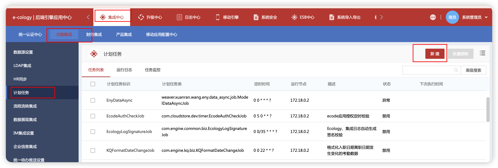

 新建计划任务卡片中需要填写计划任务标识和计划任务类，同时需要配置好对应的定时时间，使用的是`Cron`表达式

 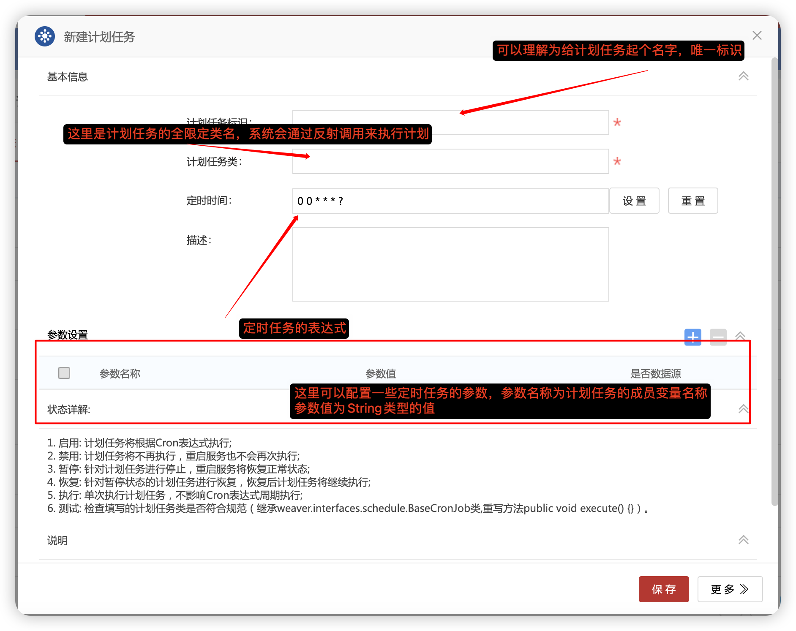

 **定时任务说明**
1、按照设定的时间定时执行任务，计划任务标识不能重复
2、计划任务类必须是类的全名，该类必须继承`weaver.interfaces.schedule.BaseCronJob`类,重写方法`public void execute() {}`
3、时间格式按 Cron 表达式的定义

 #### 代码示例

 我们编写一个定时任务，该定时任务有两个参数，接下来使用代码来编写一个定时任务


```
package weaver.schedule.example;

import lombok.Getter;
import lombok.Setter;
import org.slf4j.Logger;
import org.slf4j.LoggerFactory;
import weaver.interfaces.schedule.BaseCronJob;

/**
 * <h1>测试定时任务dome</h1>
 * </br>
 * <p>create: 2023/12/24 12:02</p>
 *
 * <p></p>
 *
 */
@Setter
@Getter
public class DomeTestCronJob extends BaseCronJob {

 /** 定时任务参数，只能使用string类型来接受 */
 private String testParam;

 private static final Logger logger = LoggerFactory.getLogger("cus");

 @Override
 public void execute() {
 // 使用基类的方法获取cron表达式
 String cronExpr = getCronExpr();
 logger.info(this.getClass().getName() + " start..... CronExpr: " + cronExpr + " testParam: " + testParam);
 }
}

```
我们在`WEB-INF/log4jinit.properties`中加入 cus 的日志配置信息

 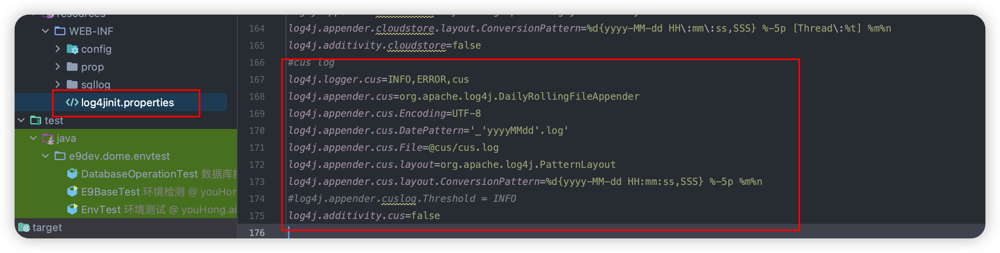

 编译成功后打包到服务器，并且修改对应的`log4jinit.properties`文件重启后我们可以配置定时任务并且手动执行测试是否能够正常运转

 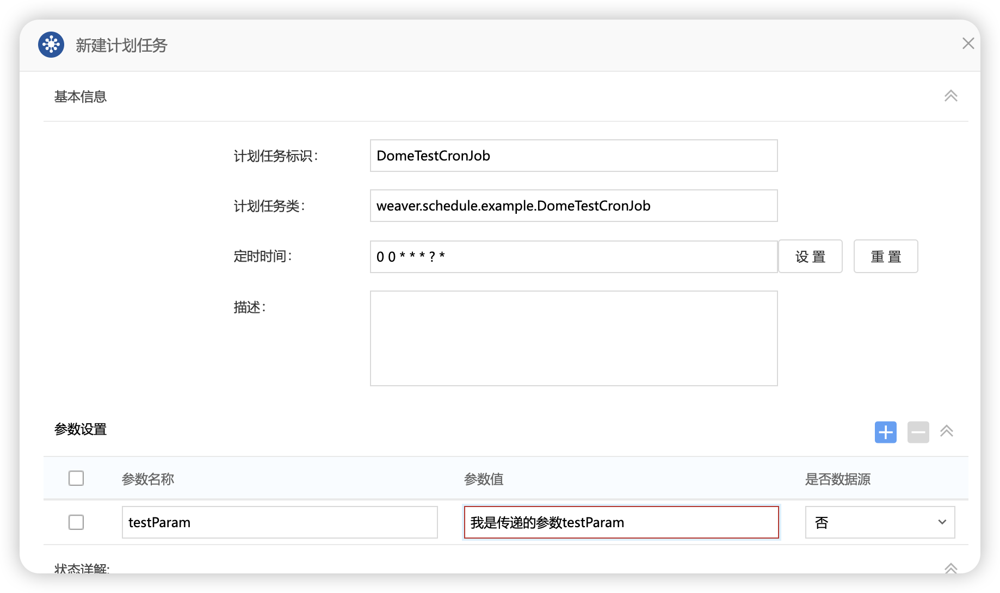

 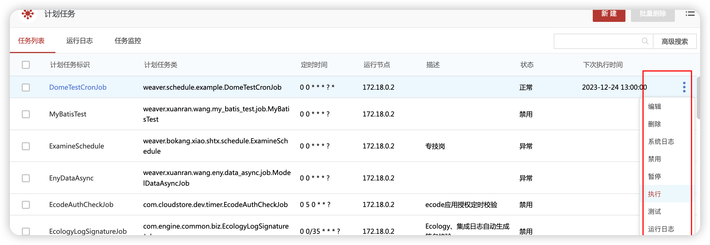

 配置完成后，我们可以进行手动执行，之后可以查看日志`ecology/log/cus/cus.log`日志，或者登录系统管理员账号在前端查看日志`/log/cus/cus.log`

 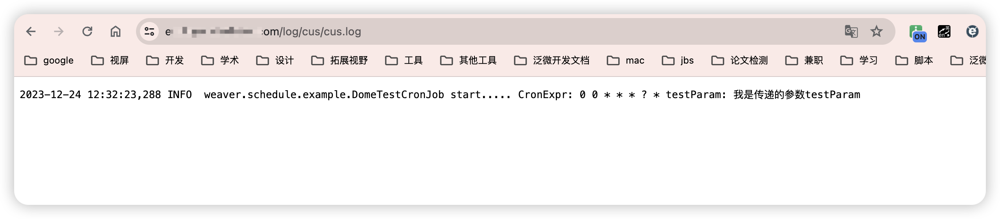

 从日志中我们能看出，定时任务执行了，并且传递的参数也正常解析到了

 #### debug

 这里的 debug 代码有多重形式，一种是使用本地单元测试进行 debug，另外一种是使用 idea 远程 debug，当然如果开发环境搭建的时候采用的其他的搭建形式，启动应用程序是从 idea 启动的，则 debug 就简单很多

 **本地单元测试**

 本地单元测试之前文档中有提及，在开发环境搭建中有讲过，必要的两个设置


```
// 设置服务名称，这里的名称也可以理解为数据源，默认是ecology
 GCONST.setServerName("ecology");
 // 设置根路径，这里设置的是服务的路径地址，如果没有吧WEB-INF文件放到项目中，则这里可以填写实际的ecology的路径地址
 GCONST.setRootPath("/your_path/src/main/resources/");

```
同时我们创建两个一个单元测试的基类，加入了`before`方法和注解


```
package e9dev.dome.envtest;

import com.alibaba.fastjson.JSON;
import org.junit.Before;
import weaver.general.GCONST;
import weaver.hrm.User;

/**
 * <h1>环境检测</h1>
 * </br>
 * <p>create: 2023/12/22 11:22</p>
 *
 * <p></p>
 *
 */
public class E9BaseTest {
 public static void main(String[] args) {
 // 设置服务名称，这里的名称也可以理解为数据源，默认是ecology
 GCONST.setServerName("ecology");
 // 设置根路径，这里设置的是服务的路径地址，如果没有吧WEB-INF文件放到项目中，则这里可以填写实际的ecology的路径地址
 GCONST.setRootPath("/Users/aoey.oct.22/code/dome/e9-dev-demo/src/main/resources/");
 User user = new User(1);
 System.out.println(JSON.toJSONString(user));
 }
 /**
 * ************************************************************
 * <h2>针对后期使用单元测试，我们可以将路径地址写到before中这样就不用每次都重新设置和编写了</h2>
 * <i>2023/12/22 11:37</i>
 *
 * ************************************************************
 */

 @Before
 public void before(){

 // 设置服务名称，这里的名称也可以理解为数据源，默认是ecology
 GCONST.setServerName("ecology");
 // 设置根路径，这里设置的是服务的路径地址，如果没有吧WEB-INF文件放到项目中，则这里可以填写实际的ecology的路径地址
 GCONST.setRootPath("/Users/aoey.oct.22/code/dome/e9-dev-demo/src/main/resources/");
 }
}

```
之后的单元测试，我们就可以继承`E9BaseTest`来进行单元测试


```
package e9dev.dome.envtest;

import org.junit.Test;
import weaver.schedule.example.DomeTestCronJob;

/**
 * <h1>单元测试</h1>
 * </br>
 * <p>create: 2023/12/24 12:39</p>
 *
 * <p></p>
 *
 */
public class ActionAndCronJobTest extends E9BaseTest {

 @Test
 public void testCronJob() {
 DomeTestCronJob cronJob = new DomeTestCronJob();
 cronJob.setTestParam("单元测试参数");
 cronJob.execute();
 }
}

```
如果采用远程 debug，那么需要再服务端修改启动参数，这里以`Resin`为例，我们需要修改`Resin4/conf/resin.properties`中的`jvm_args`参数，在参数中添加`-agentlib:jdwp=transport=dt_socket,server=y,suspend=n,address=${port}`远程 debug 参数

 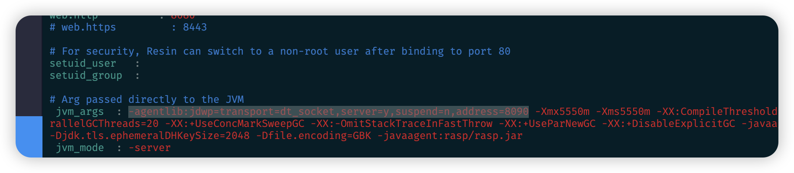

 之后重启服务，在 idea 中配置如下

 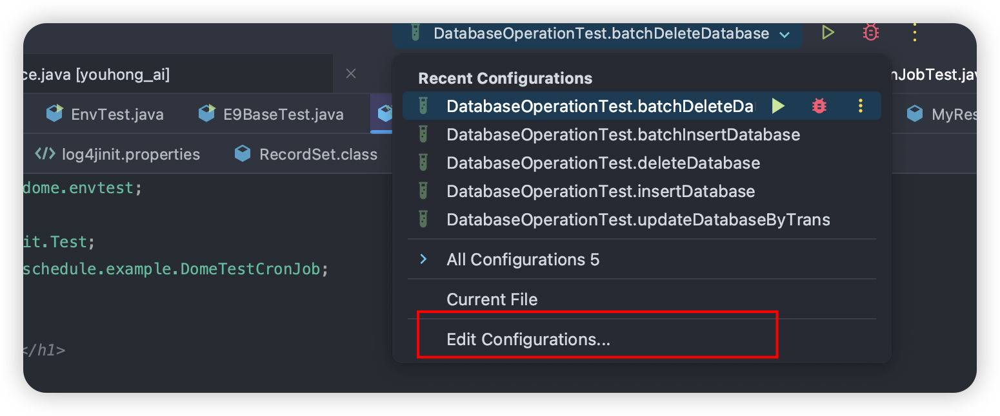

 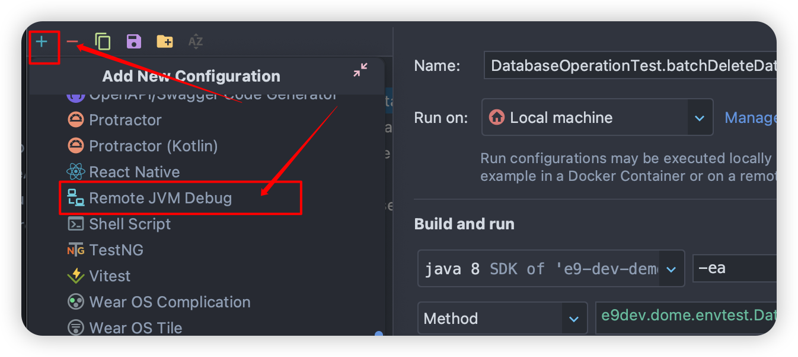

 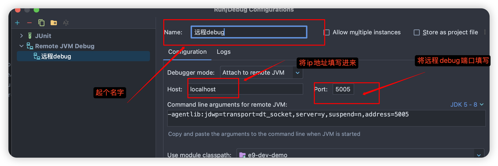

 好了，接下来就可以进行远程 debug 了，我们 debug 的形式运行我们配置的`远程debug`

  运行成功后，我们可以到前台进行手动执行，让请求进入我们的方法

 

 

 可以看到我们成功 debug(断点出现偏差是因为本地代码与服务器代码不一致导致的)

 ## 流程 Action

 流程 action 开发是我们在对流程开发中最为常见的开发，也是整个开发需求中最多的开发类型

 ### 节点附加操作执行顺序

 保存表单数据——>节点后附加操作——>生成编号——>出口附加规则——>节点前附加操作——>插入操作者和签字意见

 注：流程存为文档（workflowToDoc）接口特殊处理，作为流程提交的最后一个 action 执行

 

 ### 使用 action

 使用 action 和使用定时任务一样，需要配置类的全路径类名，只是他的集成方式有多个入口，一个就是如同定时任务一样，在集成中心新建 action

 

 

 第二种方法可以在在流程路径设置（节点信息或者图形编辑）中直接绑定

 

 

 #### action 编程说明

 1.在节点前后附加操作中可设置接口动作，完成流程自定义附加操作 2.接口动作标识不能重复；接口动作类文件必须是类全名，该类必须实现接口`weaver.interfaces.workflow.action.Action`方法`public String execute(RequestInfo request)`

 `Action`接口代码


```
package weaver.interfaces.workflow.action;

import weaver.soa.workflow.request.RequestInfo;

public interface Action {

 public static final String SUCCESS="1";

 /**
 * 失败信息，返回此信息，如果是节点前附加操作，将会阻止流程提交
 */
 public static final String FAILURE_AND_CONTINUE = "0";

 public String execute(RequestInfo request);
}

```
代码示例


```
package weaver.action.example;

import lombok.Getter;
import lombok.Setter;
import weaver.general.Util;
import weaver.hrm.User;
import weaver.interfaces.datasource.DataSource;
import weaver.interfaces.workflow.action.Action;
import weaver.soa.workflow.request.*;
import weaver.workflow.request.RequestManager;
import weaver.workflow.workflow.WorkflowBillComInfo;
import weaver.workflow.workflow.WorkflowComInfo;

/**
 * <h1>测试action</h1>
 * </br>
 * <p>create: 2023/12/24 14:18</p>
 *
 * <p></p>
 *
 */
@Getter
@Setter
public class DomeTestAction implements Action {

 //action中定义属性，接收参数值，如参数值不为数据源，则注入的值为设置的String对象
 private String testParam = "";

 //action中定义属性，接收参数值，参数值为数据源，则注入的为DataSource对象
 private DataSource dataSource = null;

 @Override
 public String execute(RequestInfo requestInfo) {
 // 获取流程数据管理对象
 RequestManager requestManager = requestInfo.getRequestManager();
 // 获取流程表单名称
 String billTable = requestManager.getBillTableName();
 // 当前流程的requestId 唯一标识
 String requestId = requestInfo.getRequestid();
 // 当前流程节点的提交人
 User user = requestInfo.getRequestManager().getUser();
 // 当前流程的路径id
 int workflowId = requestManager.getWorkflowid();
 // 操作类型 submit - 提交 reject - 退回 等
 String src = requestManager.getSrc();
 // 如果表名获取不到，可以通过下面的方式再次尝试获取
 if ("".equals(billTable)) {
 WorkflowComInfo workflowComInfo = new WorkflowComInfo();
 String formId = workflowComInfo.getFormId(String.valueOf(workflowId));
 WorkflowBillComInfo workflowBillComInfo = new WorkflowBillComInfo();
 billTable = workflowBillComInfo.getTablename(formId);
 }
 int billId = requestManager.getBillid();//表单数据ID
 String requestName = requestManager.getRequestname();//请求标题
 String remark = requestManager.getRemark();//当前用户提交时的签字意见
 int formId = requestManager.getFormid();//表单ID
 int isBill = requestManager.getIsbill();//是否是自定义表单
 //取主表数据
 Property[] properties = requestInfo.getMainTableInfo().getProperty();// 获取表单主字段信息
 for (Property property : properties) {
 String name = property.getName();// 主字段名称
 String value = Util.null2String(property.getValue());// 主字段对应的值
 }
 //取明细数据
 DetailTable[] detailTable = requestInfo.getDetailTableInfo().getDetailTable();// 获取所有明细表
 if (detailTable.length > 0) {
 // 指定明细表
 for (DetailTable dt : detailTable) {
 Row[] s = dt.getRow();// 当前明细表的所有数据,按行存储
 // 指定行
 for (Row r : s) {
 Cell[] c = r.getCell();// 每行数据再按列存储
 // 指定列
 for (Cell c1 : c) {
 String name = c1.getName();// 明细字段名称
 String value = c1.getValue();// 明细字段的值
 }
 }
 }
 }
 //控制流程流转，增加以下两行，流程不会向下流转，表单上显示返回的自定义错误信息
 requestManager.setMessagecontent("返回自定义的错误信息");
 requestManager.setMessageid("错误信息编号");

 // return返回固定返回`SUCCESS`,
 // 当return `FAILURE_AND_CONTINUE`时，表单上会提示附加操作失败
 return SUCCESS;
 }
}

```
| 常量 | 值 | 说明 |
| --- | --- | --- |
| SUCCESS | "1" | 成功标识，继续流程提交或执行下一个附加操作 |
| FAILURE_AND_CONTINUE | "0" | 失败标识，阻断流程提交 |
 #### Action 参数使用方式

 使用自定义接口时，可以进行参数设置，和指定参数值。

 设置后，需在 action 中实现对应的 setter 方法，oa 会自动将设置的参数值注入

 如果参数值为数据源，则注入的为 DataSource 对象，参数值为集成中设置的数据源名称

 如参数值不为数据源，则注入的值为设置的 String 对象


```
public class TestMsgAction implements Action {

 //action中定义属性，接收参数值，如参数值不为数据源，则注入的值为设置的String对象
 private String aaa = "";

 //action中定义属性，接收参数值，参数值为数据源，则注入的为DataSource对象
 private DataSource bbb = null;

 //设置对应的stter方法
 public void setAaa(String aaa) {
 this.aaa = aaa;
 }

 //设置对应的stter方法
 public void setBbb(DataSource bbb) {
 this.bbb = bbb;
 }

 @Override
 public String execute(RequestInfo request) {
 return SUCCESS;
 }
}

```
#### Action 能做的事情

 1、获取流程相关信息（requestid、workflowid、formid、isbill、表单信息等）；

 2、执行 sql 语句，查询或更新 OA 系统中的数据；

 3、返回失败标识和提示信息，阻断前台流程提交，并显示提示信息；

 4、强制收回触发 action 回滚

 5、调用第三方系统的接口

 6、实现自定义操作者

 1、获取流程相关信息


```
public String execute(RequestInfo info) {
 //获取工作流id
 String workflowId = info.getWorkflowid();
 //获取流程id
 String requestid = info.getRequestid();
 //获取RequestManager对象
 RequestManager RequestManager = info.getRequestManager();
 //获取当前节点id
 int currentnodeid = RequestManager.getNodeid();
 //下一个节点id
 int nextnodeid = RequestManager.getNextNodeid();
 //获取流程表单id
 int formid = RequestManager.getFormid();
 //是否为单据
 int isbill = RequestManager.getIsbill();
 //获取数据库主表名
 String tableName = isbill == 1 ? "workflow_form" : RequestManager.getBillTableName();
 return Action.SUCCESS;
 }

```
2、执行 sql 语句，查询或更新 OA 系统中的数据；


```
public class SQLExecuteActionDemo implements Action {
 @Override
 public String execute(RequestInfo info) {
 //获取流程id
 String requestid = info.getRequestid();

 /*************1.不带事务执行SQL开始***************/
 RecordSet rs = new RecordSet();
 //执行查询语句，查询数据
 rs.executeQuery("select testFieldName from formtable_main_45 where requestid = ?", requestid);
 if(rs.next()){
 String testFieldValue = rs.getString(1);
 new BaseBean().writeLog("testFieldName 的值是 :" + testFieldValue);
 }

 //执行update语句，更新数据
 rs.executeUpdate("update formtable_main_45 set testFieldName = ? where requestid = ?", "testValue", requestid);
 /*************1.不带事务执行SQL结束***************/

 /*************2.带事务执行SQL开始***************/
 RecordSetTrans rst = new RecordSetTrans();
 rst.setAutoCommit(false);
 try {
 rst.executeUpdate("update formtable_main_45 set testFieldName1 = ? where requestid = ?", "testValue1", requestid);

 rst.executeUpdate("update formtable_main_45 set testFieldName2 = ? where requestid = ?", "testValue2", requestid);

 //手动提交事务
 rst.commit();
 } catch (Exception e) {
 //执行失败，回滚数据
 rst.rollback();
 e.printStackTrace();
 }
 /*************2.带事务执行SQL结束***************/

 /*************3.查询或操作流程流转相关表开始***************/
 /*************此处需注意不要将RecordSetTrans对象的事务提交掉***************/
 RecordSetTrans requestRst = info.getRequestManager().getRsTrans();

 try {
 requestRst.executeQuery("select status from workflow_requestbase where requestid = ?", requestid);
 if (requestRst.next()) {
 String statusValue = rs.getString("status");
 new BaseBean().writeLog("statusValue 的值是 :" + statusValue);
 }
 } catch (Exception e) {
 e.printStackTrace();
 }

 /*************3.查询或操作流程流转相关表结束***************/

 return Action.SUCCESS;
 }
}

```
**注意点**


- 操作 OA 数据库中数据，必须使用 OA 自带的数据库操作类（推荐 Recordet、RecordSetTrans），使用其他方式操作数据库，可能会出现数据库缓存读取不到最新数据的情况

- 使用 requestInfo.getRequestManager().getRsTrans()获取到的 RecordSetTrans 对象，不要手动提交或者回滚数据，会导致流程提交错误。

 3、返回失败标识和提示信息，阻断前台流程提交，并显示提示信息；


```
 public String execute(RequestInfo request) {

 //获取requestId
 String requestId = request.getRequestid();

 float amount = 0;

 /*************1.直接查询数据库获取表单值***************/
 RecordSet rs = new RecordSet();
 rs.executeQuery("select amount from formtable_main_16 where requestid = ?", requestId);
 //获取金额字段的值
 if (rs.next()) {
 amount = rs.getFloat(1);
 }

 /*************2.直接查询数据库获取表单值***************/
 //获取主表数据
 Map<String, String> mainDatas = new HashMap<>();
 Property[] properties = request.getMainTableInfo().getProperty();
 for (Property propertie : properties) {
 mainDatas.put(propertie.getName(), propertie.getValue());
 }
 amount = Util.getFloatValue(Util.null2String(mainDatas.get("amount")));

 //金额字段值大于10000，阻断流程提交
 if(amount > 10000) {
 RequestManager requestManager = request.getRequestManager();
 requestManager.setMessagecontent("不允许提交金额大于10000的流程");
 return FAILURE_AND_CONTINUE;
 }

 return SUCCESS;
 }

```
4、强制收回触发 action 回滚


```
public String execute(RequestInfo request) {

 //获取requestId
 String requestId = request.getRequestid();

 //对应节点强制收回，则回滚数据
 if (request.getRequestManager().getNodeid() == 123) {
 RecordSet rs = new RecordSet();
 rs.executeUpdate("delete from uf_fix_log where requestid = ?", requestId);
 }

 return SUCCESS;
 }

```
**注意**


- 所有节点执行强制收回或者删除都会执行，需在 action 中判断当前节点 Id

 5、调用第三方系统的接口


```
package weaver.interfaces.workflow.action.actionDemo;

import com.alibaba.fastjson.JSONObject;
import weaver.conn.RecordSet;
import weaver.general.BaseBean;
import weaver.interfaces.workflow.action.Action;
import weaver.soa.workflow.request.Property;
import weaver.soa.workflow.request.RequestInfo;

import java.io.BufferedReader;
import java.io.InputStream;
import java.io.InputStreamReader;
import java.io.PrintWriter;
import java.net.HttpURLConnection;
import java.net.URL;
import java.util.HashMap;
import java.util.Map;

public class HttpTestAction implements Action {
 @Override
 public String execute(RequestInfo requestInfo) {

 //打印日志对象
 BaseBean baseBean = new BaseBean();
 baseBean.writeLog("获取到归属地action执行 requestid = " + requestInfo.getRequestid());

 Map<String, String> mainTableDatas = new HashMap<>();

 //获取主表字段数据
 Property[] properties = requestInfo.getMainTableInfo().getProperty();
 for(Property property : properties) {
 mainTableDatas.put(property.getName(), property.getValue());
 }

 String url = "https://tcc.taobao.com/cc/json/mobile_tel_segment.htm?";
 String result = httpUtil(url, "tel=" + mainTableDatas.get("dhhm"));

 String results[] = result.split("=");
 if(result.length() > 1) {
 JSONObject object = JSONObject.parseObject(results[1]);
 //获取到归属地
 String carrier = (String)object.get("carrier");
 baseBean.writeLog("获取到归属地 ：" + carrier);
 RecordSet rs = new RecordSet();
 String sql = "update formtable_main_199 set gsd = ? where requestid = ?";
 rs.executeUpdate(sql, carrier, requestInfo.getRequestid());
 }

 return SUCCESS;
 }

 public String httpUtil(String path, String data) {
 StringBuilder result = new StringBuilder();
 try {
 URL url = new URL(path);
 //打开url的连接
 HttpURLConnection conn = (HttpURLConnection)url.openConnection();
 //设置请求方式
 conn.setRequestMethod("POST");
 conn.setDoOutput(true);
 conn.setDoInput(true);

 PrintWriter out = new PrintWriter(conn.getOutputStream());
 //发送请求参数
 out.print(data);
 out.flush();
 //获取响应输入流
 InputStream is = conn.getInputStream();
 BufferedReader br = new BufferedReader(new InputStreamReader(is, "GBK"));
 String str = "";
 while ((str = br.readLine()) != null) {
 result.append(str);
 }
 //关闭输入流
 is.close();
 conn.disconnect();
 } catch (Exception e) {
 e.printStackTrace();
 }

 return result.toString();
 }
}

```
6、实现自定义操作者

 需实现`weaver.interfaces.workflow.action.OperatorAction`接口


```
package weaver.interfaces.workflow.action;

import java.util.List;

import weaver.soa.workflow.request.RequestInfo;

/**
 * 流程节点操作者自定义接口
 * @author Mcr
 *
 */
public interface OperatorAction {

 /**
 * 取节点操作者，返回人员id集合
 * @param requestInfo
 * @return
 */
 public List<String> execute(RequestInfo requestInfo);
}

```
示例代码：


```
package weaver.interfaces.workflow.action.actionDemo;

import weaver.interfaces.workflow.action.OperatorAction;
import weaver.soa.workflow.request.RequestInfo;

import java.util.ArrayList;
import java.util.List;

public class OperatorActionTest implements OperatorAction {
 /**
 * 取节点操作者，返回人员id集合
 *
 * @param requestInfo
 * @return
 */
 @Override
 public List<String> execute(RequestInfo requestInfo) {

 List<String> operatorList = new ArrayList<>();

 //返回人员id
 operatorList.add("21");
 operatorList.add("22");

 return operatorList;
 }
}

```
## 建模扩展页面 Action

 建模扩展页面的 Action 在日常开发中比较少见，但是也是存在类似的需求，它的开发与流程的 Action 类似。

 在对建模数据进行操作时候，可以触发自定义的接口动作，可以处理一些特殊的业务，比如对建模中的数据进行运算，或者把建模数据写入其他应用模块，或者写入第三方系统

 ### 使用建模扩展页面 Action

 找到对应建模的模块，然后找到页面扩展，对需要进行扩展拦截的按钮进行编辑加上 action

 

 

 

 **注意**


- 接口需要继承`weaver.formmode.customjavacode.AbstractModeExpandJavaCodeNew`类

 示例实现


```
package weaver.formmode.example;

import java.util.HashMap;
import java.util.Map;

import weaver.formmode.customjavacode.AbstractModeExpandJavaCodeNew;
import weaver.general.Util;
import weaver.hrm.User;
import weaver.soa.workflow.request.RequestInfo;/**
 * <h1>测试建模action</h1>
 * </br>
 * <p>create: 2023/12/24 15:21</p>
 *
 * <p></p>
 *
 */
public class DomeTestFormMode extends AbstractModeExpandJavaCodeNew {

 /**
 * 执行模块扩展动作
 * @param param
 * param包含(但不限于)以下数据
 * user 当前用户
 * importtype 导入方式(仅在批量导入的接口动作会传输) 1 追加，2覆盖,3更新，获取方式(int)param.get("importtype")
 * 导入链接中拼接的特殊参数(仅在批量导入的接口动作会传输)，比如a=1，可通过param.get("a")获取参数值
 * 页面链接拼接的参数，比如b=2,可以通过param.get("b")来获取参数
 * @return
 */
 @Override
 public Map<String, String> doModeExpand(Map<String, Object> param) {
 Map<String, String> result = new HashMap<String, String>();
 try {
 User user = (User)param.get("user");
 int billid = -1;//数据id
 int modeid = -1;//模块id
 RequestInfo requestInfo = (RequestInfo)param.get("RequestInfo");
 if(requestInfo!=null){
 billid = Util.getIntValue(requestInfo.getRequestid());
 modeid = Util.getIntValue(requestInfo.getWorkflowid());
 if(billid>0&&modeid>0){
 //------请在下面编写业务逻辑代码------
 }
 }
 } catch (Exception e) {
 result.put("errmsg","自定义出错信息");
 result.put("flag", "false");
 }
 return result;
 }
}

```
**注意**：这里的`RequestInfo`和流程的`RequestInfo`是有一定的差异的，开发时，要更具实际情况来

 点击保存时，回执行对应操作的 action 代码

 

 ## 拓展点

 添加的参数是如何赋值到成员变量的呢？

 主要是利用反射的原理来实现的，如右侧的代码示例


```
Class clazz = Class.forName(classpath);
BaseCronJob basecj = (BaseCronJob) clazz.newInstance();
//参数加入
if (schedtlmap.get(id) != null) {
 Map<String, Object> m = (Map) schedtlmap.get(id);
 Set<String> keyset = m.keySet();
 for (String k : keyset) {
 try {
 Field f = clazz.getDeclaredField(k);
 f.setAccessible(true);
 f.set(basecj, m.get(k));
 } catch (Exception e) {
 e.printStackTrace();
 continue;
 }
 }
}

```
## 思考


- 如何实现定时任务，开发一个定时任务，向日志中输出定时任务的参数？
- 如何实现 action，开发一个 action，判断流程下拉框字段，符合规则成功提交，不符合退回并提示不符合条件？


---

# E9 流程表单前端接口

Ecology 9 的前端框架变动较大，不再支持原生 DOM 操作。所有流程表单字段的操作必须通过统一的 API 接口进行，以保证 PC 端和移动端的兼容性。

> **核心原则**：表单字段相关操作，**不推荐使用 jQuery，禁止原生 JS 直接操作 DOM 结构**。必须使用 `WfForm` API 接口操作，由产品统一运维。

本章主要讲如何在前端流程中使用 E9 API 进行表单二次开发。

 本章主要讲如何在前端流程使用 E9Api 进行表单的二次开发，原文：[E9 流程表单前端接口](https://e-cloudstore.com/doc.html?appId=98cb7a20fae34aa3a7e3a3381dd8764e#E9%E6%B5%81%E7%A8%8B%E8%A1%A8%E5%8D%95%E5%89%8D%E7%AB%AF%E6%8E%A5%E5%8F%A3API)

 ## 1.说明

 ### 1.1 简介

 所有接口统一封装在全局对象 window.WfForm 中

 部分接口存在使用范围，最低 kb 版本以及是否移动端/PC 端独有。没有特殊注明情况下通用

 表单字段相关操作，不推荐使用 jQuery，禁止原生 JS 直接操作 DOM 结构！

 大家开发过程中，推荐都使用 API 接口操作，由产品统一运维；同时使用 API 才能完整的兼容移动终端


> 如何开发?

 我们只需要要到指定节点的表单模板中插入对应的代码即可

 

 

 

 然后再编辑器中写上代码即可完成开发

 

 ### 1.2 移动端兼容

 WfForm 对象下接口，兼容新版移动端 EM7

 由于 API 接口在 PC 端与移动端已经统一，为减少开发工作量以及后期维护成本；
故 EM7 表单在移动终端不再引入 workflow_base 表 custompage4emoble 列作为自定义页面，直接引入 custompage 列(与 PC 模板一致)作为自定义页面

 前端（JS 方法）区分终端：

 可通过方法 WfForm.isMobile()判断是否移动端


```
const isMobile = WfForm.isMobile(); //true表示是eMobile、微信、钉钉等移动终端，false代表PC端

```
后端请求（自定义页面等）区分终端:


```
const isMobile: boolean = "true".equals(request.getParameter("_ec_ismobile")); //true表示是eMobile、微信、钉钉等移动终端，false代表PC端

```
### 1.3 前端代码开发方式


- 方式 1：模板上代码块，针对单个节点，在显示/打印/移动模板单独配置

- 方式 2：【路径管理】-打开具体路径-【基础设置】-【自定义页面】，针对此路径下所有节点所有模板生效

- 方式 3：【路径管理】-【应用设置】-【流程表单自定义页面设置】，针对系统所有非模板模式的场景(PC 及移动)。注意此页面为全局 custompage，应避免写 ready、checkCustomize 等全局函数，只定义些函数体

 **特别注意**：方式二、方式三禁止引入 init_wev8.js。

 如遇配置不生效，请先将代码块/custompage 仅写 alert 确认是否生效，再逐步排查错误原因。

 ### 1.4 PC 端打开表单的方式

 新建请求：传参路径 id，会自动计算活动版本的路径 id


```
window.open("/workflow/request/CreateRequestForward.jsp?workflowid=747");

```
查看请求：传参请求 id，用户需本身具备此请求查看权限，主次账号需带入账号信息


```
window.open("/workflow/request/ViewRequestForwardSPA.jsp?requestid=5963690");

```
### 1.5 移动端打开表单的方式

 移动端表单链接：


```
//新建链接，传参路径id
const createUrl =
 "/spa/workflow/static4mobileform/index.html#/req?iscreate=1&workflowid=748";
//查看链接，传参请求id
const viewUrl =
 "/spa/workflow/static4mobileform/index.html#/req?requestid=4503066";

```
第一种方式(推荐)：调用封装好的方法
如果是通过移动端脚手架打包的模块，可以直接调用
如果是自行开发的界面，需要引入/spa/coms/openLink.js

 最低支持版本：KB900190601

 `openLink.openWorkflow(url, callbackFun, returnUrl)`


| 参数 | 参数类型 | 说明 |
| --- | --- | --- |
| url | String | 打开表单的链接 |
| callbackFun | Function | 仅限 EM 客户端，返回时的回调函数 |
| returnUrl | String | 非 EM 客户端，返回/提交后到指定链接 |

```
window.openLink.openWorkflow(createUrl, function () {
 alert("E-mobile打开表单链接，返回或提交后触发此回调函数");
});
//非EM终端打开，返回或提交后返回到流程中心界面
window.openLink.openWorkflow(
 createUrl,
 null,
 "/spa/workflow/static4mobile/index.html#/center/doing"
);

```
第二种方式：仅限于 EM 客户端，打开表单并可控制表单返回/提交后事件回调
使用 EM-SDK，弹 webview 方式实现


```
//分为两步，第一步调用SDK弹webview，第二步调用SDK控制回调刷新
window.em.openLink({
 url: viewUrl,
 openType: 2,
});
window.em.ready(function () {
 window.em.registerBroadcast({
 name: "_closeWfFormCallBack",
 action: function (argument) {
 alert("E-mobile打开表单链接，返回或提交后触发此回调函数");
 },
 });
});

```
第三种方式(不推荐)： window.open 或者 window.location.href 跳转。
此方式 url 需要传参 returnUrl 并转码，流程提交后需要关闭的情况会返回跳转到 returnUrl 地址上，无法监听打开-手动返回场景；
建议如果是 EM 客户端采用方式一或方式二！


```
window.open(
 viewUrl +
 "&returnUrl=" +
 window.encodeURIComponent("/test.jsp?param1=test11&param2=test22")
);

```
## 2.注册自定义事件

 ### 2.1 注册拦截事件，指定动作执行前触发，并可阻断/放行后续操作

 支持多次注册，按注册顺序依次执行；支持异步 ajax，避免请求卡住


- 场景 1：表单提交、保存、退回、转发、强制收回等操作执行前，执行自定义逻辑并阻断/放行后续操作

- 场景 2：明细添加行、删除行前，执行自定义逻辑并阻断/允许后续操作


| 动作类型 | 说明 | 最低版本要求 |
| --- | --- | --- |
| WfForm.OPER_SAVE | 保存 | |
| WfForm.OPER_SUBMIT | 提交/批准/提交需反馈/不需反馈等 | |
| WfForm.OPER_SUBMITCONFIRM | 提交至确认页面，如果是确认界面，点确认触发的是 SUBMIT | |
| WfForm.OPER_REJECT | 退回 | |
| WfForm.OPER_REMARK | 批注提交 | |
| WfForm.OPER_INTERVENE | 干预 | |
| WfForm.OPER_FORWARD | 转发 | |
| WfForm.OPER_TAKEBACK | 强制收回 | |
| WfForm.OPER_DELETE | 删除 | |
| WfForm.OPER_ADDROW | 添加明细行，需拼明细表序号 | |
| WfForm.OPER_DELROW | 删除明细行，需拼明细表序号 | |
| WfForm.OPER_PRINTPREVIEW | 打印预览 | KB900190501 |
| WfForm.OPER_EDITDETAILROW | 移动端-编辑明细 | KB900191101 |
| WfForm.OPER_BEFOREVERIFY | 校验必填前触发事件 | KB900191201 |
| WfForm.OPER_TURNHANDLE | 转办 | KB900201101 |
| WfForm.OPER_ASKOPINION | 意见征询 | KB900201101 |
| WfForm.OPER_TAKFROWARD | 征询转办 | KB900201101 |
| WfForm.OPER_TURNREAD | 传阅 | KB900201101 |
| WfForm.OPER_FORCEOVER | 强制归档 | KB900201101 |
| WfForm.OPER_BEFORECLICKBTN | 点右键按钮前 | KB900201101 |
| WfForm.OPER_SAVECOMPLETE | 保存后页面跳转前 | KB900210501 |
| WfForm.OPER_WITHDRAW | 撤回 | KB900201101 |
| WfForm.OPER_CLOSE | 页面关闭 | KB900201101 |
 接口名称及参数说明

 `registerCheckEvent:function(type,fun)`


| 参数 | 参数类型 | 必须 | 说明 |
| --- | --- | --- | --- |
| type | String | 是 | 动作类型(详见上表)，多个逗号分隔 |
| fun | Function | 是 | 自定义函数，此函数入参为 callback，执行自定义逻辑完成或异步 ajax 的 success 函数体内，放行需调用 callback，不调用代表阻断后续操作 |
 样例


```
jQuery().ready(function () {
 WfForm.registerCheckEvent(WfForm.OPER_SAVE, function (callback) {
 jQuery("#field27495").val("保存自动赋值");
 callback(); //继续提交需调用callback，不调用代表阻断
 });
 WfForm.registerCheckEvent(
 WfForm.OPER_SAVE + "," + WfForm.OPER_SUBMIT,
 function (callback) {
 //... 执行自定义逻辑
 callback();
 }
 );
 WfForm.registerCheckEvent(WfForm.OPER_ADDROW + "1", function (callback) {
 alert("添加明细1前执行逻辑，明细1则是OPER_ADDROW+1，依次类推");
 callback(); //允许继续添加行调用callback，不调用代表阻断添加
 });
 WfForm.registerCheckEvent(WfForm.OPER_DELROW + "2", function (callback) {
 alert("删除明细2前执行逻辑");
 callback(); //允许继续删除行调用callback，不调用代表阻断删除
 });
 WfForm.registerCheckEvent(WfForm.OPER_PRINTPREVIEW, function (callback) {
 alert("控制默认弹出的打印预览窗口");
 alert(
 "当打印含签字意见列表，此接口需要放到跳转路由前执行，组件库提供此机制"
 );
 window.WfForm.printTimeout = 3000; //产品是默认延时1s自动弹出，可通过此方式控制延时时间
 callback(); //允许继续弹出调用callback，不调用代表不自动弹预览
 });
 WfForm.registerCheckEvent(
 WfForm.OPER_EDITDETAILROW,
 function (callback, params) {
 alert(JSON.stringify(params)); //参数含当前点击哪个明细表哪一行
 callback(); //允许跳转明细编辑窗口，不调用阻断跳转
 }
 );
});

```
### 2.2 注册钩子事件，指定动作完成后触发

 支持多次调用注册，按注册的先后顺序依次执行


| 类型 | 说明 | 最低版本要求 |
| --- | --- | --- |
| WfForm.ACTION_ADDROW | 添加明细行，需拼明细表序号 | KB900190407 |
| WfForm.ACTION_DELROW | 删除明细行，需拼明细表序号 | KB900190407 |
| WfForm.ACTION_EDITDETAILROW | 移动端-编辑明细行，需拼明细表序号 | KB900190501 |
| WfForm.ACTION_SWITCHDETAILPAGING | 切换明细分页 | KB900191201 |
| WfForm.ACTION_SWITCHTABLAYOUT | 切换模板布局标签页 | KB900191201 |
 接口名称及参数说明

 `registerAction: function(actionname, fn)`


| 参数 | 参数类型 | 必须 | 说明 |
| --- | --- | --- | --- |
| actionname | String | 是 | 动作类型，详见上表 |
| fn | Function | 是 | 触发事件 |
 样例


```
WfForm.registerAction(WfForm.ACTION_ADDROW + "1", function (index) {
 alert("添加行下标是" + index);
}); //下标从1开始，明细1添加行触发事件，注册函数入参为新添加行下标
WfForm.registerAction(WfForm.ACTION_DELROW + "2", function (arg) {
 alert("删除行下标集合是" + arg.join(","));
}); //下标从1开始，明细2删除行触发事件
WfForm.registerAction(WfForm.ACTION_SWITCHDETAILPAGING, function (groupid) {
 alert("切换明细表" + (groupid + 1) + "的页码触发事件");
});
WfForm.registerAction(WfForm.ACTION_SWITCHTABLAYOUT, function (tabid) {
 alert("切换到标签项" + tabid + "触发事件");
});

```
## 3.字段基础操作接口(不适用附件、位置字段类型)

 ### 3.1 将字段名称转换成字段 id

 灵活运用此方法，可实现多表单、多环境，代码块通用；解耦代码块中指定 fieldid


> convertFieldNameToId: function(fieldname,symbol,prefix)

 参数说明


| 参数 | 参数类型 | 必须 | 说明 |
| --- | --- | --- | --- |
| fieldname | String | 是 | 字段名称 |
| symbol | String | 否 | 表单标示，主表(main)/具体明细表(detail_1),默认为 main |
| prefix | Boolean | 否 | 返回值是否需要`field`字符串前缀，默认为 true |
 样例


```
const fieldid = WfForm.convertFieldNameToId("zs");
const fieldid = WfForm.convertFieldNameToId("zs_mx", "detail_1");
const fieldid = WfForm.convertFieldNameToId("zs_mx", "detail_1", false);

```
### 3.2 获取单个字段值


> getFieldValue: function(fieldMark)

 参数说明


| 参数 | 参数类型 | 必须 | 说明 |
| --- | --- | --- | --- |
| fieldMark | String | 是 | 字段标示，格式`field${字段ID}_${明细行号}` |
 样例


```
const fieldvalue = WfForm.getFieldValue("field110");

```
### 3.3 修改单个字段值（不支持附件类型）

 此方法修改的字段如果涉及到触发联动、单元格格式化等，修改完值会自动触发联动/格式化

 改值的格式在添加明细行初始化、批量修改字段等场景类同


> changeFieldValue: function(fieldMark, valueInfo)

 参数说明


| 参数 | 参数类型 | 必须 | 说明 |
| --- | --- | --- | --- |
| fieldMark | String | 是 | 字段标示，格式`field${字段ID}_${明细行号}` |
| valueInfo | JSON | 是 | 字段值信息，非浏览按钮字段格式为{value:”修改的值”};specialobj 为浏览按钮信息，数组格式;showhtml 属性只在单行文本类型且只读情况下生效； |
 样例


```
//修改文本框、多行文本、选择框等字段类型
WfForm.changeFieldValue("field123", { value: "1.234" });
//修改浏览框字段的值，必须有specialobj数组结构对象
WfForm.changeFieldValue("field11_2", {
 value: "2,3",
 specialobj: [
 { id: "2", name: "张三" },
 { id: "3", name: "李四" },
 ],
});
//修改check框字段(0不勾选、1勾选)
WfForm.changeFieldValue("field123", { value: "1" });
//针对单行文本框字段类型，只读情况，支持显示值跟入库值不一致
WfForm.changeFieldValue("field123", {
 value: "入库真实值",
 specialobj: {
 showhtml: "界面显示值",
 },
});

```
**特别注意**：

 后台字段如果设置的是只读属性，changeFieldValue 修改的字段值在非创建时刻是禁止入库的，属于篡改数据。此情况需要设置为可编辑属性，如果前台界面又想显示成只读效果，同时设置禁止手工编辑即可。不适用于附件字段类型。

 ### 3.4 改变单个字段显示属性(只读/必填等)


> changeFieldAttr: function(fieldMark, viewAttr)

 参数说明


| 参数 | 参数类型 | 必须 | 说明 |
| --- | --- | --- | --- |
| fieldMark | String | 是 | 字段标示，格式`field${字段ID}_${明细行号}` |
| viewAttr | int | 是 | 改变字段的状态，1：只读，2：可编辑，3：必填，4：隐藏字段标签及内容，5:隐藏字段所在行(行内单元格不要存在行合并) |
 样例


```
WfForm.changeFieldAttr("field110", 1); //字段修改为只读
WfForm.changeFieldAttr("field110", 4); //字段标签以及内容都隐藏，效果与显示属性联动隐藏一致，只支持主表字段

```
### 3.5 同时修改字段的值及显示属性


> changeSingleField: function(fieldMark, valueInfo, variableInfo)

 参数说明


| 参数 | 参数类型 | 必须 | 说明 |
| --- | --- | --- | --- |
| fieldMark | String | 是 | 字段标示，格式`field${字段ID}_${明细行号}` |
| valueInfo | JSON | 否 | 字段值信息，与接口 2 格式一致，例：{value:”修改的值”} |
| variableInfo | JSON | 否 | 变更属性，例：{viewAttr:3} |
 样例


```
WfForm.changeSingleField("field110", { value: "修改的值" }, { viewAttr: "1" }); //修改值同时置为只读

```
### 3.6 批量修改字段值或显示属性


> changeMoreField: function(changeDatas, changeVariable)

 参数说明


| 参数 | 参数类型 | 必须 | 说明 |
| --- | --- | --- | --- |
| changeMoreField | JSON | 是 | 修改的字段值信息集合 |
| changeVariable | JSON | 否 | 修改的字段显示属性集合 |
 样例


```
WfForm.changeMoreField({
 field110:{value:"修改后的值"},
 field111:{value:"2,3",specialobj:[
 {id:"2",name:"张三"},{id:"3",name:"李四"}
 ]},
 ...
},{
 field110:{viewAttr:2},
 field111:{viewAttr:3},
 ...
});

```
### 3.7 触发指定字段涉及的所有联动

 说明：手动触发一次字段涉及的所有联动，包括字段联动、SQL 联动、日期时间计算、字段赋值、公式、行列规则、显示属性联动、选择框联动、bindPropertyChange 事件绑定等

 场景：触发出的子流程打开默认不执行字段联动、归档节点查看表单不执行联动，可通过此接口实现


> triggerFieldAllLinkage:function(fieldMark)

 参数说明


| 参数 | 参数类型 | 必须 | 说明 |
| --- | --- | --- | --- |
| fieldMark | String | 是 | 字段标示，格式`field${字段ID}_${明细行号}` |
 样例


```
//表单打开强制执行某字段的联动
jQuery(document).ready(function () {
 WfForm.triggerFieldAllLinkage("field110"); //执行字段涉及的所有联动
});

```
### 3.8 根据字段 ID 获取字段信息

 说明：根据字段 ID 获取字段信息，JSON 格式，包括名称、类型、只读必填属性等


> getFieldInfo:function(fieldid)

 参数说明


| 参数 | 参数类型 | 必须 | 说明 |
| --- | --- | --- | --- |
| fieldid | String | 是 | 字段 ID，不带任何标示 |
 返回值字段信息 JSON 重要属性说明


| 参数 | 说明 |
| --- | --- |
| htmltype | 字段大类型(文本/多行文本…) |
| detailtype | 字段小类型(整数/浮点数…) |
| fieldname | 字段数据库名称 |
| fieldlabel | 字段显示名 |
| viewattr | 字段属性(1:只读；2：可编辑；3：必填) |

```
WfForm.getFieldInfo("111");

```
### 3.9 获取字段当前的只读/必填属性

 此方法为实时获取字段显示属性，包含显示属性联动、代码接口变更、已办、明细已有字段不可修改等可能的变更情况，不是仅仅获取后台配置的字段属性；

 如只想获取后台配置的字段属性，调用接口 3.8 取返回值 viewattr 属性


> getFieldCurViewAttr:function(fieldMark)

 参数说明


| 参数 | 参数类型 | 必须 | 说明 |
| --- | --- | --- | --- |
| fieldMark | String | 是 | 字段标示，格式`field${字段ID}_${明细行号}` |

```
WfForm.getFieldCurViewAttr("field110_2"); //获取明细字段属性，1：只读、2：可编辑、3：必填；已办全部为只读；

```
## 4.表单字段事件绑定、自定义渲染

 ### 4.1 表单字段值变化触发事件

 字段值变化即会触发所绑定的函数，可多次绑定


> bindFieldChangeEvent: function(fieldMarkStr,funobj)

 参数说明


| 参数 | 参数类型 | 必须 | 说明 |
| --- | --- | --- | --- |
| fieldMarkStr | String | 是 | 绑定字段标示，可多个拼接逗号隔开，例如：field110(主字段),field111_2(明细字段)…… |
| funobj | Function | 是 | 字段值变化触发的自定义函数，函数默认传递以下三个参数，参数 1：触发字段的 DOM 对象，参数 2：触发字段的标示(field27555 等)，参数 3：修改后的值 |

```
WfForm.bindFieldChangeEvent("field27555,field27556", function (obj, id, value) {
 console.log("WfForm.bindFieldChangeEvent--", obj, id, value);
});

```
**特别注意**


```
如果字段绑定事件，事件内改变本字段的值，需要setTimeout延时下
WfForm.bindFieldChangeEvent("field111", function(obj,id,value){
 window.setTimeout(function(){
 WfForm.changeFieldValue("field111",{value:"修改本字段值需要延时"});
 }, 10);
 WfForm.changeFieldValue("field222",{value:"修改非本字段不需要延时"});
});

```
### 4.2 明细字段值变化触发事件

 绑定后对新添加的明细行字段以及加载的已有行明细字段，值变更触发所绑定的事件


> bindDetailFieldChangeEvent: function(fieldMarkStr,funobj)

 参数说明


| 参数 | 参数类型 | 必须 | 说明 |
| --- | --- | --- | --- |
| fieldMarkStr | String | 是 | 绑定的明细字段标示，不能有下划线标示，可多个拼接逗号隔开，例如：field110,field111 |
| funobj | Function | 是 | 字段值变更触发自定义函数，函数默认传递以下三个参数，参数 1：字段标示(field27583)，参数 2：行标示，参数 3：修改后的值 |

```
jQuery(document).ready(function () {
 WfForm.bindDetailFieldChangeEvent(
 "field27583,field27584",
 function (id, rowIndex, value) {
 console.log("WfForm.bindDetailFieldChangeEvent--", id, rowIndex, value);
 }
 );
});

```
### 4.3 字段区域绑定动作事件

 推荐使用值变化事件实现开发,因为此接口点击、双击等动作不是绑定到字段元素，是字段所在单元格区域即会触发

 此接口所有功能都通可以新版公式实现


| 类型 | 说明 |
| --- | --- |
| onblur | 失去焦点事件，仅支持单行文本类型 |
| onfocus | 获取焦点事件，仅支持单行文本字段类型 |
| onclick | 单击事件，字段所在单元格区域单击触发 |
| ondbclick | 双击事件，字段所在单元格区域双击触发 |
| mouseover | 鼠标移入事件，鼠标移入字段所在单元格区域触发 |
| mouseout | 鼠标移出事件，鼠标移出字段所在单元格区域触发 |

> bindFieldAction: function(type, fieldids, fn)

 参数说明


| 参数 | 参数类型 | 必须 | 说明 |
| --- | --- | --- | --- |
| type | String | 是 | 动作类型，见上表 |
| fieldids | String | 是 | 字段 id 集合，多个逗号分隔，明细字段不加下划线对所有行生效 |
| fn | Function | 是 | 触发函数，此函数入参接收两个参数，fieldid 以及 rowIndex 行号 |
 样例


```
WfForm.bindFieldAction(
 "onfocus",
 "field111,field222",
 function (fieldid, rowIndex) {
 alert("单行文本字段111获取焦点触发事件");
 alert("明细第" + rowIndex + "行字段222获取焦点触发事件");
 }
);
WfForm.bindFieldAction("onclick", "field333", function () {
 alert(
 "浏览按钮字段单击触发事件，不是指点放大镜选择，是整个字段所在单元格区域单击都会触发"
 );
});

```
### 4.4 自定义代理渲染单行文本框字段

 **最低版本要求**：KB900190407

 此接口仅对单行文本框字段类型生效，即数据库字段类型为 varchar

 显示效果、事件、字段值交互都可自行控制，通过接口 3.3 修改的可编辑字段值也会正常入库

 此接口传入的组件，产品会传入此字段依赖的相关 props，具体可通过 React Developer Tools 自行抓取，按需调用


> proxyFieldComp: function(fieldMark, el, range)

 参数说明


| 参数 | 参数类型 | 必须 | 说明 |
| --- | --- | --- | --- |
| fieldMark | String | 是 | 字段标示，格式`field${字段ID}_${明细行号}` |
| el | React Comp | 是 | 渲染的组件 |
| range | String | 否 | 作用范围，默认全部，(1:只读、2:可编辑、3:必填),组合后逗号分隔 |
 样例


```
WfForm.proxyFieldComp(
 "field111",
 React.createElement("div", {
 style: { background: "red" },
 children: "子内容",
 })
);
//字段111在只读、可编辑、必填情况下自定义渲染
WfForm.proxyFieldComp("field222_1", "<div>自定义渲染字段</div>", "2,3");
//明细某行字段222再可编辑、必填情况下自定义渲染

```
### 4.5 自定义追加渲染表单字段

 **最低版本要求**：KB900190407

 在标准字段展现内容的基础上，after 方式追加渲染自定义组件

 此接口参数说明与用法，与接口 4.4 类同


> afterFieldComp: function(fieldMark, el, range)

 样例


```
WfForm.afterFieldComp(
 "field111",
 React.createElement("a", {
 href: "/test.jsp?userid=" + WfForm.getFieldValue("field222"),
 children: "自定义链接",
 })
);
//字段111在只读、可编辑、必填情况下,追加渲染个自定义链接，链接参数依赖表单其它字段值

```
### 4.6 函数式自定义渲染表单字段

 **最低版本要求**：KB900190701

 以函数返回值方式自定义渲染表单字段，支持全部的字段类型，可实现基于原组件追加/复写/重新布局等等

 建议结合 ecode 工具，放到模块加载前调用，使用 JSX，可实现与表单字段渲染有关的二次开发

 此接口的优先级高于 4.4、4.5，即使用此接口代理的字段，如再使用 4.4、4.5 会直接无效


> proxyFieldContentComp: function(fieldid,fn)

 接口参数说明


| 参数 | 参数类型 | 必须 | 说明 |
| --- | --- | --- | --- |
| field | String | 是 | 主表/明细表字段 ID,格式`$fieldid$` |
| fn | Function | 是 | 代理的函数，此函数必须有返回值，返回自定义渲染的组件 |
 代理的函数参数说明


| 参数 | 参数类型 | 必须 | 说明 |
| --- | --- | --- | --- |
| info | JSON | 是 | 字段基础信息，包括字段值、字段属性等等 |
| compFn | Function | 是 | 代理前原字段组件函数，可通过此函数获取原组件 |
 样例


```
WfForm.proxyFieldContentComp("111", function (info, compFn) {
 console.log("字段id：", info.fieldid);
 console.log("明细行号：", info.rowIndex);
 console.log("字段只读必填属性：", info.viewAttr);
 console.log("字段值：", info.fieldValue);
 //返回自定义渲染的组件
 return React.createElement("div", {}, ["想怎么玩就怎么玩"]);
 //返回原组件
 return compFn();
 //返回基于原组件的复写组件
 return React.createElement("div", {}, ["前置组件", compFn(), "后置组件"]);
});
//如果此接口调用在代码块、custompage等(非模块加载前调用)，需强制渲染字段一次
WfForm.forceRenderField("field111");

```
### 4.7 根据字段标识获取字段组件

 **最低版本要求**：KB900190701

 根据字段标识，获取字段组件，即字段组件可单独提取出来放在任意地方渲染。注意字段的只读可编辑属性仍需后台事先设置好

 需要结合 ecode 工具，使用 JSX，同时 Provider 注入 Store，再结合设计器自定义属性或接口 4.6，可实现某一区域自定义排版布局渲染多个表单字段


> generateFieldContentComp:function(fieldMark)

 接口参数说明


| 参数 | 参数类型 | 必须 | 说明 |
| --- | --- | --- | --- |
| fieldMark | String | 是 | 字段标示，格式`field${字段ID}_${明细行号}` |
 样例


```
//以明细多字段、子明细的需求为例子
//步骤1：模板单元格给自定义class：area_1
//步骤2：自定义排版渲染area_1区域
const { Provider } = mobxReact;
const globalStore = WfForm.getGlobalStore();
const layoutStore = WfForm.getLayoutStore();
ReactDOM.render(
 <div>
 <Provider globalStore={globalStore} layoutStore={layoutStore}>
 <table>
 <tr>
 <td>{WfForm.generateFieldContentComp("field111_1")}</td>
 <td>{WfForm.generateFieldContentComp("field112_1")}</td>
 </tr>
 <tr>
 <td>{WfForm.generateFieldContentComp("field113_1")}</td>
 <td>{WfForm.generateFieldContentComp("field114_1")}</td>
 </tr>
 </table>
 </Provider>
 </div>,
 document.getElementByclassName("area_1")[0]
); //仅供参考，参数二要区分行号定位到具体单元格

```
## 5.明细表操作相关接口

 ### 5.1 添加明细行并设置初始值


> addDetailRow: function(detailMark, initAddRowData={})

 参数说明


| 参数 | 参数类型 | 必须 | 说明 |
| --- | --- | --- | --- |
| detailMark | String | 是 | 明细表标示，明细 1 就是 detail_1，以此递增类推 |
| initAddRowData | JSON | 否 | 给新增后设置初始值，格式为{field110:{value:”11”},field112:{value:”22”},…},注意 key 不带下划线标示 |
 样例


```
//明细2添加一行并给新添加的行字段field111赋值
WfForm.addDetailRow("detail_2", { field111: { value: "初始值" } });
//添加一行并给浏览按钮字段赋值
WfForm.addDetailRow("detail_2", {
 field222: {
 value: "2,3",
 specialobj: [
 { id: "2", name: "张三" },
 { id: "3", name: "李四" },
 ],
 },
});
//动态字段赋值，明细1添加一行并给字段名称为begindate的字段赋值
var begindatefield = WfForm.convertFieldNameToId("begindate", "detail_1");
var addObj = {};
addObj[begindatefield] = { value: "2019-03-01" };
WfForm.addDetailRow("detail_1", addObj);
//不推荐这种动态键值写法，IE不支持，避免掉
WfForm.addDetailRow("detail_1", { [begindatefield]: { value: "2019-03-01" } });

```
### 5.2 删除明细表指定行/全部行


> delDetailRow: function(detailMark, rowIndexMark)

 说明：此方法会清空明细已选情况，删除时没有提示”是否删除”的确认框

 参数说明


| 参数 | 参数类型 | 必须 | 说明 |
| --- | --- | --- | --- |
| detailMark | String | 是 | 明细表标示，明细 1 就是 detail_1，以此递增类推 |
| rowIndexMark | String | 是 | 需要删除的行标示，删除全部行:all,删除部分行：”1，2，3” |
 样例


```
WfForm.delDetailRow("detail_1", "all"); //删除明细1所有行
WfForm.delDetailRow("detail_1", "3,6"); //删除明细1行标为3,6的行

```
### 5.3 选中明细指定行/全部行


> checkDetailRow: function(detailMark, rowIndexMark,needClearBeforeChecked)

 说明：此方法可灵活使用，依靠参数 needClearBeforeChecked 可实现清除选中的逻辑

 参数说明


| 参数 | 参数类型 | 必须 | 说明 |
| --- | --- | --- | --- |
| detailMark | String | 是 | 明细表标示，明细 1 就是 detail_1，以此递增类推 |
| rowIndexMark | String | 否 | 需要选中的行标示，选中全部行:all,选中部分行：”1，2，3” |
| needClearBeforeChecked | Boolean | 否 | 是否需要清除已选 |
 样例


```
WfForm.checkDetailRow("detail_2", "all"); //勾选明细2所有行
WfForm.checkDetailRow("detail_2", "", true); //清除明细2所有已选
WfForm.checkDetailRow("detail_2", "3,6", true); //清除明细2全部已选，再勾选行标为3,6的行
WfForm.checkDetailRow("detail_2", "7", false);
//保持已选记录，追加选中行标为7的行

```
### 5.4 获取明细行所有行标示


> getDetailAllRowIndexStr： function(detailMark)

 参数说明


| 参数 | 参数类型 | 必须 | 说明 |
| --- | --- | --- | --- |
| detailMark | String | 是 | 明细表标示，明细 1 就是 detail_1，以此递增类推 |
 样例


```
console.log(WfForm.getDetailAllRowIndexStr("detail_2")); //输出1，3...等等

```
特别注意


```
遍历明细行的写法;
var rowArr = WfForm.getDetailAllRowIndexStr("detail_1").split(",");
for (var i = 0; i < rowArr.length; i++) {
 var rowIndex = rowArr[i];
 if (rowIndex !== "") {
 var fieldMark = "field111_" + rowIndex; //遍历明细行字段
 }
}

```
### 5.5 获取明细选中行下标

 **最低版本要求**：KB900190501


> getDetailCheckedRowIndexStr： function(detailMark)

 参数说明


| 参数 | 参数类型 | 必须 | 说明 |
| --- | --- | --- | --- |
| detailMark | String | 是 | 明细表标示，明细 1 就是 detail_1，以此递增类推 |
 样例


```
console.log(WfForm.getDetailCheckedRowIndexStr("detail_2")); //输出选中行1，3...等等

```
### 5.6 控制明细行 check 框是否禁用勾选

 **注**：后台配置的置灰行(不允许删除情况)，不支持通过此 API 控制


> controlDetailRowDisableCheck: function(detailMark, rowIndexMark, disableCheck)

 参数说明


| 参数 | 参数类型 | 必须 | 说明 |
| --- | --- | --- | --- |
| detailMark | String | true | 明细表标示，明细 1 就是 detail_1，以此递增类推 |
| rowIndexMark | String | 是 | 需要选中的行标示，选中全部行:all,选中部分行：”1，2，3” |
| disableCheck | boolean | true | 是否禁用勾选，true:置灰禁止勾选，false:允许勾选 |

```
WfForm.controlDetailRowDisableCheck("detail_1", "all", true); //明细1所有行check框置灰禁止选中
WfForm.controlDetailRowDisableCheck("detail_1", "1,2", false);
//明细1行标为1,2的行释放置灰，允许勾选

```
### 5.7 控制明细数据行的显示及隐藏

 **注**：只是界面效果隐藏，序号不会变化，即被隐藏行的前后行序号会断层不连续


> controlDetailRowDisplay: function(detailMark, rowIndexMark, needHide)

 参数说明


| 参数 | 参数类型 | 必须 | 说明 |
| --- | --- | --- | --- |
| detailMark | String | true | 明细表标示，明细 1 就是 detail_1，以此递增类推 |
| rowIndexMark | String | 是 | 需要选中的行标示，选中全部行:all,选中部分行：”1，2，3” |
| needHide | boolean | true | 是否隐藏行，true:隐藏，false:显示 |

```
WfForm.controlDetailRowDisplay("detail_1", "3,5", true); //明细1行标为3,5的隐藏不显示
WfForm.controlDetailRowDisplay("detail_1", "all", false);
//明细1所有行不隐藏都显示

```
### 5.8 获取明细已有行的数据库主键


> getDetailRowKey: function(fieldMark)

 此方法只对明细已有行生效，新增加的行/不存在的行返回-1

 参数说明


| 参数 | 参数类型 | 必须 | 说明 |
| --- | --- | --- | --- |
| fieldMark | String | 是 | 字段标示，格式`field${字段ID}_${明细行号}`，用于定位属于哪个明细表 |

```
WfForm.getDetailRowKey("field112_3"); //获取明细第四行主键

```
### 5.9 获取明细总行数


> getDetailRowCount： function(detailMark)

 参数说明


| 参数 | 参数类型 | 必须 | 说明 |
| --- | --- | --- | --- |
| detailMark | String | 是 | 明细表标示，明细 1 就是 detail_1，以此递增类推 |
 样例


```
console.log(WfForm.getDetailRowCount("detail_2")); //输出明细总行数，注意此结果只代表明细总行数，不能用作循环行

```
### 5.10 添加行、删除行前执行逻辑或阻断事件

 **最低版本要求**：KB900190501

 场景：可实现添加行前执行自定义逻辑、限制超过多少行添加无效、不允许删除等

 采用注册函数机制，详见接口 2.1

 ### 5.11 添加行、删除行后触发事件

 采用钩子机制，详见接口 2.2

 ### 5.12 移动端跳转至明细编辑行页面执行事件

 **最低版本要求**：KB900190501

 仅应用于移动端编辑明细行，采用钩子机制，详见接口 2.2

 ### 5.13 添加明细时默认复制最后一行记录


> setDetailAddUseCopy: function(detailMark, needCopy)

 说明：此方法在 ready 时调用，手动点添加时自动赋值最后行字段内容，覆盖节点前设置及默认值等，附件上传字段不予复制

 **注**：E9 是异步 ready 执行后点添加明细才生效，例如默认新增空明细无效;

 参数说明


| 参数 | 参数类型 | 必须 | 说明 |
| --- | --- | --- | --- |
| detailMark | String | 是 | 明细表标示，明细 1 就是 detail_1，以此递增类推 |
| needCopy | Boolean | 是 | 是否需要启用复制，true：启用，false：不启用 |

```
jQuery(document).ready(function () {
 WfForm.setDetailAddUseCopy("detail_1", true);
});

```
### 5.14 根据明细行标识获取序号(第几行)

 **最低版本要求**：KB900190601

 场景：根据明细行的下标，获取当前是第几行明细，可用于提示某某行异常等


> getDetailRowSerailNum: function(mark, rowIndex)

 参数说明


| 参数 | 参数类型 | 必须 | 说明 |
| --- | --- | --- | --- |
| mark | String | 是 | 明细表标示，支持两种格式`detail_${dindex}`或者`field${fieldid}_${rowIndex}` |
| rowIndex | Int | 是 | 行标识，第一种格式`detail_${dindex}`才需要传此参数 |
 样例


```
WfForm.getDetailRowSerailNum("detail_1", 3); //获取明细1下标为3的行序号
WfForm.getDetailRowSerailNum("field222_3"); //获取字段222对应明细表下标为3的行序号

```
## 6.常用全局接口(与字段无关)

 ### 6.1 获取当前打开请求的基础信息

 说明：包括路径 id、节点 id、表单 id、主次账号信息


> getBaseInfo: function()


```
console.log(WfForm.getBaseInfo()); //返回当前请求基础信息
//输出对象说明：
{
 f_weaver_belongto_userid: "5240"; //用户信息
 f_weaver_belongto_usertype: "0";
 formid: -2010; //表单id
 isbill: "1"; //新表单/老表单
 nodeid: 19275; //节点id
 requestid: 4487931; //请求id
 workflowid: 16084; //路径id
}

```
### 6.2 可控制显示时间的 message 信息


> showMessage: function(msg, type, duration)

 参数说明


| 参数 | 参数类型 | 必须 | 说明 |
| --- | --- | --- | --- |
| msg | String | true | 提示信息内容 |
| type | int | false | 提示类型，1(警告)、2(错误)、3(成功)、4(一般)，默认为 1，不同类型提示信息效果不同 |
| duration | Float | false | 多长时间自动消失，单位秒，默认为 1.5 秒 |

```
WfForm.showMessage("结束时间需大于开始时间"); //警告信息，1.5s后自动消失
WfForm.showMessage("运算错误", 2, 10); //错误信息，10s后消失

```
### 6.3 系统样式的 Confirm 确认框

 说明：兼容移动端，可自定义确认内容及按钮名称


> showConfirm: function(content, okEvent, cancelEvent, otherInfo={})

 参数说明


| 参数 | 参数类型 | 必须 | 说明 |
| --- | --- | --- | --- |
| content | String | 是 | 确认信息 |
| okEvent | Function | 是 | 点击确认事件 |
| cancelEvent | Function | 否 | 点击取消事件 |
| otherInfo | Object | 否 | 自定义信息(按钮名称) |

```
WfForm.showConfirm("确认删除吗？", function () {
 alert("删除成功");
});
WfForm.showConfirm(
 "请问你是否需要技术协助？",
 function () {
 alert("点击确认调用的事件");
 },
 function () {
 alert("点击取消调用的事件");
 },
 {
 title: "信息确认", //弹确认框的title，仅PC端有效
 okText: "需要", //自定义确认按钮名称
 cancelText: "不需要", //自定义取消按钮名称
 }
);

```
### 6.4 表单顶部按钮、右键菜单置灰

 说明：设置表单顶部按钮、右键菜单置灰不可操作和恢复操作功能参数 isDisabled


> controlBtnDisabled: function(isDisabled)

 参数说明


| 参数 | 参数类型 | 必须 | 说明 |
| --- | --- | --- | --- |
| isDisabled | boolean | 是 | true：按钮全部置灰不可操作,false：恢复按钮可操作状态 |

```
 function subimtForm(params){
 WfForm.controlBtnDisabled(true); //操作按钮置灰
 ...
 WfForm.controlBtnDisabled(false);
 }

```
### 6.5 调用右键按钮事件

 说明：调用表单右键事件逻辑，只可调用，不允许复写


> doRightBtnEvent: function(type)

 参数说明


| 参数 | 参数类型 | 必须 | 说明 |
| --- | --- | --- | --- |
| type | String | 是 | 按钮类型(控制台可通过 mobx.toJS(WfForm.getGlobalStore().rightMenu.rightMenus)方式定位具体按钮 type) |

```
WfForm.doRightBtnEvent("BTN_SUBBACKNAME"); //触发提交需反馈
WfForm.doRightBtnEvent("BTN_SUBMIT"); //触发提交不需反馈
WfForm.doRightBtnEvent("BTN_WFSAVE"); //触发保存
WfForm.doRightBtnEvent("BTN_REJECTNAME"); //触发退回
WfForm.doRightBtnEvent("BTN_FORWARD"); //触发转发
WfForm.doRightBtnEvent("BTN_REMARKADVICE"); //触发意见征询
WfForm.doRightBtnEvent("BTN_TURNTODO"); //触发转办
WfForm.doRightBtnEvent("BTN_DORETRACT"); //触发强制收回
WfForm.doRightBtnEvent("BTN_PRINT"); //触发打印

```
### 6.6 刷新表单页面

 强制刷新表单页面，默认为当前 requestid


> reloadPage: function(params={})

 参数说明


| 参数 | 参数类型 | 必须 | 说明 |
| --- | --- | --- | --- |
| params | Object | 否 | 自定义参数，覆盖默认参数 |

```
WfForm.reloadPage();
WfForm.reloadPage({ requestid: "11" }); //覆盖参数

```
### 6.7 移动端打开链接方式

 仅支持移动端，特别是非表单主界面(例如：明细编辑)需要用此方式打开链接。
此方式打开链接返回不会刷新表单


> window.showHoverWindow：function(url,baseRoute)

 参数说明


| 参数 | 参数类型 | 必须 | 说明 |
| --- | --- | --- | --- |
| url | String | 是 | 打开的链接地址 |
| baseRoute | String | 是 | 当前路由地址，具体见 url 地址，明细编辑打开传’/req/editDetailRow’ |
 样例


```
window.showHoverWindow("/workflow/test.jsp", "/req"); //主界面打开链接
window.showHoverWindow("https://www.baidu.com", "/req/editDetailRow"); //明细行编辑界面打开链接

```
### 6.8 扩展提交操作发送给服务端的参数

 **最低版本要求**：KB900190801

 自定义扩展提交/保存动作发送给服务端的参数，服务端可通过 request.getParameter 方式取到对应参数值

 推荐：扩展的自定义参数都以 cus_开头，避免影响/覆盖标准产品所必需的参数，导致功能异常


> appendSubmitParam: function(obj={})

 参数说明


| 参数 | 参数类型 | 必须 | 说明 |
| --- | --- | --- | --- |
| obj | Object | 否 | JSON 格式自定义参数 |

```
WfForm.appendSubmitParam({ cus_param1: "11", cus_param2: "测试" }); //服务端可通过request对象取到参数值request.getParameter("cus_param1"):

```
### 6.9 获取校验必填逻辑第一个未必填的字段

 **最低版本要求**：KB900191201

 场景：调用产品的必填校验逻辑，获取第一个未必填字段；
例如结合接口 2.1 中 WfForm.OPER_BEOPER_BEFOREVERIFY 可实现自定义控制必填提示的效果


> getFirstRequiredEmptyField: function()


```
var emptyField = WfForm.getFirstRequiredEmptyField(); //获取调用时刻的第一个未必填字段，返回值格式是`field${fieldid}_${rowIndex}`

```
### 6.10 触发一次必填验证

 **最低版本要求**：KB900191201

 手动触发一次必填验证并提示，可选控制校验必须新增空明细/校验字段必填


> verifyFormRequired: function(mustAddDetail=true, fieldRequired=true)

 参数说明


| 参数 | 参数类型 | 必须 | 说明 |
| --- | --- | --- | --- |
| mustAddDetail | Boolean | 否 | 是否校验必须新增空明细，默认为是 |
| fieldRequired | Boolean | 否 | 是否校验字段必填，默认为是 |

```
WfForm.verifyFormRequired(); //触发必填验证并提示，先校验必须新增空明细，后校验字段必填
var result = WfForm.verifyFormRequired(false, true); //仅校验字段必填并提示
if (!result) alert("存在未必填情况");

```
## 7.不同字段类型特定接口(限定指定字段类型可用)

 ### 7.1 扩展浏览按钮取数接口参数值

 **限定条件**：仅适用非日期时间的浏览按钮类型

 场景：控制浏览按钮可选数据范围，限定范围、依赖表单字段过滤数据范围等；对联想输入范围及弹窗选择范围都生效；

 实现方式：接口扩充的参数会通过 url 参数提交到服务端接口，需结合修改浏览按钮接口类方可生效


> appendBrowserDataUrlParam: function(fieldMark, jsonParam)

 参数说明


| 参数 | 参数类型 | 必须 | 说明 |
| --- | --- | --- | --- |
| fieldMark | String | 是 | 字段标示，格式`field${字段ID}_${明细行号}` |
| jsonParam | JSON | 是 | 扩展的 url 参数，JSON 中 key-value 格式 |

```
WfForm.appendBrowserDataUrlParam("field395", { customerid: "2" }); //给浏览按钮395请求后台数据时增加url参数customerid

```
### 7.2 获取浏览按钮的显示值

 **限定条件**：仅适用非日期时间的浏览按钮类型

 获取浏览按钮的显示名称，多个则以 splitChar 字符分隔拼接成串


> getBrowserShowName:function(fieldMark,splitChar)

 参数说明


| 参数 | 参数类型 | 必须 | 说明 |
| --- | --- | --- | --- |
| fieldMark | String | 是 | 字段标示，格式`field${字段ID}_${明细行号}` |
| splitChar | String | 否 | 分隔符，默认以逗号分隔 |

```
WfForm.getBrowserShowName("field110"); //以逗号分隔获取浏览按钮字段显示值

```
### 7.3 移除选择框字段选项

 **限定条件**：仅适用选择框类型字段


> removeSelectOption: function(fieldMark, optionKeys)

 参数说明


| 参数 | 参数类型 | 必须 | 说明 |
| --- | --- | --- | --- |
| fieldMark | String | 是 | 字段标示，格式`field${字段ID}_${明细行号}` |
| optionKeys | String | 是 | 需要移除的 Option 选项 key 值，多个以逗号分隔 |

```
WfForm.removeSelectOption("field112", "3,4"); //移除选择框中id值为3/4的选项

```
### 7.4 控制选择框字段选项

 **限定条件**：仅适用选择框类型字段


> controlSelectOption:function(fieldMark, optionKeys)

 参数说明


| 参数 | 参数类型 | 必须 | 说明 |
| --- | --- | --- | --- |
| fieldMark | String | 是 | 字段标示，格式`field${字段ID}_${明细行号}` |
| optionKeys | String | 是 | 完全控制选择框的选项范围 |

```
WfForm.controlSelectOption("field112", "1,2,4"); //控制选择框只显示1/2/4的选项
WfForm.controlSelectOption("field112", ""); //清除选择框所有选项

```
### 7.5 获取选择框字段的显示值

 **限定条件**：仅适用选择框类型字段

 获取选择框类型的显示名称，多个则以 splitChar 字符分隔拼接成串


> getSelectShowName:function(fieldMark,splitChar)

 参数说明


| 参数 | 参数类型 | 必须 | 说明 |
| --- | --- | --- | --- |
| fieldMark | String | 是 | 字段标示，格式`field${字段ID}_${明细行号}` |
| splitChar | String | 否 | 分隔符，默认以逗号分隔(只有复选框多选才会用到) |

```
WfForm.getSelectShowName("field110_3"); //获取选择框字段显示值

```
### 7.6 文本字段可编辑状态，当值为空显示默认灰色提示信息，鼠标点击输入时提示消失

 **限定条件**：仅支持单行文本、整数、浮点数、千分位、多行文本字段(非 html)字段类型；支持主字段及明细字段


> setTextFieldEmptyShowContent:function(fieldMark,showContent)

 参数说明


| 参数 | 参数类型 | 必须 | 说明 |
| --- | --- | --- | --- |
| fieldMark | String | 是 | 字段标示，格式`field${字段ID}_${明细行号}` |
| showContent | String | 是 | 空值时显示的提示信息，灰色 |

```
jQuery(document).ready(function () {
 WfForm.setTextFieldEmptyShowContent("field27555", "单文本默认提示信息1");
 WfForm.setTextFieldEmptyShowContent("field27566", "多文本默认提示2");
 WfForm.setTextFieldEmptyShowContent("field222_0", "明细字段提示信息"); //需要结合接口5.9添加行事件一并使用
});

```
### 7.7 复写浏览按钮组件的 props

 **仅支持浏览按钮类型**，谨慎使用，完全重写覆盖浏览按钮的 props

 只是传递 props，具体传递的属性实现何种需求由组件内部控制


> overrideBrowserProp: function(fieldMark,jsonParam)

 参数说明


| 参数 | 参数类型 | 必须 | 说明 |
| --- | --- | --- | --- |
| fieldMark | String | 是 | 字段标示，格式`field${字段ID}_${明细行号}` |
| jsonParam | JSON | 是 | 扩展或复写的 props 参数 |
 样例


```
WfForm.overrideBrowserProp("field111", {
 onBeforeFocusCheck: function (success, fail) {
 /***/
 },
}); //复写浏览按钮字段111的props

```
### 7.8 控制日期浏览按钮的可选日期范围

 **最低版本要求**：KB900190501

 仅支持日期类型，控制手动选择时的可选日期范围


> controlDateRange: function(fieldMark,start,end)

 参数说明


| 参数 | 参数类型 | 必须 | 说明 |
| --- | --- | --- | --- |
| fieldMark | String | 是 | 字段标示，格式`field${字段ID}_${明细行号}` |
| start | String | 是 | 支持两种格式，第一种标准的日期格式，比如 2019-05-28，第二种整数，相比于当前日期往前/后多少天 |
| end | String | 否 | 格式与 start 参数一致 |
 样例


```
WfForm.controlDateRange("field111", -5, 10); //限定日期可选范围，往前5天，往后10天
WfForm.controlDateRange("field111", 0, "2019-12-31"); //限定今天至本年
WfForm.controlDateRange("field222_0", "2019-05-01", "2019-05-31"); //明细字段，限定当月

```
### 7.9 控制 Radio 框字段打印是否仅显示选中项文字

 **最低版本要求**：KB900190501

 仅支持选择框中单选框类型，打印场景，是否仅显示选中项文字，都未选中显示空


> controlRadioPrintText: function(fieldid)

 参数说明


| 参数 | 参数类型 | 必须 | 说明 |
| --- | --- | --- | --- |
| fieldMark | String | 是 | 字段 id，格式`${字段ID}`,支持明细字段 |
 样例


```
WfForm.controlRadioPrintText("12580"); //单选框字段12580打印只显示文字

```
## 8.签字意见接口

 ### 8.1 获取签字意见内容

 **最低版本要求**：KB900190501


> getSignRemark: function()

 样例


```
WfForm.getSignRemark(); //获取签字意见内容

```
### 8.2 设置签字意见内容

 **最低版本要求**：KB900190501


> setSignRemark: function(text,isClear=true,isAfter=true,callback)

 参数说明


| 参数 | 参数类型 | 必须 | 说明 |
| --- | --- | --- | --- |
| text | String | 是 | 需设置的内容 |
| isClear | Boolean | 否 | 是否先清除意见，默认为 true，即覆盖意见内容，false 为追加意见内容 |
| isAfter | Boolean | 否 | 追加的位置，默认为 true，原意见内容尾部追加，false 再头部追加 |
| callback | Function | 否 | 意见设置成功后的回调函数 |
 样例


```
WfForm.setSignRemark("覆盖设置签字意见内容");
WfForm.setSignRemark("原有意见内容前追加请审批", false, false);

```
### 8.3 扩展签字意见输入框底部按钮

 签字意见输入框底部按钮，在产品内置的附件、文档、流程基础上，支持自定义扩充


> appendSignEditorBottomBar: function(comps=[])

 参数说明


| 参数 | 参数类型 | 必须 | 说明 |
| --- | --- | --- | --- |
| comps | React Comp Array | 是 | 需要扩充的 React 组件数组 |

```
WfForm.appendSignEditorBottomBar([
 React.createElement("div", {
 className: "wf-req-signbtn",
 children: "自定义按钮1",
 }),
 <div>自定义按钮2</div>,
]);

```
## 9.历史 E8 代码块的相关兼容

 以下方法不推荐使用，只为兼容历史代码块，上述 WfForm 中 API 都涵盖包括

 建议全部改造通过 WfForm 接口实现，使用老版本接口、操作 Dom 结构等，很容易引发问题及后续版本升级不兼容

 ### 9.1 提交事件执行自定义函数

 建议使用 2.1 拦截提交事件代替

 比如 checkCustomize、checkCarSubmit 会继续执行,根据函数返回值判断是否阻塞提交，返回值 true：继续流转，flase:阻断提交

 开发示例


```
window.checkCustomize = function () {
 var flag = true;
 //...
 return flag;
};

```
### 9.2 字段值变化触发事件 bindPropertyChange

 建议使用 4.1 监听字段变化代替

 说明：与 E8 一致，依赖 DOM，字段值变化时触发此函数;
自定义函数默认传递以下三个参数，参数 1：触发字段的 DOM 对象，参数 2：触发字段的标示(field27563 等)，参数 3：修改后的值

 样例


```
jQuery(document).ready(function () {
 jQuery("#field27563").bindPropertyChange(function (obj, id, value) {
 console.log("tri...", obj, id, value);
 });
});

```
### 9.3 明细新增行渲染后触发事件

 建议使用 2.2 钩子事件代替

 **说明**：重载_customAddFun”+groupid+”函数，groupid 从 0 开始递增，0 代表明细 1；不论手动添加、联动添加、接口添加都会触发

 样例


```
function _customAddFun1(addIndexStr) {
 //明细2新增成功后触发事件，addIndexStr即刚新增的行标示，添加多行为(1,2,3)
 console.log("新增的行标示：" + addIndexStr);
}

```
### 9.4 明细删除行渲染后触发事件

 建议使用 2.2 钩子事件代替

 **说明**：重载_customDelFun”+groupid+”函数，groupid 从 0 开始递增，0 代表明细 1；不论手动删除、接口删除都会触发

 样例


```
function _customDelFun1() {
 //明细2删除成功后触发事件
 console.log("删除明细");
}

```
### 9.5 修改浏览按钮字段值 window._writeBackData

 此方法只为兼容 E8 已有代码，新开发的请使用 WfForm.changeFieldValue 方式赋值

 参数说明


| 参数 | 参数类型 | 必须 | 说明 |
| --- | --- | --- | --- |
| fieldMark | String | 是 | 字段标示，格式`field${字段ID}_${明细行号}` |
| isMustInput | String | 是 | E8 参数，E9 暂时不用 |
| data | JSON | 是 | 修改的浏览按钮数据，格式{id:”***“,name:”***“} |
| _options | JSON | 否 | 修改方式，格式{replace:false,isSingle:true}，replace 或 isSingle 任意一个为 true 即为覆盖修改，否则为在原有浏览按钮数据基础上追加修改，默认为覆盖修改 |

```
_writeBackData(
 "field110",
 1,
 { id: "22", name: "lzy" },
 { replace: false, isSingle: false }
); //多人力浏览按钮追加个值lzy

```
### 9.6 少用 jQuery 操作

 不推荐使用,历史 jQuery(“#field111”).val()取值、赋值等操作已兼容

 ### 9.7 禁止 JS 原生操作

 不允许，会引发各种不可控异常

 类似 document.write(“”);document.getElementById(“field111”).value 操作需要调整为 WfForm 接口操作

 ## 10 常用配置文件修改方式

 以下配置修改都是针对当前 ecology 系统全部流程生效

 ### 10.1 修改意见默认字体

 sysadmin 账号登录，在浏览器调用接口的方式修改配置

 `/api/workflow/index/updateWfConfig?name=signinput_default_fontfamily&value=仿宋_GB2312/FangSong_GB2312`

 value 参数(字体)范围


| 字体值 | — |
| --- | --- |
| 仿宋_GB2312/FangSong_GB2312 | |
| 宋体/SimSun | |
| 微软雅黑/Microsoft YaHei | |
| 楷体/KaiTi | |
| 黑体/SimHei | |
| Arial/Arial, Helvetica, sans-serif | |
| 新宋体/NSimSun | |
| 楷体_GB2312/KaiTi_GB2312 | |
 ### 10.2 修改意见默认字体大小

 sysadmin 账号登录，在浏览器调用接口的方式修改配置

 `/api/workflow/index/updateWfConfig?name=signinput_default_fontsize&value=36/36px`

 value 参数(字体大小)范围


| 字体大小 | — | — | — |
| --- | --- | --- | --- |
| 8/8px | 9/9px | 10/10px | 11/11px |
| 2/12px | 14/14px | 16/16px | 18/18px |
| 20/20px | 22/22px | 24/24px | 26/26px |
| 28/28px | 36/36px | | |
 ### 10.3 流程自定义浏览框缓存功能开关

 sysadmin 访问链接修改配置，实时生效

 `/api/workflow/index/updateWfConfig?name=un_use_customize_browser_cache&value=0`

 value 参数 1 关闭，0 开启

 缓存任务参数及清理数据缓存页面（任务功能：保存表单、打开表单进行自定义浏览框数据缓存及刷新、以及清理自定义浏览框缓存数据批量清理以及单个流程清理）

 `/workflow/request/CustomizeBrowserCacheUtil.jsp`

 ### 10.4 非多行文本 html 字段类型支持 html 格式

 场景：E9 限制只有当字段类型为多行文本且勾选 html 的字段，内容才支持 html 格式
单行文本字段、多行文本字段是不支持，但是部分场景此类字段值是通过外面接口等情况赋值 html 串
此情况可通过改配置实现

 第一步：
找到需要支持 html 格式的字段 id(可通过表单设计器模板单元格选中看右下角)
假设字段 id 为 12345，则格式为： field12345_1
(如是老表单，则格式为 field12345_0，老表单指字段从字段库选择生成的表单，一般是 E8 系统前)
第二步：
执行 SQL(不同数据库请转换拼接符)


```
update workflow_config set value=value||',field12345_1' where name='support_html_textarea_field'

```
第三步：
重启 resin 生效

 ### 10.5 PC 端-流程表单显示底部耗时信息开个(调试分析用)

 **最低版本要求**：KB900190801
sysadmin 访问链接修改配置，实时生效

 `/api/workflow/index/updateWfConfig?name=show_duration_log&value=1`

 value 参数 1 开启，0 关闭，默认为关闭

 ### 10.6 明细开启横向滚动条情况下，首行(按钮所在行)固定不跟随滚动条滚动

 最低版本要求：KB900191101
场景: 明细开启横向滚动条、首行不包含除按钮/文字外类型、首行含添加删除按钮且处于非列锁定区域
满足上述三条件，首行会固定，不跟随横向滚动条滚动，
此时根据模板不同可能会存在首行与下一行存在不对齐问题
sysadmin 访问链接修改配置，实时生效

 `/api/workflow/index/updateWfConfig?name=detail_locked_button_row&value=1`

 value 参数 1 锁定，0 取消锁定，默认为锁定

 ### 10.7 明细字段合计给主字段，当明细未添加行，赋零值或空值

 场景: 配置列合计给主字段，当明细没有添加过行，主表合计字段，
有些场景需要赋值为空，用于校验必填
有些场景需要赋值为零，用于出口判断

 sysadmin 访问链接修改配置，实时生效

 `/api/workflow/index/updateWfConfig?name=colRule_noRow_empty&value=1`

 value 参数 1 赋零值，0 赋空值，默认为赋空值

 ### 10.8 pc 端-手写签批按钮开关

 最低版本要求：KB900191001
sysadmin 访问链接修改配置，实时生效

 `/api/workflow/index/updateWfConfig?name=handwrittensign_switch&value=1`

 value 参数 1 开启，0 关闭

 ### 10.9 移动端-选择框单选框类型显示成 radio 效果开关

 最低版本要求：KB900191101
sysadmin 访问链接修改配置，实时生效

 `/api/workflow/index/updateWfConfig?name=mobile_show_radio&value=1`

 value 参数 1 开启，0 关闭，默认为关闭

 ### 10.10 移动端-表单正文、附件签批功能开关

 **最低版本要求**：KB900190308
修改配置文件：MobileWFOfficeSign.properties

 `mobileWFOffice=1`

 mobileWFOffice 参数 1 开启，0 关闭，开启后显示签批按钮，否则不显示签批按钮

 `mobilePDFSign=1`

 mobilePDFSign 最低版本要求：KB900190901
mobilePDFSign 配置项只对 pdf 文件生效
mobilePDFSign 参数 1 pdf 文件签批后放在签字意见附件中 参数 2 pdf 文件签批后直接替换原文件 参数 3 由用户选择签批后放在签字意见附件中还是替换原文件

 ## 11 常用 CSS 样式案例分享

 根据客户需求范围，灵活变通
仅对当前模板生效—->写在代码块里面
仅对当前路径所有节点生效—->写在路径基础设置-自定义页面(CSS 文件)
对系统所有路径生效—->写在应用设置-全局自定义页面(CSS 文件)

 **注**：如写在代码块中需包一层 style 标签，写在 CSS 文件中不需要

 ### 11.1 实现明细添加删除按钮靠左显示

 场景：明细添加删除按钮，始终靠右显示，如何实现靠左显示

 插入样式到代码块：


```
<style>
 .detailButtonDiv {
 float: left;
 }
</style>

```
如写到 CSS 文件则不需要 style 标签


```
.detailButtonDiv {
 float: left;
}

```
### 11.2 实现单元格图片居中、自适应缩放

 场景：单元格插入图片，始终按原始尺寸从左上角平铺显示，如何居中，如何自适应缩放

 **最低版本要求**：KB900190901

 图片所在单元格增加自定义属性 class 标识：


```
imageCell

```
单元格宽度大于图片尺寸，实现图片居中，增加样式：


```
.imageCell_swap {
 background-position: center;
}

```
单元格宽度小于图片尺寸，实现图片自适应缩放显示完整，增加样式：


```
.imageCell_swap {
 background-size: 100% 100%;
}

```
### 11.3 控制浏览按钮链接颜色

 场景：浏览按钮链接的颜色不受单元格颜色控制，如何修改浏览按钮链接颜色

 方案一：要求版本达到 KB900190901 以上

 可通过登录 sysadmin，访问以下链接开启配置，开启后浏览按钮链接颜色完全取单元格设置的颜色
/api/workflow/index/updateWfConfig?name=browser_color_controlByCell&value=1
(value 参数 0 关闭，1 开启，默认为关闭)

 方案二：不限制版本

 浏览按钮所在单元格增加自定义属性 class 标识：


```
browserColorCell

```
增加样式


```
.browserColorCell a {
 color: red !important;
} //强制将浏览按钮链接显示为红色

```
### 11.4 控制主表选择框字段最小宽度

 场景：主表选择框字段，最小宽度要求 100px，当选项仅为”是/否”时，如何再减小宽度

 选择框所在单元格增加自定义属性 class 标识：


```
selectCell

```
增加样式


```
.selectCell .wea-select {
 min-width: 50px !important;
}

```
## 12 其它场景分享

 ### 12.1 移动端异构系统提交表单后，如何刷新流程列表

 **最低支持版本**：KB900191101


```
//提交后跳转至此页面
window.location.href =
 当前ecology服务器地址 + "/workflow/workflow/WfRefreshList.jsp";

```
**注意**：移动端可能存在反向代理，请将当前 ecology 服务器地址配置成反向代理对应的地址

 

 ## 思考


- 遍历某个明细表并输出
- 当某个下拉框字段值变更时，判断其值是否为“是”，如果是，则显示某个字段，否则隐藏该字段


---

# 建模表单前端 API

 本章主要对建模表单 js 进行说明，原文： [E9 表单建模前端 APi](https://e-cloudstore.com/doc.html?appId=e783a1d75a784d9b97fbd40fdf569f7d)

 ### 1.说明

 统一封装在全局对象 window.ModeForm 中

 E9 采用单页模式，代码推荐使用 API 接口操作，jQuery 操作不推荐，原生 JS 操作 DOM 禁止

 


> 如何开发?

 在对应应用中找到模块，然后再对应模板中插入代码即可

 

 

 

 ### 2.常用基础操作接口(适用表单所有字段类型）

 #### 2.1 将字段名称转换成字段 id

 灵活运用此方法，可实现多表单、多环境，代码块通用；解耦代码块中指定 fieldid


> convertFieldNameToId: function(fieldname,symbol,prefix)

 参数说明


| 参数 | 参数类型 | 必须 | 说明 |
| --- | --- | --- | --- |
| fieldname | String | 是 | 字段名称 |
| symbol | String | 否 | 表单标示，主表(main)/具体明细表(detail_1),默认为 main |
| prefix | Boolean | 否 | 返回值是否需要 field 字符串前缀，默认为 true |
 样例


```
var fieldid = ModeForm.convertFieldNameToId("zs");
var fieldid = ModeForm.convertFieldNameToId("zs_mx", "detail_1");
var fieldid = ModeForm.convertFieldNameToId("zs_mx", "detail_1", false);

```
#### 2.2 获取单子字段值


> getFieldValue: function(fieldMark)

 参数说明


| 参数 | 参数类型 | 必须 | 说明 |
| --- | --- | --- | --- |
| fieldMark | String | 是 | 字段标示，格式 field${字段 ID}_${明细行号} |
 样例


```
var fieldvalue = ModeForm.getFieldValue("field110");

```
#### 2.3 修改单个字段值

 此方法修改的字段如果涉及到触发联动等，修改完会自动触发联动


> changeFieldValue: function(fieldMark, valueInfo)

 参数说明


| 参数 | 参数类型 | 必须 | 说明 |
| --- | --- | --- | --- |
| fieldMark | String | 是 | 字段标示，格式 field${字段 ID}_${明细行号} |
| valueInfo | JSON | 是 | 字段值信息，非浏览按钮字段格式为{value:”修改的值”};specialobj 为浏览按 钮信息，数组格式;showhtml 属性只在文本字段类型且只读情况下生效； |
 样例


```
ModeForm.changeFieldValue("field11_2", {
 value: "2,3",
 specialobj: [
 { id: "2", name: "张三" },
 { id: "3", name: "李四" },
 ],
}); //修改浏览框字段的值
ModeForm.changeFieldValue("field123", {
 value: "0.23",
 showhtml: "23%",
}); //修改文本框的值，真实值和显示值不同

```
#### 2.4 改变单个字段显示属性(只读/必填等)


> changeFieldAttr: function(fieldMark, viewAttr)

 参数说明


| 参数 | 参数类型 | 必须 | 说明 |
| --- | --- | --- | --- |
| fieldMark | String | 是 | 字段标示，格式 field${字段 ID}_${明细行号} |
| viewAttr | int | 是 | 改变字段的状态，1：只读，2：可编辑，3：必填，4：隐藏字段标签及 内容,5:隐藏行，注意目前只有主表有隐藏行功能 |
 样例


```
ModeForm.changeFieldAttr("field110", 1); //字段修改为只读

```
#### 2.5 同时修改字段的值及显示属性


> changeSingleField: function(fieldMark, valueInfo, variableInfo)

 参数说明


| 参数 | 参数类型 | 必须 | 说明 |
| --- | --- | --- | --- |
| fieldMark | String | 是 | 字段标示，格式 field${字段 ID}_${明细行号} |
| valueInfo | JSON | 否 | 字段值信息，与接口 2 格式一致，例：{value:”修改的值”} |
| variableInfo | JSON | 否 | 变更属性，例：{viewAttr:3} |
 样例


```
ModeForm.changeSingleField(
 "field110",
 { value: "修改的值" },
 { viewAttr: "1" }
); //修改值同时置为只读

```
#### 2.6 批量修改字段值或显示属性


> changeMoreField: function(changeDatas, changeVariable)

 参数说明


| 参数 | 参数类型 | 必须 | 说明 |
| --- | --- | --- | --- |
| changeDatas | JSON | 是 | 修改的字段值信息集合 |
| changeVariable | JSON | 否 | 修改的字段显示属性集合 |
 样例


```
ModeForm.changeMoreField({
 field110:{value:"修改后的值"},
 field111:{value:"2,3",
 specialobj:[
 {id:"2",name:"张三"},{id:"3",name:"李四"}
 ]},
 ...
},{
 field110:{viewAttr:2},
 field111:{viewAttr:3},
 ...
});

```
### 3.明细操作相关接口

 #### 3.1 添加明细及设置初始值


> addDetailRow: function(detailMark, initAddRowData={})

 样例


```
ModeForm.addDetailRow("detail_2",{field111:{value:"初始值"}});
//明细2添加一行并给新添加的行字段 field111赋值
//如果初始值类型是浏览框，则需要对应为浏览框的赋值格式：
{
 field110:{value:[ {'id':"id1",'name':"11"} ]},
 field112: {value:[ {'id':"id2",'name':"22"}]},
 ...
}
ModeForm.addDetailRow("detail_2",{field110:{value:[ {'id':"id1",'name':"11"} ]}});

```
参数说明


| 参数 | 参数类型 | 必须 | 说明 |
| --- | --- | --- | --- |
| detailMark | String | 是 | 明细表标示，明细 1 就是 detail_1，以此递增类推 |
| initAddRowData | JSON | 否 | 给新增后设置初始值，格式为{field110:{value:”11”},field112: {value:”22”},…}注意 key 不带下划线标示。 |
 #### 3.2 删除明细表指定行/全部行


> delDetailRow: function(detailMark, rowIndexMark)

 说明：此方法会清空明细已选情况，删除时没有提示”是否删除”的确认框参数说明


| 参数 | 参数类型 | 必须 | 说明 |
| --- | --- | --- | --- |
| detailMark | String | 是 | 明细表标示，明细 1 就是 detail_1，以此递增类推 |
| rowIndexMark | String | 是 | 需要删除的行标示，删除全部行:all,删除部分行：”0,1,2” |
 样例


```
ModeForm.delDetailRow("detail_1", "all"); //删除明细1所有行
ModeForm.delDetailRow("detail_1", "3,6"); //删除明细1行标为3,6的行

```
#### 3.3 选中明细指定行/全部行


> checkDetailRow: function(detailMark, rowIndexMark,needClearBeforeChecked)

 说明：此方法可灵活使用，依靠参数 needClearBeforeChecked 可实现清除选中的逻辑

 参数说明


| 参数 | 参数类型 | 必须 | 说明 |
| --- | --- | --- | --- |
| detailMark | String | 是 | 明细表标示，明细 1 就是 detail_1，以此递增类推 |
| rowIndexMark | String | 否 | 需要选中的行标示，选中全部行:all,选中部分行：”1， 2，3” |
| needClearBeforeChecked | boolean | 否 | 是否需要清除已选 |
 样例


```
ModeForm.checkDetailRow("detail_2", "all"); //勾选明细2所有行
ModeForm.checkDetailRow("detail_2", "", true); //清除明细2所有已选
ModeForm.checkDetailRow("detail_2", "3,6", true); //清除明细2全部已选，再勾选行标为3,6的行
ModeForm.checkDetailRow("detail_2", "7", false); //保持已选记录，追加选中行标为7的行

```
#### 3.4 获取明细行所有行标示


> getDetailAllRowIndexStr： function(detailMark)

 参数说明


| 参数 | 参数类型 | 必须 | 说明 |
| --- | --- | --- | --- |
| detailMark | String | 是 | 明细表标示，明细 1 就是 detail_1，以此递增类推 |
 样例


```
console.log(ModeForm.getDetailAllRowIndexStr("detail_2")); //输出1，3...等等

```
#### 3.5 获取明细已有行的数据库主键


> getDetailRowKey: function(fieldMark)

 此方法只对明细已有行生效，新增加的行/不存在的行返回-1

 参数说明


| 参数 | 参数类型 | 必须 | 说明 |
| --- | --- | --- | --- |
| detailMark | String | 是 | 字段标示，格式 field${字段 ID}_${明细行号} ，用于定位属于哪个明细 表 |
 样例


```
ModeForm.getDetailRowKey("field112_3"); //获取明细第四行主键

```
#### 3.6 添加明细时默认复制最后一行记录


> setDetailAddUseCopy: function(detailMark, needCopy)

 说明：此方法在 ready 时调用，手动点添加时自动赋值最后行字段内容，覆盖节点前设置及默认值等，附件上 传字段不予复制

 注：E9 是异步 ready 执行后点添加明细才生效，例如默认新增空明细无效;

 后期标准产品直接支持明细复制，暂通过添加功能挂靠

 参数说明


| 参数 | 参数类型 | 必须 | 说明 |
| --- | --- | --- | --- |
| detailMark | String | 是 | 字段标示，格式 field${字段 ID}_${明细行号} ，用于定位属于哪个明细 表 |
| needCopy | Boolean | 是 | 是否需要启用复制，true：启用，false：不启用 |
 样例


```
jQuery(document).ready(function () {
 ModeForm.setDetailAddUseCopy("detail_1", true);
});

```
#### 3.7 根据明细行标识获取序号(第几行)

 **最低版本要求**: KB900190800

 场景：根据明细行的下标，获取当前是第几行明细，可用于提示某某行异常等


> getDetailRowSerailNum: function(mark, rowIndex)

 参数说明


| 参数 | 参数类型 | 必须 | 说明 |
| --- | --- | --- | --- |
| mark | String | 是 | 明细表标示，支持两种格式 detail*${dindex} 或者field${fieldid}*${rowIndex} |
| rowIndex | Int | 是 | 行标识，第一种格式 detail_${dindex} 才需要传此参数 |

```
ModeForm.getDetailRowSerailNum("detail_1", 3); //获取明细1下标为3的行序号
ModeForm.getDetailRowSerailNum("field222_3"); //获取字段222对应明细表下标为3的行序号
 注意： 不存在则返回-1

```
#### 3.8 获取明细总行数

 **最低版本要求**: KB900190800


> getDetailRowCount： function(detailMark)

 参数说明


| 参数 | 参数类型 | 必须 | 说明 |
| --- | --- | --- | --- |
| detailMark | String | 是 | 明细表标示，明细 1 就是 detail_1，以此递增类推 |

```
ModeForm.getDetailRowCount("detail_1");
//输出明细总行数，注意此结果只代表明细总行数，不能 用作循环行

```
#### 3.9 控制明细数据行的显示及隐藏

 **最低版本要求**: KB900190800

 **注**：只是界面效果隐藏，序号不会变化，即被隐藏行的前后行序号会断层不连续


> controlDetailRowDisplay: function(detailMark, rowIndexMark, needHide)

 参数说明


| 参数 | 参数类型 | 必须 | 说明 |
| --- | --- | --- | --- |
| detailMark | String | 是 | 明细表标示，明细 1 就是 detail_1，以此递增类推 |
| rowIndexMark | String | 是 | 需要选中的行标示，选中全部行:all,选中部分行：”1，2，3” |
| needHide | boolean | 是 | 是否隐藏行，true:隐藏，false:显示 |

```
ModeForm.controlDetailRowDisplay("detail_1", "3,5", true); //明细1行标为3,5的隐藏不显示
ModeForm.controlDetailRowDisplay("detail_1", "all", false); //明细1所有行不隐藏都显示

```
#### 3.10 控制明细行 check 框是否禁用勾选

 **最低版本要求**: KB900190800

 **注**：后台配置的置灰行(不允许删除情况)，不支持通过此 API 控制


> controlDetailRowDisableCheck: function(detailMark, rowIndexMark, disableCheck)

 参数说明


| 参数 | 参数类型 | 必须 | 说明 |
| --- | --- | --- | --- |
| detailMark | String | 是 | 明细表标示，明细 1 就是 detail_1，以此递增类推 |
| rowIndexMark | String | 是 | 需要选中的行标示，选中全部行:all,选中部分行：”1，2，3” |
| disableCheck | boolean | 是 | 是否禁用勾选，true:置灰禁止勾选，false:允许勾选 |

```
ModeForm.controlDetailRowDisableCheck("detail_1", "all", true); //明细1所有行check框置灰禁止选中
ModeForm.controlDetailRowDisableCheck("detail_1", "1,2", false);
//明细1行标为1,2的行释放置灰，允许勾选

```
#### 3.11 获取明细选中行主键 ID

 **最低版本要求**: KB900190800

 **注意**：新添加的行返回 空


> getDetailCheckedRowKey： function(detailMark)

 参数说明


| 参数 | 参数类型 | 必须 | 说明 |
| --- | --- | --- | --- |
| detailMark | String | true | 明细表标示，明细 1 就是 detail_1，以此递增类推 |

```
ModeForm.getDetailCheckedRowKey("detail_1"); //输出选中行101，102...等等

```
#### 3.12 获取明细选中行下标

 **最低版本要求**: KB900190800


> getDetailCheckedRowIndexStr： function(detailMark)

 参数说明


| 参数 | 参数类型 | 必须 | 说明 |
| --- | --- | --- | --- |
| detailMark | String | 是 | 明细表标示，明细 1 就是 detail_1，以此递增类推 |

```
ModeForm.getDetailCheckedRowIndexStr("detail_1"); //输出选中行1，3...等等

```
### 4. 浏览按钮类型相关接口

 ##### 4.1 扩展浏览按钮取数接口参数值

 **最低版本要求**: KB900190700

 **场景**：控制浏览按钮可选数据范围，限定范围、依赖表单字段过滤数据范围等；对联想输入范围及弹窗选择 范围都生效；

 **实现方式**：接口扩充的参数会通过 url 参数提交到服务端接口，需结合修改浏览按钮接口类方可生效


> appendBrowserDataUrlParam: function(fieldMark, jsonParam)

 参数说明


| 参数 | 参数类型 | 必须 | 说明 |
| --- | --- | --- | --- |
| fieldMark | String | 是 | 字段标示，格式 field${字段 ID}_${明细行号} |
| jsonParam | JSON | 否 | 扩展的 url 参数，JSON 中 key-value 格式 |
 样例


```
ModeForm.appendBrowserDataUrlParam("field395", { customerid: "2" });
//给浏览按钮395请求后台数据时 增加url参数customerid

```
##### 4.2 获取浏览按钮的显示值

 获取浏览按钮的显示名称，多个则以 splitChar 字符分隔拼接成串；


> getBrowserShowName:function(fieldMark,splitChar)

 参数说明


| 参数 | 参数类型 | 必须 | 说明 |
| --- | --- | --- | --- |
| fieldMark | String | 是 | 字段标示，格式 field${字段 ID}_${明细行号} |
| splitChar | String | 否 | 分隔符，默认以逗号分隔 |
 样例


```
ModeForm.getBrowserShowName("field110"); //以逗号分隔获取浏览按钮字段显示值

```
### 5. 选择框类型相关接口

 #### 5.1 移除选择框字段选项


> removeSelectOption: function(fieldMark, optionKeys)

 参数说明


| 参数 | 参数类型 | 必须 | 说明 |
| --- | --- | --- | --- |
| fieldMark | String | 是 | 字段标示，格式 field${字段 ID}_${明细行号} |
| optionKeys | String | 是 | 需要移除的 Option 选项 key 值，多个以逗号分隔 |
 样例


```
ModeForm.removeSelectOption("field112", "3,4"); //移除选择框中id值为3/4的选项
//当optionKeys ="" 时，显示全部的下拉选项

```
#### 5.2 控制选择框字段选项


> controlSelectOption:function(fieldMark, optionKeys)

 参数说明


| 参数 | 参数类型 | 必须 | 说明 |
| --- | --- | --- | --- |
| fieldMark | String | 是 | 字段标示，格式 field${字段 ID}_${明细行号} |
| optionKeys | String | 是 | 完全控制选择框的选项范围 |
 样例


```
ModeForm.controlSelectOption("field112", "1,2,4"); //控制选择框只显示1/2/4的选项
ModeForm.controlSelectOption("field112", ""); //清除选择框所有选项

```
#### 5.3 获取选择框字段的显示值

 **最低版本要求**: KB900190800

 限定条件：仅适用选择框类型字段

 获取选择框类型的显示名称，多个则以 splitChar 字符分隔拼接成串


> getSelectShowName:function(fieldMark,splitChar)

 参数说明


| 参数 | 参数类型 | 必须 | 说明 |
| --- | --- | --- | --- |
| fieldMark | String | 是 | 字段标示，格式 field${字段ID}_${明细行号} |
| splitChar | String | 否 | 分隔符，默认以逗号分隔(只有复选框多选才会用到) |

```
ModeForm.getSelectShowName("field10_0"); //获取选择框字段显示值

```
### 6.其它接口

 #### 6.1 表单顶部按钮、右键菜单置灰

 说明：设置表单顶部按钮、右键菜单置灰不可操作和恢复操作功能参数 isDisabled


> controlBtnDisabled: function(isDisabled)

 参数说明


| 参数 | 参数类型 | 必须 | 说明 |
| --- | --- | --- | --- |
| isDisabled | boolean | 是 | true：按钮全部置灰不可操作,false：恢复按钮可操作状态 |

```
 function subimtForm(params){
 ModeForm.controlBtnDisabled(true);
 ...
 ModeForm.controlBtnDisabled(false);
 }

```
#### 6.2 根据字段 ID 获取字段信息

 说明：根据字段 ID 获取字段信息，JSON 格式，包括名称、类型、只读必填属性等


> getFieldInfo:function(fieldid)

 参数说明


| 参数 | 参数类型 | 必须 | 说明 |
| --- | --- | --- | --- |
| fieldMark | String | 是 | 字段 ID，格式 field${字段 ID} |
 返回值字段信息 JSON 重要属性说明


| 参数 | 说明 |
| --- | --- |
| fieldhtmltype | 字段大类型(文本/多行文本…) |
| fieldtype | 1 文本 2 整数(11) 4 金额转换 3 浮点(38) |
| fieldname | 字段数据库名称 |
| fieldlabel | 字段显示名 |
| viewattr | 字段属性(1:只读；2：可编辑；3：必填) |

```
ModeForm.getFieldInfo("field15612");

```
#### 6.3 获取字段当前的只读/必填属性

 此方法为实时获取字段显示属性，不是仅仅获取后台配置的字段属性；

 如只想获取后台配置的字段属性，调用接口 6.2 取返回值 viewattr 属性


> getFieldCurViewAttr:function(fieldMark)

 参数说明


| 参数 | 参数类型 | 必须 | 说明 |
| --- | --- | --- | --- |
| fieldMark | String | 是 | 字段标示，格式 field${字段 ID}_${明细行号} |

```
ModeForm.getFieldCurViewAttr("field110_2"); //获取明细字段属性，1：只读、2：可编辑、3：必填；

```
#### 6.4 获取卡片的 url 参数

 此方法实时获取顶部 url 里面的参数及卡片内部的一些参数；


> getCardUrlInfo:function()

 返回值字段信息 JSON 重要属性说明


| 参数 | 说明 |
| --- | --- |
| billid | 数据 id |
| formId | 表单 id |
| modeId | 模块 id |
| modeName | 模块名称 |
| modedatastatus | 草稿状态 0 非草稿 1 草稿 |
| selectCategory | 文档上传目录 |
| type | 模板类型 0 显示模板 1 新建模板 2 编辑模板 3 监控模板 4 打印模板 |

```
ModeForm.getCardUrlInfo();

```
#### 6.5 刷新卡片当前页面

 此方法用于仅刷新当前卡片页面


> reloadCard:function(params)

 参数说明


| 参数 | 参数类型 | 必须 | 说明 |
| --- | --- | --- | --- |
| params | Object | 否 | 对象：{} 可以传一些新的键值对 |

```
 ModeForm.reloadCard();

```
#### 6.6 外部调用卡片保存方法

 **注意**：此方法主要用于页面扩展按钮

 此方法支持外部调用,添加了两个控制参数，1、控制页面保存后是否跳转显示页面；2、支持保存后函数回调，返回 billid


> doCardSubmit:function(pageexpandid, issystemflag, btntype,isRefreshto,callBack)

 参数说明


| 参数 | 参数类型 | 必须 | 说明 |
| --- | --- | --- | --- |
| pageexpandid | string | 是 | 页面扩展的 id(传哪个扩展 id 就是执行那个按钮配置的接口) |
| issystemflag | string | 否 | 是否是调用系统默认的保存扩展按钮保存，0 表示不调用，1 表示调用。其他也是视为不调用 |
| btntype | string | 否 | 按钮类型，默认为空，建议直接传空值占位 |
| isRefreshto | boolean | 否 | 保存后是否跳转到显示页面，默认为 true，跳转到显示页面 |
| callBack | function | 否 | 保存完成后回调函数，返回 billid，然后自己写自己的逻辑 |

```
ModeForm.doCardSubmit("14169", "0", "", false, function (billid) {
 console.log("===billid===", billid);
});
//保存方法，保存后不跳转显示页面，打印出billid

```
#### 6.7 可控制显示时间的 message 信息


> showMessage: function(msg, type, duration)

 参数说明


| 参数 | 参数类型 | 必须 | 说明 |
| --- | --- | --- | --- |
| msg | String | true | 提示信息内容 |
| type | int | false | 提示类型，1(警告)、2(错误)、3(成功)、4(一般)，默认为 1，不同类型提示信 息效果不同 |
| duration | Float | false | 多长时间自动消失，单位秒，默认为 1.5 秒 |

```
ModeForm.showMessage("结束时间需大于开始时间"); //警告信息，1.5s后自动消失
ModeForm.showMessage("运算错误", 2, 10); //错误信息，10s后消失

```
#### 6.8 系统样式的 Confirm 确认框


> showConfirm: function(content, okEvent, cancelEvent, otherInfo={})

 参数说明


| 参数 | 参数类型 | 必须 | 说明 |
| --- | --- | --- | --- |
| content | String | 是 | 确认信息 |
| okEvent | Function | 是 | 点击确认事件 |
| cancelEvent | Function | 否 | 点击取消事件 |
| otherInfo | Object | 否 | 自定义信息(按钮名称) |

```
ModeForm.showConfirm("确认删除吗？", function () {
 alert("删除成功");
});
ModeForm.showConfirm(
 "请问你是否需要技术协助？",
 function () {
 alert("点击确认调用的事件");
 },
 function () {
 alert("点击取消调用的事件");
 },
 {
 title: "信息确认", //弹确认框的title，仅PC端有效
 okText: "需要", //自定义确认按钮名称
 cancelText: "不需要", //自定义取消按钮名称
 }
);

```
#### 6.9 系统样式的 Modal 弹出框

 **最低版本要求**: KB900190800


> showModalMsg:function(title,msg,type)

 参数说明


| 参数 | 参数类型 | 必须 | 说明 |
| --- | --- | --- | --- |
| title | String | true | 提示信息头部 |
| msg | String、html | true | 提示信息内容，支持 html 格式 |
| type | int | false | 提示类型，1(一般)、2(错误)、3(成功)、4(警告)，默认为 1，不同类型提示信 息效果不同 |

```
ModeForm.showModalMsg("系统提示", "提示的信息内容", 3); //成功提示信息
ModeForm.showModalMsg(
 "系统提示",
 "<div style='color:red;'>提示的信息内容</div>",
 2
); //错误提示信息

```
#### 6.10 调用右键按钮事件

 **最低版本要求**: KB900200101

 **说明**：调用卡片右键事件逻辑，只可调用，不允许复写


> doRightBtnEvent: function(type)

 参数说明


| 参数 | 参数类型 | 必须 | 说明 |
| --- | --- | --- | --- |
| type | String | true | 按钮类型(控制台可通过 mobx.toJS(cubeStore.Card.cardTab.rightMenus)方式定位具体按钮的 function 中的方法名) |

```
ModeForm.doRightBtnEvent("viewLog"); //查看日志

```
#### 6.11、侧滑打开页面

 **最低版本要求**: KB900200101


> slideOpenModal: function(bool,url, percent)

 #参数说明


| 参数 | 参数类型 | 必须 | 说明 |
| --- | --- | --- | --- |
| bool | boolean | 是 | 打开或者关闭 |
| url | String | 是 | 链接地址 |
| percent | number | 否 | 打开的页面宽度占比(相对当前页面的宽度)默认 70 |

```
ModeForm.slideOpenModal(
 true,
 "/spa/cube/index.html#/main/cube/card?billid=4&type=2&modeId=8888&formId=-1041&guid=card",
 70
);

```
#### 6.12、扩展提交操作发送给服务端的参数

 **最低版本要求**: KB900200801

 自定义扩展提交/保存动作发送给服务端的参数，服务端可通过 request.getParameter 方式取到对应参数值

 推荐：扩展的自定义参数都以 cus_开头，避免影响/覆盖标准产品所必需的参数，导致功能异常


> appendSubmitParam: function(obj={})

 #参数说明


| 参数 | 参数类型 | 必须 | 说明 |
| --- | --- | --- | --- |
| obj | Object | 否 | JSON 格式自定义参数 |

```
ModeForm.appendSubmitParam({ cus_param1: "11", cus_param2: "测试" });
//服务端可通过request对象取到参数值request.getParameter("cus_param1"):

```
### 7.历史 E8 代码块的相关兼容

 以下方法不推荐使用，只为兼容历史代码块，上述 ModeForm 中 API 都涵盖包括

 建议全部改造通过 ModeForm 接口实现，操作 DOM 容易引发问题及后续版本升级可能不兼容

 #### 7.1 提交事件执行自定义函数

 比如 checkCustomize 会继续执行,根据函数返回值判断是否阻塞提交，返回值 true：继续 流转 false:阻断提交

 开发示例


```
window.checkCustomize =()=>{
 var flag = true; //
 ...
 return flag;
}
//请使用普通定义方法
function checkCustomize (){
 var flag = true; //
 ...
 return flag;
}

```
#### 7.2 字段值变化触发事件 bindPropertyChange

 说明：与 E8 一致，依赖 DOM，字段值变化时触发此函数; 自定义函数默认传递以下三个参数，参数 1：触发字 段的 DOM 对象，参数 2：触发字段的标示(field27563 等)，参数 3：修改后的值

 样例


```
jQuery(document).ready(function () {
 jQuery("#field27563").bindPropertyChange(function (obj, id, value) {
 console.log("tri...", obj, id, value);
 });
});

```
#### 7.3 明细新增行渲染后触发事件

 **最低版本要求**: KB900190700

 **说明**：重载_customAddFun”+groupid+”函数，groupid 从 1 开始递增，1 代表明细 1；不论手动添加、联动添 加、接口添加都会触发

 **注意**：此方法内是可以获取到新增行的 DOM 结构，自定义函数默认传参 addIndexStr 为新增行的标示串；如联 动一次性增加多行，此方法只触发一次，参数 addIndexStr 值为多行的行标示，逗号分隔；

 样例


```
function _customAddFun1(addIndexStr) {
 //明细1新增成功后触发事件，addIndexStr即刚新增的行标示， 添加多行为(1,2,3)
 console.log("新增的行标示：" + addIndexStr);
}

```
#### 7.4 明细删除行渲染后触发事件

 **最低版本要求**: KB900190700

 **说明**：重载_customDelFun”+groupid+”函数，groupid 从 1 开始递增，1 代表明细 1；不论手动删除、接口删除 都会触发

 样例


```
function _customDelFun1() {
 //明细1删除成功后触发事件
 console.log("删除明细");
}

```
#### 7.5 jQuery 操作

 不推荐使用,历史 jQuery(“#field111”).val()取值、赋值等操作已兼容

 #### 7.6 JS 原生操作

 不允许，会引发不可控各种异常

 类似 document.write(“”);document.getElementById(“field111”).value 操作需要调整为 ModeForm 接口操作

 ### 8 值变更触发事件接口

 #### 8.1 字段值变化触发事件

 字段值变化即会触发所绑定的函数，可多次绑定


> bindFieldChangeEvent: function(fieldMarkStr,funobj)

 参数说明


| 参数 | 参数类型 | 必须 | 说明 |
| --- | --- | --- | --- |
| fieldMarkStr | String | 是 | 绑定字段标示，可多个拼接逗号隔开，例如：field110(主字 段),field111_2(明细字段)…… |
| funobj | Function | 是 | 字段值变化触发的自定义函数，函数默认传递以下三个参数，参数 1： 触发字段的 DOM 对象，参数 2：触发字段的标示(field27555 等)，参数 3：修改后的值 |
 样例


```
ModeForm.bindFieldChangeEvent(
 "field27555,field27556",
 function (obj, id, value) {
 console.log("ModeForm.bindFieldChangeEvent--", obj, id, value);
 }
);

```
#### 8.2 明细字段值变化触发事件


> 绑定后对新添加的明细行字段以及加载的已有行明细字段，值变更触发所绑定的事件

 bindDetailFieldChangeEvent: function(fieldMarkStr,funobj)

 参数说明


| 参数 | 参数类型 | 必须 | 说明 |
| --- | --- | --- | --- |
| fieldMarkStr | String | 是 | 绑定的明细字段标示，不能有下划线标示，可多个拼接逗号隔开，例 如：field110,field111 |
| funobj | Function | 是 | 字段值变更触发自定义函数，函数默认传递以下三个参数，参数 1：字 段标示(field27583)，参数 2：行标示，参数 3：修改后的值 |
 样例


```
jQuery(document).ready(function () {
 ModeForm.bindDetailFieldChangeEvent(
 "field27583,field27584",
 function (id, rowIndex, value) {
 console.log("ModeForm.bindDetailFieldChangeEvent--", id, rowIndex, value);
 }
 );
});

```
### 9. 关闭打开的窗口

 #### 9.1 窗口打开的两种方式

 弹出窗口打开

 滑动窗口打开


```
//关闭弹出窗口打开
window.close();
//关闭滑动窗口打开
ModeForm.closePageBySlide();

```
### 10、新增的一部分方法

 #### 10.1 获取当前用户信息

 **最低版本要求**: KB900190800


> getCurrentUserInfo: function()

 返回值字段信息 JSON 重要属性说明


| 参数 | 说明 |
| --- | --- |
| userid | 用户 id |
| username | 用户名 |
| jobs | 岗位名称 |
| subcompanyid | 分部 id |
| subcompanyname | 分部名称 |
| deptid | 部门 id |
| deptname | 部门名称 |
| icon | 人员头像 |
 样例


```
ModeForm.getCurrentUserInfo(); //获取用户信息

```
#### 10.2 文本字段可编辑状态，当值为空显示默认灰色提示信息，鼠标点击输入时 提示消失

 **最低版本要求**: KB900190800

 **限定条件**：仅支持单行文本、整数、浮点数、千分位、多行文本字段(非 html)字段类型；支持主字段及明细字 段


> setTextFieldEmptyShowContent:function(fieldMark,showContent)

 参数说明


| 参数 | 参数类型 | 必须 | 说明 |
| --- | --- | --- | --- |
| fieldMark | String | 是 | 字段标示，格式 field${字段ID}_${明细行号} |
| showContent | String | 是 | 空值时显示的提示信息，灰色 |

```
jQuery(document).ready(function () {
 ModeForm.setTextFieldEmptyShowContent("field27555", "单文本默认提示信息1");
 ModeForm.setTextFieldEmptyShowContent("field27566", "多文本默认提示2");
 ModeForm.setTextFieldEmptyShowContent("field23824_0", "明细表提示信息");
});

```
#### 10.3 控制 Radio 框字段打印是否仅显示选中项文字

 最低版本要求: KB900190800

 仅支持选择框中单选框类型，打印场景，是否仅显示选中项文字，都未选中显示空


> controlRadioPrintText: function(fieldMark)

 参数说明


| 参数 | 参数类型 | 必须 | 说明 |
| --- | --- | --- | --- |
| fieldMark | String | 是 | 字段标示，格式 field${字段 ID} ,支持明细表字段整列， |

```
ModeForm.controlRadioPrintText("field27555"); //单选框字段field27555打印只显示文字

```
#### 10.4 获取保存按钮的页面扩展 id

 **最低版本要求**: KB900191000

 仅用于获取卡片保存按钮的页面扩展 id


> getCardSubmitExpendId: function()


```
ModeForm.getCardSubmitExpendId(); // 30705

```
最低版本要求: KB900190900--> 支持控制卡片内嵌 tab 的默认打开--> controlCardInnerTabSelect:function(tabid)-->

 ### 11、 注册自定义事件

 #### 11.1 注册拦截事件，指定动作执行前触发，并可阻断/放行后续操作

 **最低版本要求**: KB900190800

 支持多次注册，按注册顺序依次执行；支持异步 ajax，避免请求卡住

 场景 1：明细添加行、删除行前，执行自定义逻辑并阻断/允许后续操作


| 动作类型 | 说明 |
| --- | --- |
| ModeForm.OPER_ADDROW | 添加明细行，需拼明细表序号 |
| ModeForm.OPER_DELROW | 删除明细行，需拼明细表序号 |
 接口名称及参数说明


> registerCheckEvent:function(type,fun)


| 参数 | 参数类型 | 必须 | 说明 |
| --- | --- | --- | --- |
| type | String | 是 | 动作类型(详见上表)，多个逗号分隔 |
| fun | Function | 是 | 自定义函数，此函数入参为 callback，执行自定义逻辑完成或异步 ajax 的 success 函数体内，放行需调用 callback，不调用代表阻断后续操作 |
 样例


```
jQuery().ready(function () {
 ModeForm.registerCheckEvent(ModeForm.OPER_ADDROW + "1", function (callback) {
 alert("添加明细1前执行逻辑，明细1则是OPER_ADDROW+1，依次类推");
 callback(); //允许继续添加行调用callback，不调用代表阻断添加
 });
 ModeForm.registerCheckEvent(ModeForm.OPER_DELROW + "2", function (callback) {
 alert("删除明细2前执行逻辑");
 callback(); //允许继续删除行调用callback，不调用代表阻断删除
 });
});

```
#### 11.2 注册钩子事件，指定动作完成后触发

 最低版本要求: KB900190800

 支持多次调用注册，按注册的先后顺序依次执行


| 动作类型 | 说明 |
| --- | --- |
| ModeForm.ACTION_ADDROW | 添加明细行，需拼明细表序号 |
| ModeForm.ACTION_DELROW | 删除明细行，需拼明细表序号 |
 接口名称及参数说明


> registerAction: function(actionname, fn)


| 参数 | 参数类型 | 必须 | 说明 |
| --- | --- | --- | --- |
| actionname | String | 是 | 动作类型，详见上表 |
| fn | Function | 是 | 触发事件 |

```
ModeForm.registerAction(ModeForm.ACTION_ADDROW + "1", function (index) {
 alert("添加行下标是" + index);
}); //下标从1开始，明细1添加行触发事件，注册函数入参为新添加行下标
ModeForm.registerAction(ModeForm.ACTION_DELROW + "2", function (arg) {
 alert("删除行下标集合是" + arg.join(","));
}); //下标从1开始，明细2删除行触发事件

```
### 12、 表单字段事件绑定

 #### 12.1 字段区域绑定动作事件


> 最低版本要求: KB900190800

 推荐使用值变化事件实现开发,因为此接口点击、双击等动作不是绑定到字段元素，是字段所在单元格区域即会 触发


| 类型 | 说明 |
| --- | --- |
| onblur | 失去焦点事件，仅支持单行文本类型 |
| onfocus | 获取焦点事件，仅支持单行文本字段类型 |
| onclick | 单击事件，字段所在单元格区域单击触发 |
| ondbclick | 双击事件，字段所在单元格区域双击触发 |
| mouseover | 鼠标移入事件，鼠标移入字段所在单元格区域触发 |
| mouseout | 鼠标移出事件，鼠标移出字段所在单元格区域触发 |
 参数说明


| 参数 | 参数类型 | 必须 | 说明 |
| --- | --- | --- | --- |
| type | String | 是 | 动作类型，见上表 |
| fieldids | String | 是 | 字段 id 集合，多个逗号分隔，明细字段不加下划线对所有行生效 |
| fn | Function | 是 | 触发函数，此函数入参接收两个参数，fieldid 以及 rowIndex 行号 |
 样例


```
ModeForm.bindFieldAction(
 "onfocus",
 "field111,field222",
 function (fieldid, rowIndex) {
 console.log("单行文本字段111获取焦点触发事件");
 console.log("明细第" + rowIndex + "行字段fieldid222获取焦点触发事件");
 }
);
ModeForm.bindFieldAction("onclick", "field333", function () {
 console.log(
 "浏览按钮字段单击触发事件，不是指点放大镜选择，是整个字段所在单元格区域单击都会触发"
 );
});

```
#### 12.2 控制日期浏览按钮的可选日期范围

 **最低版本要求**: KB900190800

 仅支持日期类型，控制手动选择时的可选日期范围


> controlDateRange: function(fieldMark,start,end)

 参数说明


| 参数 | 参数类型 | 必须 | 说明 |
| --- | --- | --- | --- |
| fieldMark | String | 是 | 字段标示，格式 field${字段ID}_${明细行号} |
| start | String | 是 | 支持两种格式，第一种标准的日期格式，比如 2019-05-28，第二种整数，相比 于当前日期往前/后多少天 |
| end | String | 否 | 格式与 start 参数一致 |
 样例


```
ModeForm.controlDateRange("field111", -5, 10); //限定日期可选范围，往前5天，往后10天
ModeForm.controlDateRange("field111", 0, "2019-12-31"); //限定今天至本年
ModeForm.controlDateRange("field222_0", "2019-05-01", "2019-05-31"); //明细字段，限定当月

```
#### 12.3 复写浏览按钮组件的 props

 **最低版本要求**: KB900190800

 仅支持浏览按钮类型，谨慎使用，完全重写覆盖浏览按钮的 props

 只是传递 props，具体传递的属性实现何种需求由组件内部控制


> overrideBrowserProp:function(fieldMark,jsonParam)

 参数说明


| 参数 | 参数类型 | 必须 | 说明 |
| --- | --- | --- | --- |
| fieldMark | String | 是 | 字段标示，格式 field${字段ID}_${明细行号} |
| jsonParam | JSON | 是 | 扩展或复写的 props 参数 |

```
ModeForm.overrideBrowserProp("field111", {
 onBeforeFocusCheck: function (success, fail) {
 /***/
 },
}); //复写浏览按钮字段111的props

```
#### 12.4 自定义代理渲染单行文本框字段

 **最低版本要求**: KB900190800

 此接口仅对单行文本框字段类型生效，即数据库字段类型为 varchar

 显示效果、事件、字段值交互都可自行控制，通过接口 changeFieldValue 修改的可编辑字段值也会正常入库

 此接口传入的组件，产品会传入此字段依赖的相关 props，具体可通过 React Developer Tools 自行抓取，按需 调用


> proxyFieldComp: function(fieldMark, el, range)

 参数说明


| 参数 | 参数类型 | 必须 | 说明 |
| --- | --- | --- | --- |
| fieldMark | String | 是 | 字段标示，格式 field${字段ID}_${明细行号} |
| el | React Comp | 是 | 渲染的组件 |
| range | String | 否 | 作用范围，默认全部，(1:只读、2:可编辑、3:必填),组合后逗号分隔 |
 样例


```
ModeForm.proxyFieldComp(
 "field111",
 React.createElement("div", {
 style: { background: "red" },
 children: "子内容",
 })
); //字段111在只读、可编辑、必填情况下自定义渲染
ModeForm.proxyFieldComp("field222_1", "<div>自定义渲染字段</div>", "2,3");
//明细某行字段222再可编辑、必填情况下自定义渲染

```
#### 12.5 自定义追加渲染表单字段

 **最低版本要求**: KB900190800

 在标准字段展现内容的基础上，after 方式追加渲染自定义组件

 此接口参数说明与用法，与接口 proxyFieldComp 类同


> afterFieldComp: function(fieldMark, el, range)

 样例


```
ModeForm.afterFieldComp(
 "field111",
 React.createElement("a", {
 href: "/test.jsp?userid=" + ModeForm.getFieldValue("field222"),
 children: "自定义链接",
 })
);
//字段111在只读、可编辑、必填情况下,追加渲染个自定义链接，链接参数依赖表单其它字段值

```
#### 12.6 函数式自定义渲染表单字段

 **最低版本要求**：KB900191001

 以函数返回值方式自定义渲染表单字段，支持全部的字段类型，可实现基于原组件追加/复写/重新布局等等

 建议结合 ecode 工具，放到模块加载前调用，使用 JSX，可实现与表单字段渲染有关的二次开发

 此接口的优先级高于 12.4、12.5，即使用此接口代理的字段，如再使用 12.4、12.5 会直接无效


> proxyFieldContentComp: function(fieldid,fn)

 接口参数说明


| 参数 | 参数类型 | 必须 | 说明 |
| --- | --- | --- | --- |
| field | String | 是 | 主表/明细表字段 ID,格式`$fieldid$` |
| fn | Function | 是 | 代理的函数，此函数必须有返回值，返回自定义渲染的组件 |
 代理的函数参数说明


| 参数 | 参数类型 | 必须 | 说明 |
| --- | --- | --- | --- |
| info | JSON | 是 | 字段基础信息，包括字段值、字段属性等等 |
| compFn | Function | 是 | 代理前原字段组件函数，可通过此函数获取原组件 |
 样例


```
ModeForm.proxyFieldContentComp("field28214", function (info, compFn) {
 console.log("字段id：", info.fieldid);
 console.log("明细行号：", info.rowIndex);
 console.log("字段只读必填属性：", info.viewAttr);
 console.log("字段值：", info.fieldValue);
 //返回自定义渲染的组件
 return React.createElement("div", {}, ["想怎么玩就怎么玩"]);
 //返回原组件
 return compFn();
 //返回基于原组件的复写组件
 return React.createElement("div", {}, ["前置组件", compFn(), "后置组件"]);
});
ModeForm.forceRenderField("field28214");

```
#### 12.7 根据字段标识获取字段组件

 **最低版本要求**：KB900191001

 根据字段标识，获取字段组件，即字段组件可单独提取出来放在任意地方渲染。注意字段的只读可编辑属性仍需后台事先设置好

 建议结合 ecode 工具，使用 JSX，再结合设计器自定义属性或接口 12.6，可实现某一区域自定义排版布局渲染多个表单字段


> generateFieldContentComp:function(fieldMark)

 接口参数说明


| 参数 | 参数类型 | 必须 | 说明 |
| --- | --- | --- | --- |
| fieldMark | String | 是 | 字段标示，格式`field${字段ID}_${明细行号}` |
 样例


```
//以明细多字段、子明细的需求为例子
步骤1：模板单元格给自定义class：area_1
步骤2：自定义排版渲染area_1区域
ReactDOM.render(<div>
 <table>
 <tr>
 <td>{ModeForm.generateFieldContentComp("field111_1")}</td>
 <td>{ModeForm.generateFieldContentComp("field112_1")}</td>
 </tr>
 <tr>
 <td>{ModeForm.generateFieldContentComp("field113_1")}</td>
 <td>{ModeForm.generateFieldContentComp("field114_1")}</td>
 </tr>
 </table>
</div>, document.getElementsByclassName("area_1")[0]); //仅供参考，参数二要区分行号定位到具体单元格
//简单的写法
ReactDOM.render(
 ModeForm.generateFieldContentComp("field28242_0"),
 document.getElementById("selectfield28270_0")
);

```
### 13、全局的一些方法介绍

 **注**：全局方法 e9 项目下可以直接调用

 #### 13.1 页面 loading


```
ecCom.WeaLoadingGlobal.start(); //开始加载 页面出现加载效果
ecCom.WeaLoadingGlobal.end(); //结束加载，但是没去掉遮罩
ecCom.WeaLoadingGlobal.destroy(); //销毁加载，去掉了遮罩
//具体使用根据业务场景需求，正常使用可以直接调用1、3就可以

```
#### 13.2 e9 公共异步请求方法

 参数说明


| 参数 | 说明 | 类型 | 可选值 | 默认 |
| --- | --- | --- | --- | --- |
| url | 接口路径 | string | | |
| method | 请求类型 | string | ‘GET’/ ‘POST’/ | ‘GET’ |
| params | 请求参数 | object | { } | |
| type | 响应类型 | string | ’json’ /‘text’ | ‘json’ |

```
ecCom.WeaTools.callApi("/api/ec/dev/table/datas", "POST", params).then(
 function (data) {
 //请求之后逻辑
 console.log(data); // jsonObj or text
 }
);

```
## 查询列表 API 文档

 ### e9 查询列表方法说明

 注：查询列表的全局对象为【ModeList】

 在调用该代码块方法时，请使用格式： javascript: fun();


> 如何开发使用

 找到对应的查询，然后添加代码到代码块中

 

 

 如何调用我们写的代码呢？

 

 

 

 

 

 #### 1、清除选中的 checkbox


> clearChecked: function()

 描述: 清除选中的 checkbox

 样例：


```
ModeList.clearChecked();

```
#### 2、选中的 checkbox 的值


> getCheckedID: function()

 描述: 选中的 checkbox 的值（主表数据 ID)

 样例：


```
var ids = ModeList.getCheckedID();
//多个数据ID以英文半角逗号分开;例如：`1,2,3,4`

```
#### 3、选中的 checkbox 的包含明细的值


> getCheckedIDWithDetail: function()

 描述: 选中的 checkbox 的带有明细的值（主表数据 ID_明细数据 ID)

 样例：


```
var ids = ModeList.getCheckedIDWithDetail();
返回值说明;
//多个数据ID以英文半角逗号分开；如果主表没有明细格式如：主表数据ID + “_”;
//例如：`1_1,1_2,2_1 ` 或者 `1_`

```
#### 4、获取查询列表 Id


> getCustomID: function()

 描述: 获取查询列表 Id

 样例：


```
var customId = ModeList.getCustomID();
返回值说明;
// 获取查询列表Id
//例如：`163`

```
#### 5、获取查询列表和模块、表单 Id


> getCustomIdWithModeIDAndFormID: function()

 描述: 获取查询列表 Id+模块 Id+表单 Id

 样例：


```
var customId = ModeList.getCustomIdWithModeIDAndFormID();
返回值说明;
//查询列表Id+模块Id+表单Id
//例如：`{customId:customId,formId:formId,modeId:modeId}`

```
#### 6、获取表单 ID


> getFormID: function()

 描述: 获取查询列表对应表单 ID

 样例：


```
var formId = ModeList.getFormID();
返回值说明;
//获取查询列表对应表单ID
// 例如：`-163`

```
#### 7、获取模块 ID


> getModeID: function()

 描述: 获取查询列表对应模块 ID

 样例：


```
var modeId = ModeList.getModeID();
返回值说明d;
// 获取查询列表对应模块ID
// 例如：`66`

```
#### 8、获取当页表格 json 数据


> getTableDatas: function()

 描述: 获取当页表格 json 数据，不包含生成的 span 数据

 样例：


```
var datas = ModeList.getTableDatas();
返回值说明[
 //表格的json 数据数组
 //例如：
 { bm: "777", dwb: "ddd", id: "8" }
];

```
#### 9、获取当页表格 json 数据包含 span


> getTableDatasWithSpan: function()

 描述: 获取当页表格 json 数据，包含生成的 span 数据

 样例：


```
var datas = ModeList.getTableDatasWithSpan();
返回值说明[
 // 表格的json 数据数组
 // 例如：
 { bm: "777", bmspan: '<a href="">项目部</a>', id: "8", idspan: "8" }
];

```
#### 10、未选中的 checkbox 的值


> getUnCheckedID: function()

 描述: 未选中的 checkbox 的值（主表数据 ID)

 样例：


```
var ids = ModeList.getUnCheckedID();
返回值说明;
// 多个数据ID以英文半角逗号分开; 例如：`1,2,3,4 `

```
#### 11、未选中的 checkbox 包含明细值


> getUnCheckedIDWithDetail: function()

 描述: 未选中的 checkbox 的带有明细的值（主表数据 ID_明细数据 ID)

 样例：


```
var ids = ModeList.getUnCheckedIDWithDetail();

```
#### 12、刷新表格


> reloadTable: function()

 描述: 重新加载表格

 样例：


```
ModeList.reloadTable();
//为了处理数据过滤功能的回调刷新，新增了一个刷新table页面数据方法
//支持版本9002003稳定版及更新，可以在控制台先调用验证一下是否存在该方法
//此方法不会再用之前的sessionkey了，而是重新请求的seeionkey
ModeList.reloadTableAll()；

```
#### 13、全选


> setAllChecked: function()

 描述: 全选

 样例：


```
ModeList.setAllChecked();
返回值说明;
// 多个数据ID以英文半角逗号分开; 如果没有明细格式：主表数据ID + “_”
// 例如：`1_1,1_2,2_1` 或者 `1_`

```
#### 14、可控制显示时间的 message 信息


> showMessage: function(msg, type, duration)

 #参数说明


| 参数 | 参数类型 | 必须 | 说明 |
| --- | --- | --- | --- |
| msg | String | true | 提示信息内容 |
| type | int | false | 提示类型，1(警告)、2(错误)、3(成功)、4(一般)，默认为 1，不同类型提示信 息效果不同 |
| duration | Float | false | 多长时间自动消失，单位秒，默认为 1.5 秒 |

```
ModeList.showMessage("结束时间需大于开始时间"); //警告信息，1.5s后自动消失
ModeList.showMessage("运算错误", 2, 10); //错误信息，10s后消失

```
#### 15、 系统样式的 Confirm 确认框


> showConfirm: function(content, okEvent, cancelEvent, otherInfo={})

 #参数说明


| 参数 | 参数类型 | 必须 | 说明 |
| --- | --- | --- | --- |
| content | String | 是 | 确认信息 |
| okEvent | Function | 是 | 点击确认事件 |
| cancelEvent | Function | 否 | 点击取消事件 |
| otherInfo | Object | 否 | 自定义信息(按钮名称) |

```
ModeList.showConfirm("确认删除吗？", function () {
 alert("删除成功");
});
ModeList.showConfirm(
 "请问你是否需要技术协助？",
 function () {
 alert("点击确认调用的事件");
 },
 function () {
 alert("点击取消调用的事件");
 },
 {
 title: "信息确认", //弹确认框的title，仅PC端有效
 okText: "需要", //自定义确认按钮名称
 cancelText: "不需要", //自定义取消按钮名称
 }
);

```
#### 16、打开自定义对话框

 此方法用来打开一个自定义对话框；


> openCustomDialog:function(prop,buttons)


```
//如果是内部iframe里定义的方法,直接写方法名,外部添加代码块方式添加的方法,需要在方法名前面加上base.
let buttons = [
 { btnname: "保存", callfun: "saveDialog" },
 { btnname: "新建", callfun: "base.add" },
 { btnname: "关闭", callfun: "closeDialog" },
];
let style = { width: 300, height: 600 };
let prop = { title: "测试jsp", url: "/formmode/test.jsp", style: style };
ModeForm.openCustomDialog(prop, buttons);

```
返回值字段信息 JSON 重要属性说明


| 参数 | 说明 |
| --- | --- |
| prop | Object 对象 参考 WeaDialog 对应的参数说明 title 和 url 必传,分别为对话框标题和内嵌的 jsp 页面 |
| buttons | [] 对话框的按钮及对应的方法名称 |
 prop 字段信息 JSON 重要属性说明(其他属性请参考 WeaDialog 对应的参数说明)


| 参数 | 说明 | 类型 | 是否必填 | 默认 |
| --- | --- | --- | --- | --- |
| title | Dialog 标题 | string | 是 | |
| url | 内嵌的 jsp 页面 | string | 是 | |
| style | Dialog 样式 | Object | 否 | |
| icon | Dialog 顶部标题的图标 | string | 否 | icon-coms-ModelingEngine |
| iconBgcolor | Dialog 顶部标题的图标的背景色 | string | 否 | #96358a |
| iconFontColor | Dialog 顶部标题颜色 | string | 否 | #fff |
 #### 17、关闭自定义对话框

 此方法用来关闭一个自定义对话框；


> closeCustomDialog:function()


```
//该方法在嵌入的外部页面中自行调用
parent.ModeForm.closeCustomDialog();

```
#### 18、侧滑打开页面

 最低版本要求: KB900200101


> slideOpenModal: function(bool,url, percent)

 #参数说明


| 参数 | 参数类型 | 必须 | 说明 |
| --- | --- | --- | --- |
| bool | boolean | 是 | 打开或者关闭 |
| url | String | 是 | 链接地址 |
| percent | number | 否 | 打开的页面宽度占比(相对当前页面的宽度)默认 70 |

```
ModeList.slideOpenModal(
 true,
 "/spa/cube/index.html#/main/cube/card?billid=4&type=2&modeId=8888&formId=-1041&guid=card",
 70
);

```
#### 19、获取批量修改的字段值

 最低版本要求: KB900200101


> getBatchEditDatas: function()


```
ModeList.getBatchEditDatas();

```
#### 20、获取当前查询条件的值

 最低版本要求: KB900200101


> getHighSearchDatas: function()


```
ModeList.getHighSearchDatas();

```
#### 21、获取当前顶部快捷搜索条件的值

 最低版本要求: KB900200201


> getTopSearchDatas: function()


```
ModeList.getTopSearchDatas();

```
## 思考


- 自定义追加渲染表单某个单行文本字段，输入链接后，可以点击后面的按钮进行跳转
- 打开页面后进入加载状态，10s 钟后自动关闭


---

# Ecode 开发文档

Ecode 是 Ecology 9 内置的**前端在线开发平台**，核心能力包括：

| 能力 | 说明 |
|------|------|
| **组件参数复写** | 通过 `overwritePropsFnQueueMapSet` 修改任意组件的 props |
| **组件重写** | 通过 `overwriteClassFnQueueMapSet` 完全替换组件实现 |
| **新页面开发** | 通过 `rewriteRouteQueue` 注入自定义路由页面 |
| **门户业务绑定** | 主题、元素、登录页等门户组件的自定义注册 |
| **前置加载** | JS/CSS 在系统加载前执行，用于全局事件注册和样式覆盖 |

**核心优势**：无侵入定制，不直接修改源码，采用动态注册方案。开发内容插件化，支持一键共享、复用、二次封装。内置编辑器和编译器，无需搭建开发环境，直接通过浏览器进行前端开发。

**技术要求**：
- PC 端：JS、CSS、ES6、React 16.x、React-Router 3、MobX
- 移动端：JS、CSS、ES6、React 16.x、React-Router 4、MobX

**安装要求**：仅支持 Chrome 内核浏览器（国产浏览器请使用 360 极速模式）。

## ecode 使用说明

 维护团队：云商店

 [原文地址](https://e-cloudstore.com/doc.html) [English](https://e-cloudstore.com/doc.html?appId=4425a2e7e73d438d986f739878493f0f)


> 如何使用？

 使用系统管理员账号登录系统，然后访问`http[s]://${ip}:${prot}*/ecode`

 

 如果提示没有权限，则需要为系统管理员添加权限，或者创建一个 ecode 开发用户的角色，指定某位用户进行 ecode 的开发，ecode 开发权限如下：

 

 

 

 选择前端这三个权限填给指定角色即可进入开发页面

 ### 前言


> 描述 ecode 的作用和设计初衷

 ecode 核心是解决 EC 所有界面无侵入定制和扩展二次开发，采用动态注册，不直接修改源码的方案解决开发需求。除了新开发页面的之外，它还支持所有标准页面的修改。ecode 包含了整套前端编辑器、编译器，可以让用户无需搭建开发环境直接通过浏览器开始 single page 前端开发，同时采用 ecode 开发的内容都是插件化，支持一键共享、复用、二次封装。


> 使用 ecode 需要提前学习的内容，基础决定了您可以用多深

 PC 端：js、css、es6、react16.x、react-router3、mobx

 MOBILE 端：js、css、es6、react16.x、react-router4、mobx


> 相关常用链接

 [ecology 后端开发文档](https://e-cloudstore.com/doc.html?appId=84e77d7890a14c439590b37707251859) - 维护团队：公共组件

 [相关技术快速入门方法：分享学习方法和学习资料](https://e-cloudstore.com/doc.html?appId=41be1b9bcb66484b9137748d4591d620) - 维护团队：公共组件

 [e9 技术站：含所有 e9 技术文档，包括组件库及前后端 sdk、api 等等](https://e-cloudstore.com/e9/index2.html) - 维护团队：公共组件

 [weaJs：pc 和移动都可用的一套轻量 sdk，通常用于快速迁移 e8 以前老代码时最小改动](https://e-cloudstore.com/doc.html?appId=ddb03e0fa89048bbab26cba6b2f02b75) - 维护团队：公共组件

 [表单代码块 sdk：包含 pc 和移动 sdk](https://e-cloudstore.com/doc.html?appId=98cb7a20fae34aa3a7e3a3381dd8764e) - 维护团队：流程组

 [建模代码块 sdk：只包含 pc，移动建模当前版本使用的是独立框架，与 e9 总框架关系不大](https://e-cloudstore.com/doc.html?appId=e783a1d75a784d9b97fbd40fdf569f7d) - 维护团队：建模组

 [ecode 前端开发规范](https://e-cloudstore.com/doc.html?appId=36f4cc525d7444ee9291e6dfaeb0a632) - 维护团队：公共组件

 [ecode 常见问题及解决方法](https://e-cloudstore.com/doc.html?appId=25fb364617c44ca3aa007581db3e4269) - 维护团队：公共组件

 [全局数据读取](https://e-cloudstore.com/doc.html?appId=d420e0bcd34b4fbe888fa9e5a7e9f658) - 维护团队：公共组件

 [支持 ecode 复写的组件版本信息整理](https://e-cloudstore.com/doc.html?appId=f353923a8d2d42948235e7bbbd5f8912) - 维护团队：公共组件

 ### 注意事项（重要）

 [点击查看 ecode 注意事项](https://e-cloudstore.com/doc.html?appId=b398cea04e8a492ab99c7ccb6c8a32b1)

 [点击查看 ecode 应用导致后台页面白屏通用解决方案](https://e-cloudstore.com/doc.html?appId=cf9ee2e0ebfe4e4fb26b32a51dc542a5)

 [点击查看系统登陆页/首页白屏相关问题及解决方案](https://e-cloudstore.com/doc.html?appId=f9a644cf305e400bb902b24ba530572b)

 ### 功能说明文档

 [点击查看 ecode 页面部分功能说明清单](https://e-cloudstore.com/doc.html?appId=836e12deff924b8a92bb112b2b29b742)

 ### 在线共享案例

 [点击查看 ecode 共享案例说明](https://e-cloudstore.com/doc.html?appId=09885365bc3c494ea848b067e5084297&maxImgWidth=800)

 ### 权限维护

 登录 sysadmin 之后,在组织权限中心-权限管理-角色设置中,添加一个新的角色,例如*ecode 管理员*,该角色添加权限项`前端在线开发权限`,在成员设置中添加用户即可.

 [ecode 权限配置说明](https://e-cloudstore.com/doc.html?appId=e6f85c66d5514aa2aa9242a0cea303d7) - 维护团队：公共组件

 ### 如何安装

 *目前仅支持的浏览器内核谷歌 chrome，国产环境请用 360*

 下载并覆盖 ecology 的 ecode 通用升级包（注意标准 kb1907+ 默认包含 ecode，但版本不是最新版，最新版请以此链接为准）

 [点击这里下载安装包](https://e-cloudstore.com/files/ecology_dev.zip)

 


> 覆盖后到 ecology 访问地址进入 ecode 界面：ip:port/ecode

 只要左侧菜单正常加载系统配置、默认分类，并且无报错就代表安装成功

 


> 导入最新官方参考案例，首先在左上角点击进入云商店案例库界面

 


> 找到需要的案例导入，导入案例将会放于本地分类【默认分类】

 


> 安装部署常见问题 FAQ

 [点击这里查看](https://e-cloudstore.com/doc.html?appId=25fb364617c44ca3aa007581db3e4269)

 ### 一、ecode 功能概述

 #### 1、新建


> 产生新数据

 目前支持新建分类、文件夹、js、css、md

 #### 2、文件夹发布


> 发布成功文件夹变成橙色

 作用是发布下面代码到 EC,只有文件夹支持发布,文件夹选择了发布,其下面的文件会自动进行构建发布,开发者只需要编写代码,文件夹下的 js 和 css 就会分别被自动编译合并打包到一个 js 和 css 下,位置位于/cloudstore/release/${appId}，此文件默认是不加载的，都是利用 sdk 去触发加载

 #### 3、前置加载


> 文件图标出现 p 标志

 js、css 支持前置加载,选择了前置加载将会在系统和组件未加载前执行,js 在前置加载时可以用来进行一些底层全局事件注册,css 在前置加载时可以用来做一些全局样式修改,当然也可以通过代码判断去区分作用范围,前置加载的所有脚本将会被合并到`/cloudstore/dev/init.js`和`/cloudstore/dev/init.css`

 #### 4、在线编译语法与线下编译语法差异


> react 可以不用引入，全局默认存在


```
import React from "react"; //ecode中不用写

```
> ecode 模块引入与 nodejs 模块化中的 import、export 不同，需要修改成解构赋值


```
import { Button } from "antd";
import { WeaInput } from "ecCom";

```
改为


```
const { Button } = antd; //antd全局存在
const { WeaInput } = ecCom; //ecCom全局存在

```
> ecode 本地模块引入与 nodejs 本地模块化中的 import、export 不同，需要改成 ecode imp、exp


```
export default NewCom; //模块化导出
import NewCom from "./NewCom"; //模块化导入

```
改为


```
ecodeSDK.exp(NewCom); //ecode中导出
ecodeSDK.imp(NewCom); //ecode中导入，注意导入的模块必须在同一个橙色发布文件夹以内

```
> ecode 导出模块到全局的方式，这个在 nodejs 中是脚手架处理成 umd 导出，在 ecode 中我们封装了对应 sdk，此方案可以有效管理全局组件


```
//NewBrowserForMeeting是对应组件名
ecodeSDK.setCom("${appId}", "NewBrowserForMeeting", NewBrowserForMeeting);

```
> ecode 导入全局模块需要使用异步的方法一，通常用于表单和建模的代码块扩展


```
ecodeSDK.load({
 id: "${appId}", //如果在ecode外部（比如表单）使用，${appId}需要自行获取字符串
 noCss: true, //是否禁止单独加载css，通常为了减少css数量，css默认前置加载
 cb: function () {
 //回调的时候可以获取组件
 var Com = ecodeSDK.getCom("${appId}", "NewBrowserForMeeting ");
 //将组件通过ReactDOM渲染到指定位置或者绑定到具体业务
 },
});

```
> ecode 前置加载文件中异步引入组件的方法，通常用于前置加载时扩展组件以及新页面开发


```
const acParams = {
 appId: "${appId}",
 name: "NewBrowserForMeeting", //模块名称
 isPage: false, //是否是路由页面
 noCss: true, //是否禁止单独加载css，通常为了减少css数量，css默认前置加载
 props: {}, //组件参数
};
const Com = ecodeSDK.getAsyncCom(acParams);

```
#### 5、ecode 中使用组件库及工具库名称


> PC 端相关库


```
const { Button } = antd;
const { WeaTop } = ecCom;
const { toJS } = mobx;
const { Provider } = mobxReact;

```
> MOBILE 端相关库


```
const { observer, inject } = mobxReact;
const { withRouter } = ReactRouterDom;
const { AtSomeone } = WeaverMobilePage;
const { Button, Tools, WingBlank } = WeaverMobile;

```
#### 6、文件夹和文件剪切、复制、黏贴


> 用来方便的对已有方案进行二次修改

 文件夹剪切黏贴之后，appId 将不会变化，而文件夹复制黏贴之后，将会产生新的 appId

 #### 7、灰度发布功能

 [查看](https://e-cloudstore.com/doc.html?appId=d99a973d62d54a36becd7ef00459f37a)

 ### 二、如何创建 ecode 项目

 #### 1、新建 ecode 分类以及文件夹


> 新建分类，分类的作用是清晰的管理 ecode 代码

 


> 新建文件夹，文件夹的作用是用来放实际项目 js、css、md 代码，另外根文件夹可以用来发布，其它的文件夹无法发布

 

 #### 2、新建 js 文件并发布文件夹


> 右键新建选择类型为 js，并填入名称点击保存

 


> 选择根文件夹，点击右键并点击发布，操作成功之后文件夹会变成橙色，关于发布的机制，请看（第一章，第 2 点）的介绍

 


> 选择 js 文件，点击右键并点击前置加载，操作成功后文件图标上会有一个”p”的标志，关于前置加载机制，请看（第一章，第 3 点）的介绍

 

 ### 三、EC 如何查看前端源代码


> ecode 的深入应用需要搭配 EC 源代码，所以本章重点介绍如何快速查找源代码

 #### 1、PC 端源码如何查找


> 找到各模块的源码入口

 前台：`/pc4mobx/[模块名]/index.js`
后台：`/pc4backstage/[模块名]/index.js`

 比如

 流程表单 `/pc4mobx/workflowForm/index.js`
流程 `/pc4mobx/workflow/index.js`
流程后台 `/pc4backstage/workflow/index.js`


> 以前台流程为例，可以在路由定义中找到流程模块各个页面的地址，使用 chrome search 或 ctrl+p 抓取

 


> 接着可以看待办页面具体源码，继续使用 chrome search 抓取，通过这样的方式就可以以此类推，找出所有业务源码

 

 #### 2、MOBILE 端源码如何查找


> 找到各模块的源码入口

 `/mobile4mobx/[模块名]/index.js`

 比如

 流程表单`/mobile4mobx/workflowForm/index.js`
流程 `/mobile4mobx/workflow/index.js`


> 以前台流程为例，可以在路由定义中找到流程模块各个页面的地址，使用 chrome search 或 ctrl+p 抓取，这里要注意的是移动端 h5 每个模块是分离的，需要到对应模块页面去抓取

 


> 接着可以看流程中心页面具体源码，继续使用 chrome search 抓取，通过这样的方式就可以以此类推，找出所有业务源码

 

 ### 四、组件参数复写


> 可以对 EC 全系统组件参数进行配置，支持[组件站](https://e-cloudstore.com/e9/index2.html)中大部分组件参数，相当于全系统视图参数配置，部分复写方案项目人员也可上手，比如常见的修改表单富文本、隐藏页面部分元素、在界面中添加按钮等等场景，我们会不断提供各种案例让大家参考

 #### 1、PC 端组件参数复写


```
ecodeSDK.overwritePropsFnQueueMapSet(name, option);

```
*ecology 版本要求：1906 及 1906+*

 ##### （1）参数说明


| 参数 | 说明 | 类型 | 可选 | 默认 | 备注 |
| --- | --- | --- | --- | --- | --- |
| name | 组件名 | string | 必填 | ‘’ | 包含 [组件站](https://e-cloudstore.com/e9/index2.html) PC 组件库 ecCom、antd 大部分组件 ，其中 Radio、Radio.Button、Tree.TreeNode、Menu.ItemGruop、Select.Option、Select.OptGroup、SelectNew.Option、SelectNew.OptGroup 暂不支持复写 |
| option | 复写配置 | object | 必填 | {} | |
| option.fn | 复写钩子函数 | function | 必填 | (newProps)=>{} | |
| option.order | 复写排序 | integer | 选填 | 0 | |
| option.desc | 复写说明 | string | 选填 | ‘’ | 无 |
 ##### （2）基本例子


> 首先需要创建 ecode 项目，请参考（二、如何开始 ecode 项目）进行操作，创建成功如图

 


> 其中 register.js 的代码如下


```
ecodeSDK.overwritePropsFnQueueMapSet("WeaTop", {
 //组件名
 fn: (newProps) => {
 //newProps代表组件参数
 //进行位置判断
 },
 order: 1, //排序字段，如果存在同一个页面复写了同一个组件，控制顺序时使用
 desc: "在这里写此复写的作用，在调试的时候方便查找",
});

```
##### （3）如何定位组件及其参数

 在[组件站](https://e-cloudstore.com/e9/index2.html)PC 组件库中的组件与所需要修改的组件进行对比，比如下图中我们发现了 WeaTop 这个组件

 

 


> 当然有些组件不一定能通过查看完全确认，我们需要进一步通过日志确认是否正确


```
ecodeSDK.overwritePropsFnQueueMapSet("WeaTop", {
 //组件名
 fn: (newProps) => {
 //newProps代表组件参数
 console.log("WeaTop:", newProps); //在这里输出日志，如果成功输出代表组件成功定位
 },
 order: 1, //排序字段，如果存在同一个页面复写了同一个组件，控制顺序时使用
 desc: "在这里写此复写的作用，在调试的时候方便查找",
});

```
> 日志不输出，通常要先检查代码是否正常生成，chrome 浏览器 F12 Newwork 中，查找 init.js，在 js 中搜索复写代码，如果存在，但数据还是没有打印，那就要进一步到源码确认，如何查看源码，请查看（三、如何查看前端源代码）

 

 找到组件之后我们需要找到能解决我们需求的组件参数，比如当我需要修改顶部菜单按钮的情况，同样的在[组件站](https://e-cloudstore.com/e9/index2.html)PC 组件库中我们可以找到每一个参数的详细说明

 

 

 ##### （4）如何开发调试


> 复写组件参数第一件事情，判断组件渲染位置


```
const getLb = (id, name) => {
 const { WeaLocaleProvider } = ecCom;
 const getLabel = WeaLocaleProvider.getLabel;
 return getLabel(id, name);
};
ecodeSDK.overwritePropsFnQueueMapSet("WeaTop", {
 //组件名
 fn: (newProps) => {
 //newProps代表组件参数
 //可以通过地址栏判断，此函数会自动匹配实际html为/wui/index.html 且hash为#/main/workflow/listDoing的页面，如果html含参数/wui/index.html?xxx=ssss也支持判断
 if (!ecodeSDK.checkLPath("/wui/index.html#/main/workflow/listDoing"))
 return;
 //也可以通过newProps.className、newProps.id 等等业务参数来判断，也可以调用业务api判断 ，如果组件页面内只存在一个，地址判断即可
 },
 order: 1, //排序字段，如果存在同一个页面复写了同一个组件，控制顺序时使用
 desc: "在这里写此复写的作用，在调试的时候方便查找",
});

```
> 找到参数后，我们可以直接对参数进行修改，以下是常见类型的改法


```
ecodeSDK.overwritePropsFnQueueMapSet("WeaTop", {
 //组件名
 fn: (newProps) => {
 //newProps代表组件参数
 if (!ecodeSDK.checkLPath("/wui/index.html#/main/workflow/listDoing"))
 return;
 console.log("WeaTop:", newProps); //在这里输出日志，如果成功输出代表组件成功定位
 //数组操作，引入组件，可以放入任意位置，数组元素的类型必须匹配，修改对应数据必须判断下标
 const { Button } = antd;
 if (newProps.buttons.length >= 1)
 newProps.buttons[0] = <Button>测试</Button>;
 //组件操作，可追加或者更换或者注入组件
 newProps.children = [
 newProps.children,
 <div>我的自定义内容，也可以放dialog</div>,
 ];
 //className、style修改，并给到特殊样式
 newProps.className = "my-new-class";
 newProps.style = {
 color: "red",
 };
 //icon修改
 newProps.icon = <i className="icon-coms-download2" />;
 return newProps; //修改之后返回数据
 },
 order: 1, //排序字段，如果存在同一个页面复写了同一个组件，控制顺序时使用
 desc: "在这里写此复写的作用，在调试的时候方便查找",
});

```
#### 2、MOBILE 端组件参数复写：


```
ecodeSDK.overwriteMobilePropsFnQueueMapSet(name, option);

```
*ecology 版本要求：1906 及 1906+*

 ##### （1）参数说明


| 参数 | 说明 | 类型 | 可选 | 默认 | 备注 |
| --- | --- | --- | --- | --- | --- |
| name | 组件名 | string | 必填 | ‘’ | 包含 [组件站](https://e-cloudstore.com/e9/index2.html) 移动组件库 WeaverMobile、WeaMobilePage 大部分组件 |
| option | 复写配置 | object | 必填 | {} | |
| option.fn | 复写钩子函数 | function | 必填 | (newProps)=>{} | |
| option.order | 复写排序 | integer | 选填 | 0 | |
| option.desc | 复写说明 | string | 选填 | ‘’ | 无 |
 ##### （2）基本例子


> 首先需要创建 ecode 项目，请参考（二、如何开始 ecode 项目）进行操作，创建成功如图

 


> 其中 register.js 的代码如下


```
ecodeSDK.overwriteMobilePropsFnQueueMapSet("TabPage", {
 //组件名
 fn: (newProps) => {
 //newProps代表组件参数
 //进行位置判断
 },
 order: 1, //排序字段，如果存在同一个页面复写了同一个组件，控制顺序时使用
 desc: "在这里写此复写的作用，在调试的时候方便查找",
});

```
##### （3）如何定位组件及其参数


> 参考第四章组件参数复写 sdk 第 1 节第（3）点

 ##### （4）如何开发调试


> 参考第四章组件参数复写 sdk 第 1 节第（4）点

 ### 五、组件重写


> 可以对 EC 全系统组件进行重写，支持[组件站](https://e-cloudstore.com/e9/index2.html)中大部分组件，重新定义的组件只要遵循原组件的交互要求，即可进行自由定义，我们会不断提供各种案例让大家参考

 #### 1、PC 端组件重写

 `ecodeSDK.overwriteClassFnQueueMapSet(name,option)` *ecology 版本要求：1906 及 1906+*

 ##### （1）参数说明


| 参数 | 说明 | 类型 | 可选 | 默认 | 备注 |
| --- | --- | --- | --- | --- | --- |
| name | 组件名 | string | 必填 | ‘’ | |
| option | 复写配置 | object | 必填 | {} | |
| option.fn | 复写钩子函数 | function | 必填 | (Com,newProps)=>{} | |
| option.order | 复写排序 | integer | 选填 | 0 | |
| option.desc | 复写说明 | string | 选填 | ‘’ | 无 |

> option.fn 钩子函数用法


```
ecodeSDK.overwriteClassFnQueueMapSet('WeaBrowser',{
 fn:(Com,newProps)=>{
 //Com是当前复写的原组件
 //newProps是当前复写的原组件参数
 return {
 com:Com,
 props:newProps
 };
 }
 },
 order:1,
 desc:'浏览按钮复写'
})

```
##### （2）基本例子


> register.js：需要前置加载


```
let enable = true;
const NewWeaBrowser = (props) => {
 //此函数不允许写在复写方法内，会导致实例重复创建，也就是dimout不断执行
 const acParams = {
 appId: "${appId}", //appId会自动识别
 name: "NewWeaBrowserCom", //模块名称
 isPage: false, //是否是路由页面
 noCss: true, //是否禁止单独加载css，通常为了减少css数量，css默认前置加载
 };
 const NewCom = props.Com;
 return window.comsMobx ? (
 ecodeSDK.getAsyncCom(acParams)
 ) : (
 <NewCom {...props} />
 );
};
ecodeSDK.overwriteClassFnQueueMapSet("WeaBrowser", {
 fn: (Com, newProps) => {
 if (!enable) return; //总开关
 const { hash } = window.location;
 if (!hash.startsWith("#/main/workflow/req")) return;
 const baseInfo = WfForm.getBaseInfo();
 //判断流程id
 if (baseInfo.workflowid !== 44) return;
 //判断字段id，并且判断组件是否允许不能复写，如果不能复写，直接返回空
 if (newProps.fieldid !== "6318" || newProps._noOverwrite) return;
 newProps.Com = Com; //如果需要原组件，可带上
 return {
 com: NewWeaBrowser,
 props: newProps,
 };
 },
});

```
> index.js：不需要前置加载，所有非前置加载 js，会被发布成模块 /cloudstore/release/${appId}/index.js


```
const { WeaBrowser } = ecCom;
class NewWeaBrowserCom extends React.Component {
 constructor(props) {
 //初始化，固定语法
 super(props);
 this.state = {};
 }
 render() {
 let newProps = { ...this.props };
 //复写组件的时候，必须带上_noOverwrite参数，避免被复写的组件又被复写导致死循环
 return <WeaBrowser {...newProps} _noOverwrite />;
 }
}
//发布模块
ecodeSDK.setCom("${appId}", "NewWeaBrowserCom", NewWeaBrowserCom);

```
##### （3）如何定位组件及其参数


> 参考第四章组件参数复写 sdk 第 1 节第（3）点

 ##### （4）如何开发调试


> 参考第四章组件参数复写 sdk 第 1 节第（4）点

 #### 2、MOBILE 端组件重写

 `ecodeSDK.overwriteMobileClassFnQueueMapSet(name,option)` *ecology 版本要求：1906 及 1906+*

 ##### （1）参数说明


| 参数 | 说明 | 类型 | 可选 | 默认 | 备注 |
| --- | --- | --- | --- | --- | --- |
| name | 组件名 | string | 必填 | ‘’ | |
| option | 复写配置 | object | 必填 | {} | |
| option.fn | 复写钩子函数 | function | 必填 | (Com,newProps)=>{} | |
| option.order | 复写排序 | integer | 选填 | 0 | |
| option.desc | 复写说明 | string | 选填 | ‘’ | 无 |

> option.fn 钩子函数用法


```
ecodeSDK.overwriteMobileClassFnQueueMapSet('WeaBrowser',{
 fn:(Com,newProps)=>{
 //Com是当前复写的原组件
 //newProps是当前复写的原组件参数
 return {
 com:Com,
 props:newProps
 };
 }
},
 order:1,
 desc:'浏览按钮复写'
})

```
##### （2）基本例子


> register.js：需要前置加载


```
let enable = true;
const NewWeaBrowser = (props) => {
 //此函数不允许写在复写方法内，会导致实例重复创建，也就是dimout不断执行
 const acParams = {
 appId: "${appId}", //appId会自动识别
 name: "NewWeaBrowserCom", //模块名称
 isPage: false, //是否是路由页面
 noCss: true, //是否禁止单独加载css，通常为了减少css数量，css默认前置加载
 };
 //const NewCom = props.Com;
 return ecodeSDK.getAsyncCom(acParams);
};
ecodeSDK.overwriteMobileClassFnQueueMapSet("Browser", {
 fn: (Com, newProps) => {
 if (!enable) return; //总开关
 const { hash } = window.location;
 if (!hash.startWith("#/req")) return;
 const baseInfo = WfForm.getBaseInfo();
 //判断流程id
 if (baseInfo.workflowid !== 44) return;
 //判断字段id，并且判断组件是否允许不能复写，如果不能复写，直接返回空
 if (newProps.fieldid !== "6318" || newProps._noOverwrite) return;
 //newProps.Com = Com; //如果需要原组件，可带上
 return {
 com: NewWeaBrowser,
 props: newProps,
 };
 },
});

```
> index.js：不需要前置加载，所有非前置加载 js，会被发布成模块 /cloudstore/release/${appId}/index.js


```
const { Browser } = WeaverMobile;
class NewWeaBrowserCom extends React.Component {
 constructor(props) {
 //初始化，固定语法
 super(props);
 this.state = {};
 }
 render() {
 let newProps = { ...this.props };
 //复写组件的时候，必须带上_noOverwrite参数，避免被复写的组件又被复写导致死循环
 return <Browser {...newProps} _noOverwrite />;
 }
}
//发布模块
ecodeSDK.setCom("${appId}", "NewWeaBrowserCom", NewWeaBrowserCom);

```
##### （3）如何定位组件及其参数


> 参考第四章组件参数复写 sdk 第 1 节第（3）点

 ##### （4）如何开发调试


> 参考第四章组件参数复写 sdk 第 1 节第（4）点

 ### 六、新页面开发

 #### 1、PC 端新页面开发：

 `ecodeSDK.rewriteRouteQueue.push(option)` *ecology 版本要求：1906 及 1906+*

 ##### （1）参数说明


| 参数 | 说明 | 类型 | 可选 | 默认 | 备注 |
| --- | --- | --- | --- | --- | --- |
| option | 复写配置 | object | 必填 | {} | |
| option.fn | 复写钩子函数 | function | 必填 | (params)=>{} | params 参数请看下一个表格 |
| option.order | 复写排序 | integer | 选填 | 0 | |
| option.desc | 复写说明 | string | 选填 | ‘’ | 无 |

> params 数据


| 参数 | 说明 | 类型 | 备注 |
| --- | --- | --- | --- |
| Com | 路由组件 | react component | 路由定义时传入的 compoent |
| Route | 路由参数 | object | |
| nextState | 路由参数 | object | 无 |
 ##### （2）基本例子


> register.js：需要前置加载，注册了路由就会动态注入到 react 路由中


```
ecodeSDK.rewriteRouteQueue.push({
 fn: (params) => {
 const { Com, Route, nextState } = params;
 const cpParams = {
 path: "main/cs/app", //路由地址
 appId: "${appId}",
 name: "pageSimple", //具体页面应用id
 node: "app", //渲染的路由节点，这里渲染的是app这个节点
 Route,
 nextState,
 };
 if (ecodeSDK.checkPath(cpParams)) {
 //判断地址是否是要注入的地址
 const acParams = {
 appId: cpParams.appId,
 name: cpParams.name, //模块名称
 props: params, //参数
 isPage: true, //是否是路由页面
 noCss: true, //是否禁止单独加载css，通常为了减少css数量，css默认前置加载
 };
 //异步加载模块${appId}下的子模块pageSimple
 return ecodeSDK.getAsyncCom(acParams);
 }
 return null; //这里一定要返回空，不然会干扰到其它新页面
 },
 order: 10,
 desc: "Demo简单页面",
});

```
> index.js：不需要前置加载，所有非前置加载 js，会被发布成模块 /cloudstore/release/${appId}/index.js


```
const { Provider } = mobxReact;
const SimpleStore = ecodeSDK.imp(SimpleStore);
const Simple = ecodeSDK.imp(Simple);
//实例化store，并通过provider注入所有组件中
const allSimpleStore = {
 simpleStore: new SimpleStore(),
};
class simpleRoot extends React.Component {
 render() {
 return (
 <Provider {...allSimpleStore}>
 <Simple {...this.props} />
 </Provider>
 );
 }
}
//发布模块
ecodeSDK.setCom("${appId}", "pageSimple", simpleRoot);

```
##### （3）如何配置和访问页面


> 获取 appId，左上角点击已发布清单图标进入

 

 


> 假如 appId 是 d7dce9fcf9d7430e9bdd7eddcb3bfc29，在门户菜单中配置路由地址：/main/cs/app/d7dce9fcf9d7430e9bdd7eddcb3bfc29_pageSimple

 


> 门户主入口访问地址：/wui/index.html#/main/cs/app/d7dce9fcf9d7430e9bdd7eddcb3bfc29_pageSimple

 


> 单独访问地址：/spa/custom/static/index.html#/main/cs/app/d7dce9fcf9d7430e9bdd7eddcb3bfc29_pageSimple

 

 #### 2、MOBILE 端新页面开发

 `ecodeSDK.rewriteMobileRouteQueue.push(option)` *ecology 版本要求：1906 及 1906+*

 ##### （1）参数说明


| 参数 | 说明 | 类型 | 可选 | 默认 | 备注 |
| --- | --- | --- | --- | --- | --- |
| option | 复写配置 | object | 必填 | {} | |
| option.fn | 复写钩子函数 | function | 必填 | (params)=>{} | params 参数请看下一个表格 |
| option.order | 复写排序 | integer | 选填 | 0 | |
| option.desc | 复写说明 | string | 选填 | ‘’ | 无 |

> params 数据


| 参数 | 说明 | 类型 | 备注 |
| --- | --- | --- | --- |
| Com | 路由组件 | react component | 路由定义时传入的 compoent |
| props | 路由参数 | object | 在移动端中，有些路由节点不会传入 Com，而是传入 props.render |
| state | 路由参数 | object | 无 |
| context | 路由参数 | object | 无 |
 ##### （2）基本例子


> register.js：需要前置加载，注册了路由就会动态注入到 react 路由中


```
let _this = null;
const waitWmLoad = (props, params) => {
 const acParams = {
 appId: "${appId}",
 name: "MobileSimplePage", //模块名称
 params, //参数
 isPage: true, //是否是路由页面
 noCss: true, //是否禁止单独加载css，通常为了减少css数量，css默认前置加载
 };
 //异步加载${appId}下的子模块MobilePage1
 class WaitWeaverMobileLoad extends React.Component {
 constructor(props) {
 super(props);
 this.state = {
 isLoad: false,
 };
 _this = this;
 }
 setIsLoad(b) {
 this.setState({
 isLoad: b,
 });
 }
 render() {
 if (!this.state.isLoad) return <div />;
 const NewCom = ecodeSDK.getAsyncCom(acParams);
 return <NewCom />;
 }
 }
 return WaitWeaverMobileLoad;
};
ecodeSDK.onWeaverMobileLoadQueue.push(() => {
 _this && _this.setIsLoad(true);
});
//注册和绑定新页面前端实现接口
ecodeSDK.rewriteMobileRouteQueue.push({
 fn: (params) => {
 const { Com, props, state, context } = params;
 const mpParams = {
 path: "/cs/app/:uuid", //路由地址
 appId: "${appId}",
 name: "MobileSimplePage", //路由名称
 props,
 state,
 };
 if (ecodeSDK.checkMobilePath(mpParams)) {
 return waitWmLoad(props, params);
 }
 return null;
 },
 order: 10,
 desc: "Demo简单页面",
});

```
> index.js：不需要前置加载，所有非前置加载 js，会被发布成模块 /cloudstore/release/${appId}/index.js


```
const { Provider } = mobxReact;
const SimpleStore = ecodeSDK.imp(SimpleStore);
const Simple = ecodeSDK.imp(Simple);
//实例化store，并通过provider注入所有组件中
const allSimpleStore = {
 simpleStore: new SimpleStore(),
};
class simpleRoot extends React.Component {
 render() {
 return (
 <Provider {...allSimpleStore}>
 <Simple {...this.props} />
 </Provider>
 );
 }
}
//发布模块
ecodeSDK.setCom("${appId}", "MobileSimplePage", simpleRoot);

```
##### （3）如何配置和访问页面


> 获取 appId，左上角点击已发布清单图标进入

 

 


> 假如 appId 是 2d7187049bbe4adfbc4bfe4a41e188f6，生成的访问地址为：/spa/custom/static4mobile/index.html#/cs/app/2d7187049bbe4adfbc4bfe4a41e188f6_MobileSimplePage

 

 


> 配置完成后进入移动门户设置新应用

 


> 进入移动端入口访问 /spa/em/mobile.html

 

 ### 七、业务绑定


> ecode 除了可以在针对所有界面动态复写和动态注入组件之外，我们还提供了针对特殊业务绑定的 sdk

 #### 1、PC 门户主题注册

 `ecodeSDK.rewritePortalThemeQueue.push(option)` *ecology 版本要求：1906 及 1906+*


> ecode 的主题开发方案，解决传统主题开发的几大问题：主题通常都需要二次修改，用了 ecode 只需复制一下即可开始二次修改，不用安装配置脚手架，甚至一些小修改项目人员即可处理；主题的复用问题，使用 ecode 开发的主题完全无侵入，可拔插方便的在不同环境之间共享；解决以往难以让客户维护主题源码的问题，主题交付客户之后，可让客户自行维护；此方案开发进行标准页面跳转，直接支持 single page 模式，可以用 react-router 进行路由快速切换

 ##### （1）参数说明


| 参数 | 说明 | 类型 | 可选 | 默认 | 备注 |
| --- | --- | --- | --- | --- | --- |
| option | 复写配置 | object | 必填 | {} | |
| option.fn | 复写钩子函数 | function | 必填 | (params)=>{} | params 参数请看下一个表格 |
| option.order | 复写排序 | integer | 选填 | 0 | |
| option.desc | 复写说明 | string | 选填 | ‘’ | 无 |

> params 数据


| 参数 | 说明 | 类型 | 备注 |
| --- | --- | --- | --- |
| props | 主题父组件参数 | object | |
| options | 业务信息 | object | 无 |
| options.id | 主题 ID | string | 主题定义完成后生成的 ID |
 ##### （2）基本例子


> register.js：需要前置加载，注册了主题即可关联到标准


```
//注册和绑定门户主题前端实现接口
ecodeSDK.rewritePortalThemeQueue.push({
 fn: (params) => {
 const { props, options } = params;
 //异步加载模块${appId}下的子模块NewTheme
 if (options && options.id === "d89d986c812a4f038740e3f824999de1") {
 const acParams = {
 appId: "${appId}",
 name: "NewTheme", //模块名称
 props: props,
 isPage: false, //是否是路由页面
 noCss: true, //是否禁止单独加载css，通常为了减少css数量，css默认前置加载
 };
 return ecodeSDK.getAsyncCom(acParams);
 }
 return null;
 },
 order: 1,
 desc: "这是一个主题界面的参考案例",
});

```
> index.js：不需要前置加载，用来实现主题代码，也可以使用 mobx 开发


```
const Top = ecodeSDK.imp(Top);
const { WeaPopoverHrm } = ecCom;
class NewTheme extends React.Component {
 render() {
 return (
 <div className="newtheme">
 {!window.pointerXY && <WeaPopoverHrm />}
 <Top {...this.props} />
 <div className="newtheme-container">{this.props.children}</div>
 </div>
 );
 }
}
//发布模块NewTheme，作为模块${appId}的子模块
ecodeSDK.setCom("${appId}", "NewTheme", NewTheme);

```
##### （3）如何配置主题


> 到后台门户引擎，特色门户中新建主题

 


> 新建成功后，配置好主题共享权限，然后选择自定义模式，可以获取到主题 id

 


> 在主题注册代码中关联这个 id

 


> 配置完后即可自由开发主题

 

 #### 2、PC 门户元素注册

 `ecodeSDK.rewritePortalCusEleQueue.push(option)` *ecology 版本要求：1906 及 1906+*


> 此方案开发的元素，客户端性能可达到最优，避免门户内存泄漏，另外复用性也比较强，可方便进行二次修改

 ##### （1）参数说明


| 参数 | 说明 | 类型 | 可选 | 默认 | 备注 |
| --- | --- | --- | --- | --- | --- |
| option | 复写配置 | object | 必填 | {} | |
| option.fn | 复写钩子函数 | function | 必填 | (params)=>{} | params 参数请看下一个表格 |
| option.order | 复写排序 | integer | 选填 | 0 | |
| option.desc | 复写说明 | string | 选填 | ‘’ | 无 |

> params 数据


| 参数 | 说明 | 类型 | 备注 |
| --- | --- | --- | --- |
| props | 主题父组件参数 | object | |
| options | 业务信息 | object | 无 |
| options.ebaseid | 元素 ID | string | 元素定义完成后生成的 ID |
 ##### （2）基本例子


> register.js：需要前置加载，注册了元素即可关联到标准


```
//注册和绑定门户元素前端实现接口
ecodeSDK.rewritePortalCusEleQueue.push({
 fn: (params) => {
 // console.log('params:',params);
 const { props, options } = params;
 if (options.ebaseid === "Custom_1562992730957") {
 const acParams = {
 appId: "${appId}",
 name: "CusEle", //模块名称
 params, //参数
 isPage: false, //是否是路由页面
 noCss: true, //是否禁止单独加载css，通常为了减少css数量，css默认前置加载
 };
 //异步加载模块${appId}下的子模块CusEle
 return ecodeSDK.getAsyncCom(acParams);
 }
 return null;
 },
 order: 1,
 desc: "这是一个元素界面的参考案例",
});

```
> index.js：不需要前置加载，元素也可以用 mobx 实现


```
const { Button } = antd;
class CusEle extends React.Component {
 render() {
 // console.log(this.props);
 return (
 <div style={{ padding: 10 }}>
 <Button>我是一个动态加载的元素界面</Button>
 </div>
 );
 }
}
//发布模块CusEle，作为模块${appId}的子模块
ecodeSDK.setCom("${appId}", "CusEle", CusEle);

```
##### （3）如何配置元素


> 在门户引擎中建立元素，获取主键 ID

 

 


> 在代码中关联这个 ID

 

 ##### （4）如何配置自定义内容来源

 ***ecology**版本要求：2110 及 2110+*


> 自定义元素设置默认有个内容来源设置，可以配置当前元素内容来源参数，参数格式可以根据自定义元素实际需求设置，比如获取某个门户下文档列表元素的数据时，可以配置为：


```
{
 "hpid": 1,
 "subCompanyId": 1,
 "eid": 1,
 "ebaseid": "7",
 "styleid": "synergys1"
}

```
> 注意：JSON 格式的 key 和 value 一定要用英文双引号。

 

 内容来源参数可以在自定义元素组件中通过属性获取：


```
 componentDidMount() {
 const { datasourceconfig = '{}' } = this.props.params.options.config.item;
 const datasourceconfigobj = JSON.parse(datasourceconfig);
 const { hpid, subCompanyId, eid, ebaseid, styleid } = datasourceconfigobj;
 WeaTools.callApi('/api/portal/element/news', 'POST', { hpid, subCompanyId, eid, ebaseid, styleid }).then(result => {
 const data = result.data || {};
 this.setState({ data });
 })
 }

```
##### （5）自定义设置


> register.js：需要前置加载，注册了元素即可关联到标准


```
ecodeSDK.rewritePortalCusEleSettingQueue.push({
 fn: (params) => {
 const { props = {}, options = {} } = params;
 if (options.ebaseid === "Custom_1562992730957") {
 const acParams = {
 appId: "${appId}",
 name: "Setting",
 params,
 isPage: false,
 noCss: true,
 };
 return ecodeSDK.getAsyncCom(acParams);
 }
 return null;
 },
});

```
> Setting.js：自定义设置组件


```
const { WeaTools, WeaFormItem, WeaBrowser } = window.ecCom;
class Setting extends React.Component {
 constructor(props) {
 super(props);
 const { params = {} } = this.props;
 const { options = {} } = params;
 // 获取自定义设置组件实例，固定写法
 options.getInstance && options.getInstance(this);
 // 自定义设置组件中的相关数据
 this.state = { ids: "", datas: [] };
 }
 componentWillMount() {
 const { params = {} } = this.props;
 const { options = {} } = params;
 const { eid } = options;
 // 自定义实现元素自定义设置数据的获取
 WeaTools.callApi("/api/portal/dev/element/docsearch/getsecid", "GET", {
 eid,
 }).then((result) => {
 const { data = {} } = result;
 const { secobj = [] } = data;
 this.setState({ datas: secobj });
 });
 }
 render() {
 // 实现自定义配置项
 return (
 <WeaFormItem
 label="文档目录"
 labelCol={{ span: 6 }}
 wrapperCol={{ span: 16 }}
 >
 <WeaBrowser
 title="请选择文档目录"
 type="doccategory"
 isSingle={false}
 replaceDatas={this.state.datas}
 onChange={(ids, names, datas) => this.setState({ ids, datas })}
 />
 </WeaFormItem>
 );
 }
 // 设置保存方法名固定为onSave
 onSave = () => {
 const { params = {} } = this.props;
 const { options = {} } = params;
 const { eid } = options;
 const { ids: secid } = this.state;
 // 自定义实现元素自定义设置数据的保存接口
 WeaTools.callApi("/api/portal/dev/element/docsearch/setsecid", "POST", {
 eid,
 secid,
 });
 };
}
ecodeSDK.setCom("${appId}", "Setting", Setting);

```
#### 3、移动门户元素注册

 `ecodeSDK.rewritePortalCusEleQueue.push(option)` *ecology 版本要求：1912 及 1912+* *移动门户元素注册的钩子函数与 pc 端一致*


> 此方案开发的元素，客户端性能可达到最优，避免门户内存泄漏，另外复用性也比较强，可方便进行二次修改

 ##### （1）参数说明


| 参数 | 说明 | 类型 | 可选 | 默认 | 备注 |
| --- | --- | --- | --- | --- | --- |
| option | 复写配置 | object | 必填 | {} | |
| option.fn | 复写钩子函数 | function | 必填 | (params)=>{} | params 参数请看下一个表格 |
| option.order | 复写排序 | integer | 选填 | 0 | |
| option.desc | 复写说明 | string | 选填 | ‘’ | 无 |

> params 数据


| 参数 | 说明 | 类型 | 备注 |
| --- | --- | --- | --- |
| props | 主题父组件参数 | object | |
| options | 业务信息 | object | 无 |
| options.ebaseid | 元素 ID | string | 元素定义完成后生成的 ID |
 ##### （2）基本例子


> register.js：需要前置加载，注册了元素即可关联到标准


```
ecodeSDK.rewritePortalCusEleQueue.push({
 fn: (params) => {
 const { props } = params;
 // client = mobile：移动端门户标记
 // ebaseid = Custom_QuickEntry: 移动端门户自定义元素标记，区分元素类型
 if (props.client === "mobile" && props.ebaseid === "Custom_QuickEntry") {
 const acParams = {
 appId: "${appId}",
 name: "View",
 params,
 isPage: false,
 noCss: true,
 };
 return ecodeSDK.getAsyncCom(acParams);
 }
 return null;
 },
});

```
组件


```
class View extends React.Component {
 render() {
 const data = [
 {
 id: 1,
 name: "我要请假",
 icon: "/cloudstore/release/b59e05ced89f43d69ed7d6bdb6c57140/resources/01.png",
 url: "/spa/workflow/static4mobileform/index.html#/req?iscreate=1&workflowid=1",
 },
 {
 id: 2,
 name: "我要留言",
 icon: "/cloudstore/release/b59e05ced89f43d69ed7d6bdb6c57140/resources/02.png",
 url: "/spa/workflow/static4mobileform/index.html#/req?iscreate=1&workflowid=2",
 },
 {
 id: 3,
 name: "我要出差",
 icon: "/cloudstore/release/b59e05ced89f43d69ed7d6bdb6c57140/resources/03.png",
 url: "/spa/workflow/static4mobileform/index.html#/req?iscreate=1&workflowid=3",
 },
 {
 id: 4,
 name: "产品建议",
 icon: "/cloudstore/release/b59e05ced89f43d69ed7d6bdb6c57140/resources/04.png",
 url: "/spa/workflow/static4mobileform/index.html#/req?iscreate=1&workflowid=4",
 },
 ];
 return (
 <div className="portal-m-e-quick-entry">
 {data.map((item, index) => {
 return (
 <div key={index} onClick={() => this.onOpen(item.url)}>
 
 <div>
 <span>{item.name}</span>
 </div>
 </div>
 );
 })}
 </div>
 );
 }
 onOpen = (url) => {
 if (window.em && window.em.checkJsApi("openLink")) {
 window.em.openLink({
 sysId: window.localStorage.emobile_ec_id,
 url: url,
 openType: 2,
 });
 } else {
 window.open(url);
 }
 };
}
ecodeSDK.setCom("${appId}", "View", View);

```
##### （3）如何配置元素

 通过脚本建立元素，获取主键 ID


```
insert into hp_mobile_BaseElement(id,elementtype,title,elementdesc,isuse,titleEN,titleTHK,loginview,isbase)
values('Custom_QuickEntry',2,'快捷入口元素','快捷入口元素',1,'Quick Entry Element','快捷入口元素',0,1)

```
在移动门户配置对应元素(如：快捷入口元素)

 

 在代码中关联元素类型：如案例中的‘Custom_QuickEntry’

 

 #### 4、特色门户元素注册

 `ecodeSDK.rewritePortalCusEleQueue.push(option)`

 *ecology 版本要求：2003 及 2003+*

 ecode 元素开发易常简洁，无需创建表结构、接口和执行 sql，就可以实现多 tab 元素，只需依照案例重写业务设置项与视图，即可实现整个元素开发。

 ##### （1）参数说明


| 参数 | 说明 | 类型 | 可选 | 默认 | 备注 |
| --- | --- | --- | --- | --- | --- |
| option | 复写配置 | object | 必填 | {} | |
| option.fn | 复写钩子函数 | function | 必填 | (params)=>{} | params 参数请看下一个表格 |
| option.order | 复写排序 | integer | 选填 | 0 | |
| option.desc | 复写说明 | string | 选填 | ‘’ | 无 |

> params 数据


| 参数 | 说明 | 类型 | 备注 |
| --- | --- | --- | --- |
| props | 元素父组件参数 | object | |
| options | 业务信息 | object | 无 |
| options.id | 元素 ID | string | 主题定义完成后生成的 ID |
 ##### （2）基本例子

 register.js：注册元素文件，需要前置加载。该文件可以修改，元素选择名称，如下图

 

 

 SettingExtend.js :内容设置扩展文件。该文件可以扩展内容设置页面 设置项，如下图

 

 

 SettingStyleExtend.js :样式设置扩展文件。该文件可以扩展样式设置页面 设置项，如下图

 

 

 ContainerModleProxy.js :元素模型代理文件。该文件可以设置 设置扩展页面属性默认值，如下图

 

 

 ContainerViewProxy.js :显示页面代理文件。
该文件可以设置


- 是否隐藏 设置页面的 内容来源表格 (即是否有多 tab)

- more 页面地址，如下图

 1)、是否隐藏 设置页面的 内容来源表格

 

 

 2）、more 页面地址

 

 

 AddExtend.js :添加页面扩展文件。该
文件可以


- 扩展添加页面 设置项

- 设置扩展添加页面 属性默认 ,如下图 1)、扩展添加页面 设置项

 

 

 2)、设置扩展添加页面 属性默认值

 

 

 AddExtendGroup.js :添加页面扩展文件。该文件可以扩展添加页面 设置项组，如下图

 

 

 ContainerViewExtend.js :显示页面文件。该文件是元素的显示页面，可以拿到所有设置数据，具体内容显示根据业务渲染，如下图

 

 

 ContainerViewExtend.js： 元素设置页面代理文件，作为功能扩展文件，目前开发不需要修改

 #### 5.元素头注册

 `ecodeSDK.rewritePortalCusEleHeaderQueue.push(option)` *ecology 版本要求：2011 及 2011+*


> 此方案开发的元素，可以直接使用标准登录插件，另外跳转到主题可以用路由跳转，性能可达到最优

 ##### （1）参数说明


| 参数 | 说明 | 类型 | 可选 | 默认 | 备注 |
| --- | --- | --- | --- | --- | --- |
| option | 复写配置 | object | 必填 | {} | |
| option.fn | 复写钩子函数 | function | 必填 | (params)=>{} | params 参数请看下一个表格 |
| option.order | 复写排序 | integer | 选填 | 0 | |
| option.desc | 复写说明 | string | 选填 | ‘’ | 无 |

> params 数据


| 参数 | 说明 | 类型 | 备注 |
| --- | --- | --- | --- |
| props | 主题父组件参数 | object | |
| options | 业务信息 | object | 无 |
| options.ebaseid | 元素 ID | string | 元素定义完成后生成的 ID |
 ##### （2）基本例子


> register.js：需要前置加载，注册了登录页即可关联到标准


```
ecodeSDK.rewritePortalCusEleHeaderQueue.push({
 fn: (params) => {
 const { props = {}, options = {} } = params;
 if (options.ebaseid === "1") {
 const acParams = {
 appId: "${appId}",
 name: "Header",
 params,
 isPage: false,
 noCss: true,
 };
 return ecodeSDK.getAsyncCom(acParams);
 }
 return null;
 },
});

```
> Header.js：不需要前置加载，元素也可以用 mobx 实现


```
class Header extends React.Component {
 render() {
 // console.log(this.props);
 const { params = {} } = this.props;
 const { props = {}, options = {} } = params;
 const { config = {} } = props;
 const { header = {} } = config.item || {};
 return (
 <div className="portal-cus-rss-header">
 <span className="portal-cus-rss-header-title">{header.title}</span>
 {options.ToolbarCom}
 </div>
 );
 }
}
ecodeSDK.setCom("${appId}", "Header", Header);

```
> Header.css：需要前置加载，自定义元素样式


```
.portal-cus-rss-header {
 position: relative;
 height: 36px;
 line-height: 36px;
 color: #fff;
 background-color: #4d7ad8;
}
.portal-cus-rss-header-title {
 padding-left: 10px;
 font-size: 14px;
}

```
##### （3）案例效果

 

 #### 6.元素标签页注册

 `ecodeSDK.rewritePortalCusEleTabQueue.push(option)` *ecology 版本要求：2011 及 2011+*


> 此方案开发的元素，可以直接使用标准登录插件，另外跳转到主题可以用路由跳转，性能可达到最优

 ##### （1）参数说明


| 参数 | 说明 | 类型 | 可选 | 默认 | 备注 |
| --- | --- | --- | --- | --- | --- |
| option | 复写配置 | object | 必填 | {} | |
| option.fn | 复写钩子函数 | function | 必填 | (params)=>{} | params 参数请看下一个表格 |
| option.order | 复写排序 | integer | 选填 | 0 | |
| option.desc | 复写说明 | string | 选填 | ‘’ | 无 |

> params 数据


| 参数 | 说明 | 类型 | 备注 |
| --- | --- | --- | --- |
| props | 主题父组件参数 | object | |
| options | 业务信息 | object | 无 |
| options.ebaseid | 元素 ID | string | 元素定义完成后生成的 ID |
 ##### （2）基本例子


> register.js：需要前置加载，注册了登录页即可关联到标准


```
ecodeSDK.rewritePortalCusEleTabQueue.push({
 fn: (params) => {
 const { props = {}, options = {} } = params;
 if (options.ebaseid === "1") {
 const acParams = {
 appId: "${appId}",
 name: "Tab",
 params,
 isPage: false,
 noCss: true,
 };
 return ecodeSDK.getAsyncCom(acParams);
 }
 return null;
 },
});

```
> Tab.js：不需要前置加载，元素也可以用 mobx 实现


```
const { Popconfirm } = antd;
class Tab extends React.Component {
 render() {
 const { params = {} } = this.props;
 const { props = {}, options = {} } = params;
 const { datas = {} } = props;
 const { tabids = [], titles = [], counts = {} } = datas;
 return (
 <div className="portal-cus-rss-tab">
 <ul>
 {titles.map((item, index) => {
 return (
 <li
 key={tabids[index]}
 className={
 tabids[index] == options.tabid
 ? "portal-cus-rss-tab-active"
 : ""
 }
 onClick={() => options.handleTabData(tabids[index])}
 >
 <span>{item}</span>
 </li>
 );
 })}
 </ul>
 </div>
 );
 }
}
ecodeSDK.setCom("${appId}", "Tab", Tab);

```
> Tab.css：需要前置加载，自定义元素样式


```
.portal-cus-rss-tab {
 position: relative;
 height: 36px;
 line-height: 36px;
 color: #333;
 border-bottom: 1px solid #ccc;
 box-sizing: content-box;
}
.portal-cus-rss-tab ul::after {
 content: "";
 display: block;
 clear: both;
}
.portal-cus-rss-tab ul li {
 float: left;
 width: auto;
 padding: 0px 10px;
 cursor: pointer;
}
.portal-cus-rss-tab-active {
 color: #4d7ad8;
 border-bottom: 1px solid #4d7ad8;
}

```
##### （3）案例效果

 

 #### 7.元素工具栏注册

 `ecodeSDK.rewritePortalCusEleToolbarQueue.push(option)` *ecology 版本要求：2011 及 2011+*


> 此方案开发的元素，可以直接使用标准登录插件，另外跳转到主题可以用路由跳转，性能可达到最优

 ##### （1）参数说明


| 参数 | 说明 | 类型 | 可选 | 默认 | 备注 |
| --- | --- | --- | --- | --- | --- |
| option | 复写配置 | object | 必填 | {} | |
| option.fn | 复写钩子函数 | function | 必填 | (params)=>{} | params 参数请看下一个表格 |
| option.order | 复写排序 | integer | 选填 | 0 | |
| option.desc | 复写说明 | string | 选填 | ‘’ | 无 |

> params 数据


| 参数 | 说明 | 类型 | 备注 |
| --- | --- | --- | --- |
| props | 主题父组件参数 | object | |
| options | 业务信息 | object | 无 |
| options.ebaseid | 元素 ID | string | 元素定义完成后生成的 ID |
 ##### （2）基本例子


> register.js：需要前置加载，注册了登录页即可关联到标准


```
ecodeSDK.rewritePortalCusEleToolbarQueue.push({
 fn: (params) => {
 const { props = {}, options = {} } = params;
 if (options.ebaseid === "1") {
 const acParams = {
 appId: "${appId}",
 name: "Toolbar",
 params,
 isPage: false,
 noCss: true,
 };
 return ecodeSDK.getAsyncCom(acParams);
 }
 return null;
 },
});

```
> Toolbar.js：不需要前置加载，元素也可以用 mobx 实现


```
const { Popconfirm } = antd;
class Toolbar extends React.Component {
 render() {
 const { params = {} } = this.props;
 const { props = {}, options = {} } = params;
 return (
 <div className="portal-cus-rss-toolbar">
 <ul>
 <li>
 <span onClick={options.handleRefresh}>刷新</span>
 </li>
 <li>
 <span onClick={options.handleSetting}>设置</span>
 </li>
 <li>
 <Popconfirm
 placement="leftTop"
 title="此元素被删除后将不能被恢复，是否继续？"
 onConfirm={options.handleDelete}
 okText="确定"
 cancelText="取消"
 >
 <span>删除</span>
 </Popconfirm>
 </li>
 <li>
 <span onClick={options.handleMore}>更多</span>
 </li>
 </ul>
 </div>
 );
 }
}
ecodeSDK.setCom("${appId}", "Toolbar", Toolbar);

```
> Toolbar.css：需要前置加载，自定义元素样式


```
.portal-cus-rss-toolbar {
 position: absolute;
 top: 0;
 right: 5px;
}
.portal-cus-rss-toolbar ul::after {
 content: "";
 display: block;
 clear: both;
}
.portal-cus-rss-toolbar ul li {
 float: left;
 width: auto;
 padding: 0px 10px;
 cursor: pointer;
}

```
##### （3）案例效果

 

 #### 8、PC 门户登录页注册

 `ecodeSDK.rewritePortalLoginQueue.push(option)` *ecology 版本要求：1906 及 1906+*


> 此方案开发的元素，可以直接使用标准登录插件，另外跳转到主题可以用路由跳转，性能可达到最优

 ##### （1）参数说明


| 参数 | 说明 | 类型 | 可选 | 默认 | 备注 |
| --- | --- | --- | --- | --- | --- |
| option | 复写配置 | object | 必填 | {} | |
| option.fn | 复写钩子函数 | function | 必填 | (params)=>{} | params 参数请看下一个表格 |
| option.order | 复写排序 | integer | 选填 | 0 | |
| option.desc | 复写说明 | string | 选填 | ‘’ | 无 |

> params 数据


| 参数 | 说明 | 类型 | 备注 |
| --- | --- | --- | --- |
| props | 主题父组件参数 | object | |
| options | 业务信息 | object | 无 |
| options.id | 登录页 ID | string | 登录页定义完成后生成的 ID |
 ##### （2）基本例子


> register.js：需要前置加载，注册了登录页即可关联到标准


```
ecodeSDK.rewritePortalLoginQueue.push({
 fn: (params) => {
 const { props, options } = params;
 if (options.id === "a92ef529fd16469988feebe0e38cd83e") {
 const acParams = {
 appId: "${appId}",
 name: "E9NewLogin", //模块名称
 isPage: false, //是否是路由页面
 noCss: true, //是否禁止单独加载css，通常为了减少css数量，css默认前置加载
 props: props,
 };
 //异步加载模块${appId}下的子模块CusEle
 return ecodeSDK.getAsyncCom(acParams);
 }
 return null;
 },
 order: 1,
 desc: "新登录页",
});

```
##### （3）如何配置登录页


> 建立特色登录前门户，并获取 ID

 


> 在登录页中关联登录前门户，从页面模板可以选择到这个特色门户，并选中这个登录页启用，注意一旦启用并且登录页还未调试好，就必须通过特殊地址才能登陆，调试期间可通过此地址/wui/index.html#/?templateId=-1 强制切到标准登录页

 


> 在代码中关联此登录页，即可开始调试

 

 #### 9、全局流程代码块整合


> 此方案用于对全局流程做批量控制采用，另外也可作为单个流程或节点的代码块快速绑定，省去了绑定流程还到多个地方操作的麻烦，创建 ecode 项目的 register.js 并标记前置加载


```
let enable = true;
let isRun = false; //控制执行次数
const runScript = () => {
 //代码块钩子，类似放在代码块中或者jquery.ready
 //可操作WfForm，以及部分表单dom hiden、ReactDOM.render
 //console.log('runScript!');
 isRun = true; //确保只执行一次
};
//PC端代码块
//利用组件复写作为代码块执行钩子，这种方案可以支持覆盖到所有流程，也可以判断到指定流程指定节点
ecodeSDK.overwritePropsFnQueueMapSet("WeaReqTop", {
 fn: (newProps) => {
 if (!enable) return; //开关打开
 const { hash } = window.location;
 if (!hash.startsWith("#/main/workflow/req")) return; //判断页面地址
 if (!ecCom.WeaTools.Base64) return; //完整组件库加载完成
 if (!WfForm) return; //表单sdk加载完成
 const baseInfo = WfForm.getBaseInfo();
 const { workflowid } = baseInfo;
 if (workflowid !== 44) return; //判断流程id
 if (isRun) return; //执行过一次就不执行
 runScript(); //执行代码块
 },
});
//移动端触发代码块，由于移动端代码块使用的组件和PC端代码块不同，所以此方法可以建一个独立项目（橙色）
ecodeSDK.overwriteMobilePropsFnQueueMapSet("TabPage", {
 fn: (newProps) => {
 if (!enable) return; //开关打开
 const { hash } = window.location;
 if (!hash.startsWith("#/req")) return; //判断页面地址
 if (!WfForm) return; //表单sdk加载完成
 const baseInfo = WfForm.getBaseInfo();
 const { workflowid } = baseInfo;
 if (workflowid !== 44) return; //判断流程id
 if (isRun) return; //执行过一次就不执行
 runScript(); //执行代码块
 },
});

```
### 八、标准页面无侵入注册组件

 整理中

 ## 思考


- 使用 ecode 进行开发，修改流程表单中流程类型（workflowId = ？）的表单的提交按钮名称为“发送审批”
- 编写一个新页面，页面中展示当前用户的部门名称、分部名称、用户姓名、用户工号、用户登录名

# 测试
